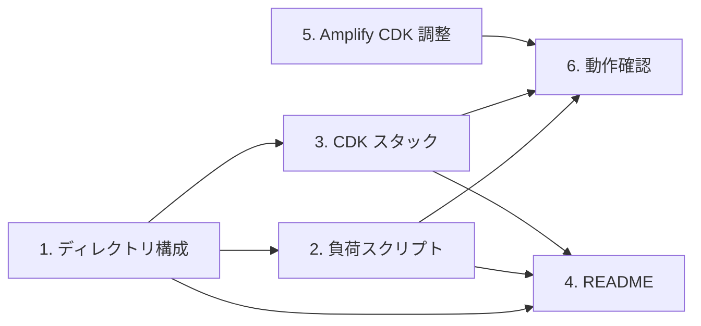

# EC2 ベース負荷生成ツール — タスク

## タスク依存関係

- Task 2 と Task 3 は並行作業可能
- Task 5 は負荷テスト前に完了させる（WCU 設定を sandbox に反映）
- Task 6 は全タスク完了後に E2E 確認

## タスク一覧

### 1. ディレクトリ構成の作成

- [x] `load-generator/` ディレクトリを作成
- [x] `load-generator/cdk/` と `load-generator/scripts/` を作成
- [x] `load-generator/README.md` の雛形を作成

### 2. 負荷生成スクリプト (load_test.py)

- [x] コマンドライン引数のパース（argparse）
- [x] DynamoDB テーブルから SKU リストを Scan で取得
- [x] ThreadPoolExecutor による並列 UpdateItem 実行
- [x] 倉庫の重み付きランダム選択ロジック
- [x] 毎秒のリアルタイムレポート（成功/スロットル/レイテンシ）
- [x] 完了時サマリー出力（p50/p95/p99 レイテンシ含む）
- [x] `--no-retry` オプションで SDK リトライ無効化
- [x] `requirements.txt` に boto3 を記載

### 3. CDK スタック定義

- [x] `cdk.json` 作成
- [x] `app.py` エントリポイント作成
- [x] `stack.py`: EC2 インスタンス定義（t3.xlarge, Amazon Linux 2023）
- [x] `stack.py`: IAM ロール（DynamoDB 書き込み + SSM）
- [x] `stack.py`: Security Group（アウトバウンドのみ）
- [x] `stack.py`: User Data でスクリプト配置 + Python 依存インストール
- [x] `stack.py`: テーブル名を CDK context から取得し環境変数に設定
- [x] `requirements.txt` に aws-cdk-lib を記載

### 4. README 作成

- [x] 前提条件（Amplify sandbox 稼働中、Python 3.12+、CDK CLI）
- [x] デプロイ手順（`cdk deploy`）
- [x] SSM 接続 → スクリプト実行手順
- [x] 実験シナリオ（3 ラウンド: Bad+noRetry, Bad+retry, Good+retry）
- [x] 片付け（`cdk destroy`）
- [x] コスト見積もり

### 5. Amplify CDK 調整

- [x] GSI の WCU を 100 に下げる（コスト削減、GSI はテスト対象外）
- [x] 必要に応じて Amplify テーブルの WCU を確認

### 6. 動作確認

- [x] CDK synth が通ることを確認
- [x] load_test.py が単体でインポートエラーなく動作することを確認（ローカル dry-run）
- [x] `cdk deploy` が正常に完了し、EC2 インスタンスが起動することを確認
- [x] SSM Session Manager で EC2 に接続できることを確認
- [x] load_test.py を低 RPS (--rps 10 --duration 5) で実行し、基本動作を確認

### 7. ユニットテスト（オプション）

- [x] 引数パースのテスト（必須引数欠落時のエラー、デフォルト値）
- [x] レポートフォーマットのテスト（毎秒出力、サマリー出力）
- [x] 倉庫選択の重み付きロジックのテスト（tokyo-ratio が反映されること）
