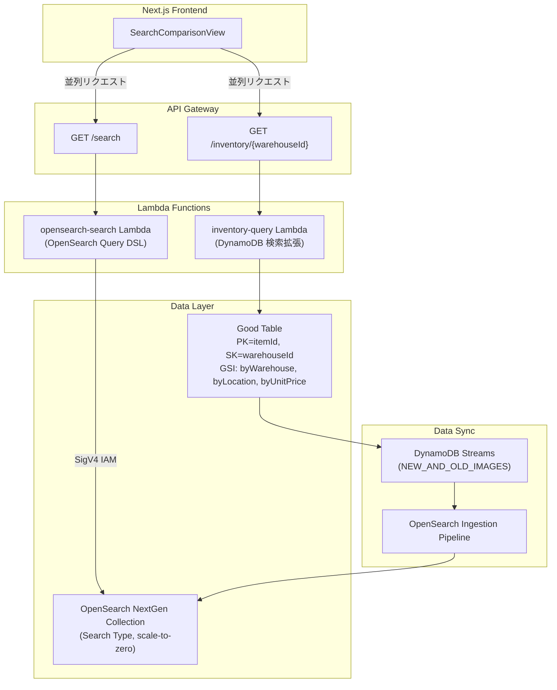

# Design Document: OpenSearch Comparison

## Overview

DynamoDB の GSI 検索と OpenSearch Serverless NextGen の検索を横並びで比較する検証機能の技術設計。同一の検索条件で両エンジンに並列リクエストを送り、レイテンシ・件数・データの差異を可視化する。

### 設計方針

- **インフラ**: OpenSearch Serverless NextGen（Collection Group + Collection）を CDK L1 Construct（`CfnCollectionGroup`, `CfnCollection`）で定義。Ingestion Pipeline は `CfnPipeline` で管理。
- **バックエンド**: 既存 Lambda 拡張（DynamoDB 検索）＋新規 Lambda（OpenSearch 検索）。API Gateway に `/search` エンドポイント追加。
- **フロントエンド**: 既存「在庫管理」タブ内に検索比較 UI を追加。並列リクエスト＋左右パネル表示。
- **データ同期**: DynamoDB Streams + PITR → OpenSearch Ingestion Pipeline → Collection（Zero-ETL）。

## Architecture



### リクエストフロー

1. ユーザーが検索条件を入力し「検索」ボタンを押下
2. フロントエンドが DynamoDB 検索 API と OpenSearch 検索 API に並列リクエスト送信
3. 各 Lambda が検索を実行し、レイテンシ情報とともに結果を返却
4. フロントエンドが左右パネルに結果を表示、レイテンシバーで比較

## Components and Interfaces

### 1. OpenSearch インフラ CDK Construct (`amplify/custom/opensearch-infra.ts`)

OpenSearch Serverless NextGen のリソースを定義する Construct。

```typescript
export interface OpenSearchInfraProps {
  /** データ同期元の DynamoDB テーブル */
  sourceTable: dynamodb.Table;
}

export class OpenSearchInfraConstruct extends Construct {
  /** OpenSearch Collection のエンドポイント URL */
  public readonly collectionEndpoint: string;
  /** Collection の ARN */
  public readonly collectionArn: string;
  /** Ingestion Pipeline のパイプライン名 */
  public readonly pipelineName: string;
}
```

**CDK リソース構成:**

1. **Collection Group** (`CfnCollectionGroup`): scale-to-zero 設定
   - `standbyReplicas`: `'ENABLED'`（NextGen 必須）
   - `capacityLimits`: min 0 OCU（scale-to-zero 有効化）

2. **Encryption Policy** (`CfnSecurityPolicy`): AWS 所有キーによる暗号化

3. **Network Policy** (`CfnSecurityPolicy`): パブリックアクセス許可（検証用途）

4. **Data Access Policy** (`CfnAccessPolicy`): Lambda ロール + Ingestion Pipeline ロールへのアクセス許可

5. **Collection** (`CfnCollection`): Search タイプ、Collection Group に所属
   - `type`: `'SEARCH'`
   - `collectionGroupName`: Collection Group 名を参照

6. **Ingestion Pipeline IAM Role**: DynamoDB Streams 読み取り + OpenSearch 書き込み権限

7. **Ingestion Pipeline** (`osis.CfnPipeline`): DynamoDB → OpenSearch のデータ同期

**Ingestion Pipeline 設定 (YAML テンプレート):**

```yaml
version: "2"
dynamodb-pipeline:
  source:
    dynamodb:
      acknowledgments: true
      tables:
        - table_arn: "${tableArn}"
          stream:
            start_position: "LATEST"
          export:
            s3_bucket: "${s3BucketName}"
            s3_region: "${region}"
            s3_prefix: "ddb-export/"
      aws:
        sts_role_arn: "${pipelineRoleArn}"
        region: "${region}"
  sink:
    - opensearch:
        hosts:
          - "${collectionEndpoint}"
        index: "inventory"
        index_type: "custom"
        document_id: "${getMetadata(\"primary_key\")}"
        action: "${getMetadata(\"opensearch_action\")}"
        document_version: "${getMetadata(\"document_version\")}"
        document_version_type: "external"
        aws:
          sts_role_arn: "${pipelineRoleArn}"
          region: "${region}"
          serverless: true
```

### 2. OpenSearch 検索 Lambda (`amplify/functions/opensearch-search/handler.ts`)

```typescript
interface SearchRequest {
  warehouseId?: string;
  itemPrefix?: string;
  locationPrefix?: string;
  itemName?: string;
  minPrice?: number;
  maxPrice?: number;
  minQuantity?: number;
  maxQuantity?: number;
  from?: number;
  size?: number;
}

interface SearchResponse {
  items: InventoryRecord[];
  total: number;
  took: number;         // OpenSearch took (ms)
  latencyMs: number;    // サーバー側トータルレイテンシ (ms)
  from: number;
  size: number;
}
```

**Query DSL 構築ロジック:**

```typescript
function buildQuery(params: SearchRequest): object {
  const must: object[] = [];

  if (params.warehouseId) {
    must.push({ term: { warehouseId: params.warehouseId } });
  }
  if (params.itemPrefix) {
    must.push({ prefix: { itemId: params.itemPrefix } });
  }
  if (params.locationPrefix) {
    must.push({ prefix: { location: params.locationPrefix } });
  }
  if (params.itemName) {
    must.push({ match: { itemName: params.itemName } });
  }
  if (params.minPrice !== undefined || params.maxPrice !== undefined) {
    must.push({ range: { unitPrice: {
      ...(params.minPrice !== undefined && { gte: params.minPrice }),
      ...(params.maxPrice !== undefined && { lte: params.maxPrice }),
    }}});
  }
  if (params.minQuantity !== undefined || params.maxQuantity !== undefined) {
    must.push({ range: { quantity: {
      ...(params.minQuantity !== undefined && { gte: params.minQuantity }),
      ...(params.maxQuantity !== undefined && { lte: params.maxQuantity }),
    }}});
  }

  return {
    query: must.length > 0 ? { bool: { must } } : { match_all: {} },
    from: params.from ?? 0,
    size: params.size ?? 20,
  };
}
```

**OpenSearch クライアント接続（SigV4 署名）:**

```typescript
import { Client } from '@opensearch-project/opensearch';
import { AwsSigv4Signer } from '@opensearch-project/opensearch/aws';
import { defaultProvider } from '@aws-sdk/credential-provider-node';

const client = new Client({
  ...AwsSigv4Signer({
    region: process.env.AWS_REGION!,
    service: 'aoss', // OpenSearch Serverless
    getCredentials: () => defaultProvider()(),
  }),
  node: process.env.OPENSEARCH_ENDPOINT!,
});
```

### 3. DynamoDB 検索拡張 (`amplify/functions/inventory-query/handler.ts` 拡張)

既存の `inventory-query` Lambda に検索比較用の拡張パラメータを追加。

**GSI 優先順位ロジック:**

複数条件が入力された場合、1つの GSI の KeyConditionExpression のみ使用可能。以下の優先順位で GSI を選択:

1. **単価範囲** (`minPrice` + `maxPrice`): → GSI `byUnitPrice` (BETWEEN は最も絞り込み効率が高い)
2. **ロケーション前方一致** (`locationPrefix`): → GSI `byLocation` (begins_with)
3. **商品 ID 前方一致** (`itemPrefix`): → GSI `byWarehouse` (begins_with on SK=itemId)
4. **デフォルト（条件なし）**: → GSI `byWarehouse` (全件)

残りの条件は `FilterExpression` として適用:
- `itemName` → `contains(itemName, :name)`
- 使用しなかった range/prefix 条件 → 対応する FilterExpression

**レスポンス拡張:**

```typescript
interface DynamoDBSearchResponse {
  items: InventoryRecord[];
  nextToken: string | null;
  latencyMs: number;           // サーバー側レイテンシ
  usedIndex: string;           // 使用した GSI 名
  filterApplied: string[];     // FilterExpression で適用した条件
  limitation?: string;         // DynamoDB の制約メッセージ
}
```

### 4. API Gateway エンドポイント追加

`InventoryApiConstruct` に OpenSearch 検索用エンドポイントを追加:

```typescript
// GET /search?warehouseId=...&itemPrefix=...&locationPrefix=...&itemName=...
//            &minPrice=...&maxPrice=...&minQuantity=...&maxQuantity=...&from=...&size=...
const search = this.restApi.root.addResource('search');
search.addMethod('GET', opensearchSearchIntegration);
```

### 5. フロントエンドコンポーネント

```
src/components/inventory/
├── SearchComparisonView.tsx      # メインコンテナ（検索フォーム + 結果パネル）
├── SearchComparisonView.module.css
├── SearchForm.tsx                # 検索条件入力フォーム
├── SearchForm.module.css
├── ComparisonPanel.tsx           # 左右パネル（結果テーブル + メタ情報）
├── ComparisonPanel.module.css
├── LatencyBar.tsx                # レイテンシ比較バー
└── LatencyBar.module.css
```

**SearchComparisonView コンポーネント:**

```typescript
interface SearchState {
  warehouseId: string;
  itemPrefix: string;
  locationPrefix: string;
  itemName: string;
  minPrice: string;
  maxPrice: string;
  minQuantity: string;
  maxQuantity: string;
}

interface SearchResult {
  source: 'dynamodb' | 'opensearch';
  items: InventoryRecord[];
  total: number;
  latencyMs: number;
  loading: boolean;
  error: string | null;
  metadata?: {
    usedIndex?: string;
    filterApplied?: string[];
    limitation?: string;
    took?: number;
  };
}
```

**並列リクエストパターン:**

```typescript
const handleSearch = async (params: SearchState) => {
  // 両バックエンドに並列リクエスト
  const [ddbResult, osResult] = await Promise.allSettled([
    searchDynamoDB(params),
    searchOpenSearch(params),
  ]);

  // 各結果を独立して処理（一方が失敗しても他方は表示）
  setDdbResult(ddbResult.status === 'fulfilled' ? ddbResult.value : errorState);
  setOsResult(osResult.status === 'fulfilled' ? osResult.value : errorState);
};
```

**コールドスタート対応:**

- OpenSearch リクエストには 35 秒タイムアウトを設定
- ローディング中は「コールドスタート中（10〜30 秒）」メッセージを表示
- DynamoDB 結果が先に表示され、OpenSearch はプログレッシブに読み込み

### 6. フロントエンド API クライアント (`src/lib/inventory/api.ts` 拡張)

```typescript
export interface ComparisonSearchParams {
  warehouseId?: string;
  itemPrefix?: string;
  locationPrefix?: string;
  itemName?: string;
  minPrice?: number;
  maxPrice?: number;
  minQuantity?: number;
  maxQuantity?: number;
  from?: number;
  size?: number;
}

export async function searchOpenSearch(
  params: ComparisonSearchParams
): Promise<OpenSearchSearchResponse> { ... }

export async function searchDynamoDBComparison(
  params: ComparisonSearchParams
): Promise<DynamoDBComparisonResponse> { ... }
```

## Data Models

### OpenSearch インデックスマッピング

```json
{
  "mappings": {
    "properties": {
      "itemId": { "type": "keyword" },
      "warehouseId": { "type": "keyword" },
      "itemName": {
        "type": "text",
        "analyzer": "standard",
        "fields": {
          "keyword": { "type": "keyword" }
        }
      },
      "quantity": { "type": "integer" },
      "lotNumber": { "type": "keyword" },
      "location": { "type": "keyword" },
      "unitPrice": { "type": "float" },
      "lastUpdated": { "type": "date", "format": "strict_date_optional_time" }
    }
  }
}
```

### DynamoDB Good Table 既存スキーマ（参照）

| 属性 | 型 | 用途 |
|------|------|------|
| `itemId` (PK) | String | `ITEM#ETH-YIRG-G1-MEDIUM-200G` |
| `warehouseId` (SK) | String | `WH-TOKYO` / `WH-OSAKA` / `WH-FUKUOKA` |
| `itemName` | String | 商品名 |
| `quantity` | Number | 在庫数量 |
| `lotNumber` | String | ロット番号 |
| `location` | String | 棚番号（例: `A-03-02`） |
| `unitPrice` | Number | 単価 |
| `lastUpdated` | String | ISO 8601 |

### GSI 構成（既存）

| GSI 名 | PK | SK | 用途 |
|--------|------|------|------|
| `byWarehouse` | `warehouseId` | `itemId` | 倉庫別一覧 + 商品 ID 前方一致 |
| `byLocation` | `warehouseId` | `location` | ロケーション前方一致 |
| `byUnitPrice` | `warehouseId` | `unitPrice` | 単価範囲検索 |

### IAM ロール構成

**Ingestion Pipeline Role:**
- `dynamodb:DescribeTable` on Good Table
- `dynamodb:DescribeStream` on Good Table stream
- `dynamodb:GetShardIterator` on Good Table stream
- `dynamodb:GetRecords` on Good Table stream
- `dynamodb:ExportTableToPointInTime` on Good Table
- `s3:PutObject`, `s3:GetObject` on export bucket
- `aoss:BatchGetCollection`
- `aoss:APIAccessAll` on Collection

**OpenSearch Search Lambda Role:**
- `aoss:APIAccessAll` on Collection

## Correctness Properties

*A property is a characteristic or behavior that should hold true across all valid executions of a system-essentially, a formal statement about what the system should do. Properties serve as the bridge between human-readable specifications and machine-verifiable correctness guarantees.*

### Property 1: OpenSearch Query DSL は全入力条件を AND 結合する

*For any* 組み合わせの検索パラメータ（0〜6 フィールド入力）に対して、生成される Query DSL の `bool.must` 配列には、入力された全フィールドに対応するクエリ句が含まれ、空フィールドに対応するクエリ句は含まれない。

**Validates: Requirements 4.7, 1.3, 1.4**

### Property 2: GSI 選択ロジックは常に 1 つの GSI のみを使用する

*For any* 複数条件の組み合わせに対して、DynamoDB 検索の GSI 選択ロジックは必ず 1 つの GSI のみを `IndexName` に指定し、残りの条件は全て `FilterExpression` に含める。

**Validates: Requirements 3.5**

### Property 3: DynamoDB 未使用条件は全て FilterExpression に含まれる

*For any* 検索パラメータセットに対して、GSI の KeyConditionExpression で使用されなかった条件は全て FilterExpression として適用され、条件が欠落することはない。

**Validates: Requirements 3.5, 3.6**

### Property 4: 空フィールドは検索条件から除外される

*For any* 検索フォーム状態において、空文字列または未定義のフィールドは DynamoDB・OpenSearch 双方のリクエストパラメータに含まれない。

**Validates: Requirements 1.3**

### Property 5: OpenSearch ページネーションの from/size は非負整数を維持する

*For any* ページ遷移操作に対して、OpenSearch に送信される `from` は 0 以上の整数、`size` は 1 以上の整数であり、`from + size` がリクエストごとに正しくインクリメントされる。

**Validates: Requirements 7.2, 4.8**

## Error Handling

### Lambda エラー処理

| エラー種別 | 原因 | レスポンス | フロントエンド表示 |
|-----------|------|----------|----------------|
| `COLD_START_TIMEOUT` | OpenSearch scale-to-zero からの起動待ち超過 | 503 + retry-after | 「コールドスタート中」メッセージ継続表示 |
| `OPENSEARCH_UNAVAILABLE` | Collection 未起動/ネットワークエラー | 503 | 右パネルにエラー表示 |
| `UNSUPPORTED_SEARCH` | DynamoDB で不可能な検索パターン | 200 + limitation フィールド | 左パネルに制約メッセージ表示 |
| `THROTTLED` | DynamoDB スロットリング | 429 | 左パネルにスロットリングメッセージ |
| `INVALID_PARAMETERS` | バリデーションエラー | 400 | 検索フォーム下にエラー表示 |

### OpenSearch コールドスタート対策

```
[ユーザー操作] → [検索リクエスト送信]
                      ├── DynamoDB: 通常 50-200ms で応答
                      └── OpenSearch:
                           ├── ウォーム状態: 100-500ms で応答
                           └── コールド状態: 10-30s で応答
                                ├── 5s 経過: 「コールドスタート中...」メッセージ表示
                                ├── 35s 経過: タイムアウト → エラー表示
                                └── 応答: 結果表示
```

**Lambda タイムアウト**: OpenSearch 検索 Lambda は `Duration.seconds(60)` に設定（コールドスタート 30s + 検索処理 + マージン）。

### DynamoDB 制約メッセージ

| 入力パターン | 制約理由 | メッセージ例 |
|------------|---------|------------|
| `itemName` のみ | GSI SK に itemName がない | 「DynamoDB: 商品名部分一致は FilterExpression で実行（全件スキャン後フィルタ）」 |
| `minQuantity` / `maxQuantity` | GSI SK に quantity がない | 「DynamoDB: 数量範囲は FilterExpression で実行」 |
| 倉庫未指定 | 全 GSI の PK が warehouseId | 「DynamoDB: 倉庫指定が必須です（GSI の PK が warehouseId のため）」 |

## Testing Strategy

### ユニットテスト

- **OpenSearch Query DSL ビルダー**: 各条件パターンで正しい JSON 構造が生成されることを検証
- **GSI 選択ロジック**: 優先順位に従って正しい GSI が選択されることを検証
- **FilterExpression ビルダー**: 未使用条件が正しく FilterExpression に変換されることを検証
- **フロントエンド**: 検索フォームの入力バリデーション、パネル表示ロジック

### プロパティベーステスト

本機能の Lambda 検索ロジック（Query DSL 構築、GSI 選択）は純粋関数として抽出可能であり、PBT に適している。

- **ライブラリ**: `fast-check`（TypeScript）
- **最小イテレーション**: 100 回/プロパティ
- **タグ形式**: `Feature: opensearch-comparison, Property N: {property text}`
- **対象関数**:
  - `buildQuery(params)` → Query DSL 構築
  - `selectGsi(params)` → GSI 選択 + FilterExpression 分離
  - `buildFilterExpression(params, usedGsi)` → FilterExpression 構築

### インテグレーションテスト

- Ingestion Pipeline によるデータ同期確認（DynamoDB 書き込み → OpenSearch 反映）
- OpenSearch 検索の E2E 動作確認（コールドスタート含む）
- API Gateway エンドポイントの CORS 設定確認

### CDK スナップショットテスト

- `OpenSearchInfraConstruct` の CloudFormation テンプレート出力をスナップショットテストで検証
- セキュリティポリシー、アクセスポリシーの設定値を検証

### 手動検証項目

- OpenSearch コールドスタート → ウォーム状態遷移の体験確認
- 768px 以下でのレスポンシブレイアウト確認
- Amplify sandbox での全体統合テスト
