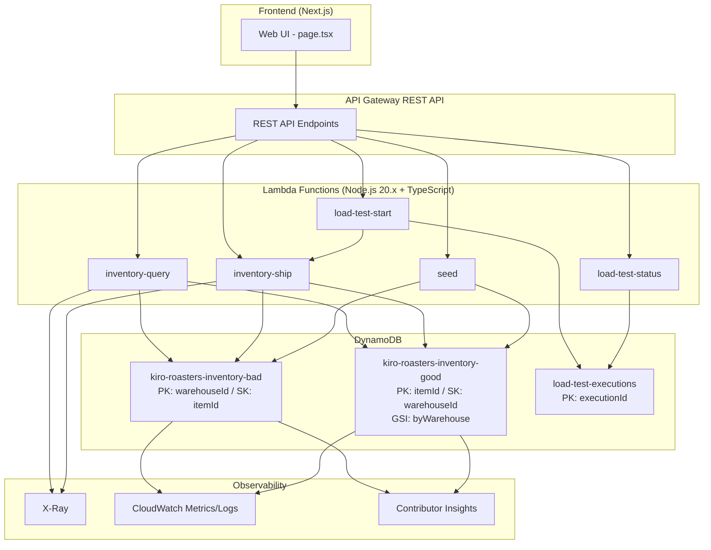

# Design Document: Phase 1 — DynamoDB ホットスポット検証 在庫管理基盤

## Overview

Kiro Roasters の在庫管理システムを題材に、DynamoDB のパーティションキー設計がオンラインリクエストのレスポンスに与える影響を実測データで検証するアプリケーションを構築する。

同一データを「悪い設計（warehouseId を PK）」と「良い設計（itemId を PK）」の 2 テーブルに保持し、朝の出荷ラッシュ（書き込み集中）の状況下で在庫照会（読み取り）のレスポンスタイムとエラー率を比較する。

**主要な技術的判断:**

1. **DynamoDB テーブルは CDK 直接定義**: Amplify の `defineData` ではなく、`aws-cdk-lib/aws-dynamodb` で直接定義する。プロビジョンドキャパシティ、Contributor Insights、GSI の細かい制御が必要なため。
2. **API Gateway REST API**: Lambda 関数のエンドポイントは API Gateway REST API で公開する。Amplify の AppSync ではなく REST API を使う（DynamoDB 直接操作に特化し、GraphQL のオーバーヘッドが不要）。
3. **負荷生成は Lambda 内ループ**: Step Functions Map ステートの代わりに、Lambda 内で非同期ループを実行する。シンプルさと sandbox 環境での動作確実性を優先。実行状態は DynamoDB テーブルに記録。
4. **Web UI はトップページに構築**: `src/app/page.tsx` にタブ形式で在庫照会・負荷テスト制御・結果ダッシュボードを配置。

## Architecture



### API エンドポイント一覧

| Method | Path | Lambda | 説明 |
|--------|------|--------|------|
| GET | /inventory/{warehouseId}/{itemId}?table=bad\|good | inventory-query | 在庫照会 |
| POST | /inventory/ship | inventory-ship | 出庫処理 |
| POST | /load-test/start | load-test-start | 負荷生成開始 |
| GET | /load-test/status/{executionId} | load-test-status | 負荷生成ステータス |
| POST | /seed | seed | 初期データ投入 |

## Components and Interfaces

### 1. Infrastructure Layer (`amplify/custom/`)

#### `amplify/custom/dynamodb-tables.ts`

CDK で 3 つの DynamoDB テーブルを定義する Construct。

```typescript
interface InventoryTablesProps {
  // なし（固定設定）
}

// 出力
interface InventoryTables {
  badTable: dynamodb.Table;   // kiro-roasters-inventory-bad
  goodTable: dynamodb.Table;  // kiro-roasters-inventory-good
  executionsTable: dynamodb.Table; // load-test-executions
}
```

#### `amplify/custom/api-gateway.ts`

REST API と Lambda 統合を定義する Construct。

```typescript
interface InventoryApiProps {
  queryFunction: lambda.Function;
  shipFunction: lambda.Function;
  loadTestStartFunction: lambda.Function;
  loadTestStatusFunction: lambda.Function;
  seedFunction: lambda.Function;
}

// 出力: REST API URL（Amplify outputs に登録）
```

### 2. Lambda Functions (`amplify/functions/`)

#### `inventory-query/handler.ts`

```typescript
interface QueryEvent {
  pathParameters: {
    warehouseId: string;
    itemId: string;
  };
  queryStringParameters: {
    table: "bad" | "good";
  };
}

interface InventoryRecord {
  warehouseId: string;
  itemId: string;
  itemName: string;
  quantity: number;
  lotNumber: string;
  location: string;
  unitPrice: number;
  lastUpdated: string; // ISO 8601
}

// 200: InventoryRecord
// 404: { error: string }
// 500: { error: string } (throttling を含む)
```

**実装方針:**
- `table` パラメータでテーブル名を切り替え
- Bad_Table: `GetItem(PK=warehouseId, SK=itemId)`
- Good_Table: `GetItem(PK=itemId, SK=warehouseId)`
- `ConsistentRead: true` を常に指定
- DynamoDB のスロットリングエラーはキャッチせずそのまま返す（SDK デフォルトリトライ後）

#### `inventory-ship/handler.ts`

```typescript
interface ShipEvent {
  body: {
    warehouseId: string;
    itemId: string;
    quantity: number;
    table: "bad" | "good";
  };
}

// 200: { success: true, updatedQuantity: number, lastUpdated: string }
// 400: { error: "INSUFFICIENT_STOCK", currentQuantity: number, requestedQuantity: number }
// 500: { error: string }
```

**実装方針:**
- `UpdateItem` で `SET quantity = quantity - :qty, lastUpdated = :now`
- `ConditionExpression: "quantity >= :qty"`
- `ConditionalCheckFailedException` → 400 (INSUFFICIENT_STOCK)
- スロットリングエラーはそのまま返す

#### `load-test-start/handler.ts`

```typescript
interface LoadTestStartEvent {
  body: {
    table: "bad" | "good";
    durationSeconds: number;     // 最大 300
    requestsPerSecond: number;   // 最大 200
    warehouseDistribution: {
      "WH-TOKYO": number;  // 0.0-1.0
      "WH-OSAKA": number;
      "WH-FUKUOKA": number;
    };
  };
}

// 202: { executionId: string, status: "STARTED" }
```

**実装方針:**
- UUID で executionId を生成
- executions テーブルに初期レコードを書き込み（status: RUNNING）
- 別の Lambda を非同期 Invoke（Event 型）して負荷生成を実行
- 即座にレスポンスを返す

**負荷生成ワーカー（同一 Lambda の別ハンドラーまたは専用 Lambda）:**
- `setInterval` ベースで指定レートでリクエスト生成
- 各リクエストで warehouseDistribution に基づき倉庫を選択
- ランダムな SKU を選択して Ship API（内部的に直接 DynamoDB 更新）を実行
- 実行結果を executions テーブルに定期更新
- 完了時に status を COMPLETED に更新

#### `load-test-status/handler.ts`

```typescript
interface LoadTestStatusEvent {
  pathParameters: {
    executionId: string;
  };
}

interface ExecutionStatus {
  executionId: string;
  status: "RUNNING" | "COMPLETED" | "FAILED";
  totalRequests: number;
  successCount: number;
  throttleCount: number;
  elapsedSeconds: number;
}

// 200: ExecutionStatus
// 404: { error: string }
```

#### `seed/handler.ts`

```typescript
// POST /seed
// 200: { message: string, recordCount: number }
```

**実装方針:**
- SKU 生成ロジック: カテゴリ別に命名規則に従った商品 ID を生成
- 各 SKU × 3 倉庫 = 15,000 レコード
- `BatchWriteItem` で 25 件ずつ両テーブルに投入
- 未処理アイテムのリトライ処理を含む
- Lambda タイムアウト: 15 分（最大）

### 3. Frontend Components (`src/components/inventory/`)

#### コンポーネント構成

```
src/components/inventory/
├── InventoryDashboard.tsx     # メインコンテナ（タブ切り替え）
├── InventoryQueryPanel.tsx    # 在庫照会パネル
├── LoadTestPanel.tsx          # 負荷テスト制御パネル
├── ResultsDashboard.tsx       # 結果ダッシュボードパネル
└── types.ts                   # 共通型定義
```

#### `InventoryDashboard.tsx`

タブ UI でパネルを切り替えるメインコンテナ。

```typescript
type Tab = "query" | "loadtest" | "results";
```

#### `InventoryQueryPanel.tsx`

- テーブル選択（bad / good）
- 倉庫選択（WH-TOKYO / WH-OSAKA / WH-FUKUOKA）
- 商品 ID 入力（テキスト or ドロップダウン）
- 照会実行ボタン
- レスポンス表示（データ + レイテンシ）
- エラー表示（スロットリング情報含む）

#### `LoadTestPanel.tsx`

- テーブル選択
- 継続秒数入力
- リクエスト/秒入力
- 倉庫分布比率スライダー
- 開始ボタン
- 進捗表示（ポーリング）: totalRequests, successCount, throttleCount, elapsedSeconds

#### `ResultsDashboard.tsx`

- Bad vs Good のレイテンシ比較表
- スロットルイベント数比較
- エラー率比較

### 4. API Client (`src/lib/inventory/`)

```typescript
// src/lib/inventory/api.ts
const API_BASE_URL = process.env.NEXT_PUBLIC_INVENTORY_API_URL;

export async function queryInventory(
  warehouseId: string,
  itemId: string,
  table: "bad" | "good"
): Promise<{ data: InventoryRecord; latencyMs: number }>;

export async function shipInventory(
  warehouseId: string,
  itemId: string,
  quantity: number,
  table: "bad" | "good"
): Promise<ShipResponse>;

export async function startLoadTest(
  params: LoadTestParams
): Promise<{ executionId: string }>;

export async function getLoadTestStatus(
  executionId: string
): Promise<ExecutionStatus>;

export async function seedData(): Promise<{ recordCount: number }>;
```

## Data Models

### Bad_Table: `kiro-roasters-inventory-bad`

| Attribute | Type | Key | Description |
|-----------|------|-----|-------------|
| warehouseId | String | PK | 倉庫ID (WH-TOKYO, WH-OSAKA, WH-FUKUOKA) |
| itemId | String | SK | 商品ID (ITEM#ETH-YIRG-G1-MEDIUM-200G) |
| quantity | Number | - | 在庫数 (10-1000) |
| lotNumber | String | - | ロット番号 (LOT#2026-05-20-003) |
| lastUpdated | String | - | ISO 8601 日時 |
| location | String | - | 棚番号 (A-03-02) |
| unitPrice | Number | - | 単価（円） |
| itemName | String | - | 商品名（表示用） |

**キャパシティ:** プロビジョンド 100 RCU / 100 WCU
**Contributor Insights:** 有効

**問題点:** warehouseId のカーディナリティが 3 と極端に低い。東京倉庫の出荷比率 70% により、WH-TOKYO パーティションに書き込みが集中する。

### Good_Table: `kiro-roasters-inventory-good`

| Attribute | Type | Key | Description |
|-----------|------|-----|-------------|
| itemId | String | PK | 商品ID |
| warehouseId | String | SK | 倉庫ID |
| quantity | Number | - | 在庫数 |
| lotNumber | String | - | ロット番号 |
| lastUpdated | String | - | ISO 8601 日時 |
| location | String | - | 棚番号 |
| unitPrice | Number | - | 単価（円） |
| itemName | String | - | 商品名（表示用） |

**GSI `byWarehouse`:**
| Attribute | Type | Key |
|-----------|------|-----|
| warehouseId | String | GSI-PK |
| itemId | String | GSI-SK |
射影: ALL

**キャパシティ:** プロビジョンド 100 RCU / 100 WCU
**Contributor Insights:** 有効

**利点:** itemId のカーディナリティが 5,000。書き込みが多数のパーティションに自然に分散。

### Executions Table: `load-test-executions`

| Attribute | Type | Key | Description |
|-----------|------|-----|-------------|
| executionId | String | PK | UUID |
| status | String | - | RUNNING / COMPLETED / FAILED |
| table | String | - | bad / good |
| totalRequests | Number | - | 累計リクエスト数 |
| successCount | Number | - | 成功数 |
| throttleCount | Number | - | スロットリング数 |
| startedAt | String | - | 開始日時 ISO 8601 |
| elapsedSeconds | Number | - | 経過秒数 |
| config | Map | - | 設定パラメータ |

**キャパシティ:** オンデマンド（負荷テスト管理用なので低トラフィック）

### SKU 命名規則

```
ITEM#{産地略称}-{品種略称}-{グレード}-{焙煎度}-{容量}

例:
- ITEM#ETH-YIRG-G1-MEDIUM-200G   (エチオピア イルガチェフェ G1 ミディアム 200g)
- ITEM#BRA-SANT-NY2-CITY-1KG      (ブラジル サントス NY2 シティ 1kg)
- ITEM#BLEND-MORNING-LIGHT-500G   (ブレンド モーニング ライト 500g)
- ITEM#DRIP-ETH-YIRG-10P          (ドリップバッグ エチオピア 10個入)
- ITEM#MAT-BAG-200G-KRAFT         (資材 袋 200g クラフト)
```

## Correctness Properties

*A property is a characteristic or behavior that should hold true across all valid executions of a system — essentially, a formal statement about what the system should do. Properties serve as the bridge between human-readable specifications and machine-verifiable correctness guarantees.*

### Property 1: Inventory query returns complete record from correct table

*For any* valid (warehouseId, itemId, table) tuple where a matching inventory record exists, the Inventory_Query_API SHALL return an HTTP 200 response containing all required fields (warehouseId, itemId, itemName, quantity, lotNumber, location, unitPrice, lastUpdated) with values matching the record in the specified table.

**Validates: Requirements 3.1, 3.3**

### Property 2: Non-existent inventory returns 404

*For any* (warehouseId, itemId, table) tuple where no matching inventory record exists in the specified table, the Inventory_Query_API SHALL return HTTP 404 with a descriptive error message.

**Validates: Requirements 3.4**

### Property 3: Shipment correctly decrements quantity and updates timestamp

*For any* valid shipment request where the current inventory quantity is greater than or equal to the requested shipment quantity, the Ship_API SHALL decrement the quantity by exactly the requested amount AND update lastUpdated to a valid ISO 8601 timestamp within a reasonable time window of the request.

**Validates: Requirements 4.1, 4.3**

### Property 4: Insufficient stock guard prevents over-shipment

*For any* shipment request where the requested quantity exceeds the current inventory quantity, the Ship_API SHALL return HTTP 400 with an INSUFFICIENT_STOCK error and the inventory quantity SHALL remain unchanged.

**Validates: Requirements 4.4**

### Property 5: Load generation distributes requests per warehouse ratios using valid SKUs

*For any* load test configuration with a warehouseDistribution specifying ratios summing to 1.0, the generated shipment requests SHALL be distributed across warehouses approximately matching the specified ratios (within statistical tolerance), AND each generated request SHALL reference a valid SKU that exists in the target warehouse's inventory.

**Validates: Requirements 5.2, 5.4**

### Property 6: Load test status response contains all required fields

*For any* valid executionId corresponding to a started load test, the Load_Test_Status_API SHALL return a response containing executionId (string), status (one of RUNNING/COMPLETED/FAILED), totalRequests (number >= 0), successCount (number >= 0), throttleCount (number >= 0), and elapsedSeconds (number >= 0), where successCount + throttleCount <= totalRequests.

**Validates: Requirements 6.2**

### Property 7: Seed data generation satisfies all invariants

*For any* execution of the Seed_Script, the generated data SHALL satisfy all of the following: (a) exactly 5,000 unique SKUs are generated, each following the Kiro Roasters naming convention (ITEM# prefix + category-specific pattern); (b) total record count equals SKU count × 3 warehouses = 15,000 per table; (c) every record's quantity is in the range [10, 1000]; (d) SKU category distribution approximately matches: green beans ~32, roasted beans ~960, blends ~1,500, drip bags ~500, materials ~2,008.

**Validates: Requirements 7.1, 7.2, 7.3, 7.5**

## Error Handling

### Lambda 関数共通

| エラー種別 | HTTP Status | 対応 |
|-----------|-------------|------|
| パスパラメータ不正 | 400 | バリデーションエラーメッセージ |
| リクエストボディ不正 | 400 | JSON パース or バリデーションエラー |
| DynamoDB ProvisionedThroughputExceededException | 500 | エラーをそのまま返す（SDK デフォルトリトライ後） |
| DynamoDB ConditionalCheckFailedException | 400 | 在庫不足エラー（Ship API のみ） |
| DynamoDB ResourceNotFoundException | 500 | テーブル未作成エラー |
| その他 DynamoDB エラー | 500 | 内部エラー |
| Lambda タイムアウト | 502 | API Gateway がタイムアウトレスポンスを返す |

### エラーレスポンス形式

```typescript
interface ErrorResponse {
  error: string;         // エラーコード (e.g., "INSUFFICIENT_STOCK", "NOT_FOUND", "THROTTLED")
  message: string;       // 人間可読なメッセージ
  details?: unknown;     // 追加情報（throttling の場合は retryAfterMs など）
}
```

### スロットリングエラーの扱い

- **意図的にリトライしない**: SDK のデフォルトリトライ（指数バックオフ、最大 3 回）の後もスロットリングが発生した場合、エラーをクライアントにそのまま返す。
- **理由**: ホットスポットの影響を実測データとして可視化するため、アプリケーション層でのリトライや緩和策を入れない。
- エラーレスポンスにはスロットリング情報を含め、Web UI で目立つように表示する。

### Seed スクリプトのエラーハンドリング

- `BatchWriteItem` の `UnprocessedItems` を最大 5 回リトライ（指数バックオフ）
- 全リトライ失敗時はエラーログを残し、投入済み件数を返して処理を中断
- Lambda タイムアウト（15 分）に達した場合は途中経過をログに記録

## Testing Strategy

### テスト戦略の概要

このプロジェクトはインフラ（CDK）+ Lambda ハンドラー + フロントエンドの 3 層で構成される。各層に適したテスト手法を適用する。

### 1. インフラ（CDK テンプレート）テスト

**手法:** CDK Assertions（スナップショットテスト + Fine-grained assertions）

- DynamoDB テーブルのキースキーマ、キャパシティ設定、Contributor Insights が正しいか
- Lambda 関数の runtime、tracing 設定が正しいか
- IAM ポリシーが最小権限になっているか
- API Gateway のリソース定義が正しいか

### 2. Lambda ハンドラーのユニットテスト

**手法:** Property-based testing + Example-based testing

**Property-based testing ライブラリ:** [fast-check](https://github.com/dubzzz/fast-check)（TypeScript PBT ライブラリ）

**Property tests（各 100 iterations 以上）:**

| Property | テスト内容 | Tag |
|----------|-----------|-----|
| Property 1 | 在庫照会の正確性 | Feature: phase1-inventory, Property 1: Inventory query returns complete record from correct table |
| Property 2 | 存在しないアイテムの 404 | Feature: phase1-inventory, Property 2: Non-existent inventory returns 404 |
| Property 3 | 出庫処理の正確性 | Feature: phase1-inventory, Property 3: Shipment correctly decrements quantity and updates timestamp |
| Property 4 | 在庫不足ガード | Feature: phase1-inventory, Property 4: Insufficient stock guard prevents over-shipment |
| Property 5 | 負荷分散の比率 | Feature: phase1-inventory, Property 5: Load generation distributes requests per warehouse ratios using valid SKUs |
| Property 6 | ステータス応答の完全性 | Feature: phase1-inventory, Property 6: Load test status response contains all required fields |
| Property 7 | シードデータ生成 | Feature: phase1-inventory, Property 7: Seed data generation satisfies all invariants |

**Example-based tests:**

- ConsistentRead が true で呼ばれることの確認（mock 検証）
- ConditionExpression が正しく設定されることの確認
- スロットリングエラーの伝搬確認

**テスト環境:**
- DynamoDB はモック（`@aws-sdk/client-dynamodb` を jest.mock）
- Lambda ハンドラーを直接呼び出し

### 3. フロントエンドテスト

**手法:** Example-based testing（React Testing Library）

- 各パネルのレンダリング確認
- フォーム送信の API 呼び出し確認
- エラー表示の確認
- ポーリング動作の確認

### 4. Integration テスト（sandbox 環境）

- Seed スクリプト実行後の両テーブルのデータ一致確認
- API エンドポイントのエンドツーエンド動作確認
- X-Ray トレースの記録確認
- CloudWatch メトリクスの発行確認

### テストツール

| ツール | 用途 |
|--------|------|
| Jest | テストランナー |
| fast-check | Property-based testing |
| React Testing Library | フロントエンドテスト |
| CDK Assertions | インフラテスト |
| k6 | 負荷テスト（プロジェクト外から実行） |


## UI/Visual Design

### Design Principles

- **Business-first**: 倉庫スタッフが情報を素早く読み取れる、クリーンで情報密度の高いレイアウト
- **Kiro Roasters identity**: ウォームなコーヒートーンをアクセントカラーに使用し、ニュートラルなベースに対して控えめに配置
- **Modern enterprise**: 最小限のクローム、十分なホワイトスペース、明確なタイポグラフィ階層
- **Functional first**: デコレーションよりもデータの視認性とスキャナビリティを優先
- **Accessibility**: WCAG 2.1 AA 準拠のコントラスト比を確保。色だけに依存しない情報伝達（アイコン + テキストを併用）

### Color Palette

既存の `globals.css` CSS カスタムプロパティを拡張する形で定義する。

```css
:root {
  /* === Base/Neutral (既存を継承) === */
  --color-text: #1a1a2e;
  --color-text-secondary: #555;
  --color-text-muted: #888;
  --color-bg: #fafafa;
  --color-surface: #ffffff;
  --color-surface-alt: #f5f3f1;        /* カード内の交互行背景 */
  --color-border: #e0e0e0;
  --color-border-subtle: #ede9e5;      /* 軽いセパレーター */

  /* === Brand Accent (Primary) — Roasted Bean === */
  --color-brand: #6b4f3f;              /* プライマリアクション、アクティブタブ */
  --color-brand-hover: #5a3f31;        /* ホバー状態 */
  --color-brand-light: #f7f0eb;        /* ブランドカラーの薄い背景 */

  /* === Brand Accent (Secondary) — Caramel/Latte === */
  --color-brand-secondary: #a0826d;    /* セカンダリ要素、ホバーアクセント */
  --color-brand-secondary-light: #d4bfb0; /* サブ見出し下線など */

  /* === Semantic — Danger === */
  --color-danger: #c0392b;             /* スロットリングエラー、ホットスポット警告 */
  --color-danger-bg: #fdf2f0;          /* エラーアラート背景 */
  --color-danger-border: #e74c3c;      /* エラーカード左ボーダー */

  /* === Semantic — Success === */
  --color-success: #27ae60;            /* 成功操作、正常レスポンス */
  --color-success-bg: #eafaf1;         /* 成功アラート背景 */

  /* === Semantic — Warning === */
  --color-warning: #d4930d;            /* 負荷テスト実行中ステータス */
  --color-warning-bg: #fef9e7;         /* 警告背景 */

  /* === Table Comparison — Accessibility-safe (NOT red/green) === */
  --color-bad-table: #e07050;          /* Coral/Warm — Bad Table 指標 */
  --color-bad-table-bg: #fef5f2;       /* Bad Table 背景 */
  --color-bad-table-border: #d4553e;

  --color-good-table: #2d8fa0;         /* Teal/Cool — Good Table 指標 */
  --color-good-table-bg: #f0fafb;      /* Good Table 背景 */
  --color-good-table-border: #1f7a8a;
}
```


```css
@media (prefers-color-scheme: dark) {
  :root {
    /* === Base/Neutral (既存ダークモードを継承) === */
    --color-text: #e0e0e0;
    --color-text-secondary: #aaa;
    --color-text-muted: #777;
    --color-bg: #121212;
    --color-surface: #1e1e1e;
    --color-surface-alt: #2a2520;
    --color-border: #333;
    --color-border-subtle: #3a3530;

    /* === Brand (暗い背景でのコントラスト調整) === */
    --color-brand: #c9a88e;
    --color-brand-hover: #d4b89e;
    --color-brand-light: #2a2320;

    --color-brand-secondary: #b89880;
    --color-brand-secondary-light: #3d3028;

    /* === Semantic === */
    --color-danger: #e57373;
    --color-danger-bg: #2c1a1a;
    --color-danger-border: #c0392b;

    --color-success: #66bb6a;
    --color-success-bg: #1a2c1a;

    --color-warning: #f0b429;
    --color-warning-bg: #2c2a1a;

    /* === Table Comparison === */
    --color-bad-table: #f08060;
    --color-bad-table-bg: #2c1f1a;
    --color-bad-table-border: #e07050;

    --color-good-table: #4db8c9;
    --color-good-table-bg: #1a2c2e;
    --color-good-table-border: #2d8fa0;
  }
}
```

### Typography

| 用途 | フォント | ウェイト | サイズ |
|------|---------|---------|--------|
| ページタイトル (h1) | Inter | 700 (Bold) | 1.75rem (28px) |
| セクション見出し (h2) | Inter | 600 (Semibold) | 1.25rem (20px) |
| カード見出し (h3) | Inter | 600 (Semibold) | 1rem (16px) |
| 本文 | Inter | 400 (Regular) | 0.875rem (14px) |
| 補足テキスト | Inter | 400 (Regular) | 0.8125rem (13px) |
| モノスペース（ID、レイテンシ値） | var(--font-mono) | 500 (Medium) | 0.8125rem (13px) |
| ステータスバッジ | Inter | 600 (Semibold) | 0.75rem (12px) |

**サイズスケール**: データヘビーな画面に適した 14px ベース。テーブルセルや入力フィールドも 14px で統一し、スキャナビリティを確保する。

### Layout Pattern

```
┌─────────────────────────────────────────────────────────────┐
│  ☕ Kiro Roasters  │  在庫管理検証システム                     │  ← Header Bar
├─────────────────────────────────────────────────────────────┤
│  [在庫照会]  [負荷テスト]  [結果ダッシュボード]              │  ← Tab Navigation
├─────────────────────────────────────────────────────────────┤
│                                                             │
│  ┌─────────────────────────────────────────────────────┐   │
│  │  Content Area (Card-based panels)                    │   │
│  │                                                      │   │
│  │  各タブの内容がここに表示される                        │   │
│  │                                                      │   │
│  └─────────────────────────────────────────────────────┘   │
│                                                             │
└─────────────────────────────────────────────────────────────┘
```

**構成ルール:**
- **Header Bar**: 高さ 56px。左に Kiro Roasters ロゴ/ワードマーク、中央にアプリタイトル「在庫管理検証システム」
- **Tab Navigation**: Header 直下に配置。アクティブタブはブランドカラーの下線 + ブランドカラーテキスト
- **Content Area**: max-width: 1200px、padding: 24px。カードベースのパネル配置
- **Responsive**: デスクトップファースト（倉庫スタッフはデスクトップ使用）。768px 以下で 1 カラムにフォールバック

### Component Design Tokens

#### Card
```css
.card {
  background: var(--color-surface);
  border: 1px solid var(--color-border);
  border-radius: 8px;
  box-shadow: 0 1px 3px rgba(0, 0, 0, 0.04);
  padding: 20px;
}
```

#### Buttons
```css
/* Primary — Brand filled */
.btn-primary {
  background: var(--color-brand);
  color: #ffffff;
  border: none;
  border-radius: 6px;
  padding: 8px 16px;
  font-weight: 600;
  font-size: 0.875rem;
}
.btn-primary:hover {
  background: var(--color-brand-hover);
}

/* Secondary — Outlined */
.btn-secondary {
  background: transparent;
  color: var(--color-brand);
  border: 1px solid var(--color-brand);
  border-radius: 6px;
  padding: 8px 16px;
  font-weight: 500;
  font-size: 0.875rem;
}
```

#### Form Controls
```css
.input {
  border: 1px solid var(--color-border);
  border-radius: 6px;
  padding: 8px 12px;
  font-size: 0.875rem;
  font-family: var(--font-sans);
  background: var(--color-surface);
  color: var(--color-text);
}
.input:focus {
  outline: none;
  border-color: var(--color-brand);
  box-shadow: 0 0 0 2px var(--color-brand-light);
}
.label {
  display: block;
  font-size: 0.8125rem;
  font-weight: 500;
  color: var(--color-text-secondary);
  margin-bottom: 4px;
}
```

#### Status Badges
```css
.badge {
  display: inline-flex;
  align-items: center;
  padding: 2px 10px;
  border-radius: 9999px;          /* pill shape */
  font-size: 0.75rem;
  font-weight: 600;
  text-transform: uppercase;
  letter-spacing: 0.02em;
}
.badge-running {
  background: var(--color-warning-bg);
  color: var(--color-warning);
  border: 1px solid var(--color-warning);
}
.badge-completed {
  background: var(--color-success-bg);
  color: var(--color-success);
  border: 1px solid var(--color-success);
}
.badge-failed {
  background: var(--color-danger-bg);
  color: var(--color-danger);
  border: 1px solid var(--color-danger);
}
```

#### Latency Display
```css
.latency {
  font-family: var(--font-mono);
  font-weight: 500;
  font-size: 0.875rem;
}
.latency-fast {         /* < 100ms */
  color: var(--color-success);
}
.latency-moderate {     /* 100-500ms */
  color: var(--color-warning);
}
.latency-slow {         /* > 500ms or timeout */
  color: var(--color-danger);
}
```

#### Error Alert
```css
.alert-error {
  background: var(--color-danger-bg);
  border: 1px solid var(--color-border);
  border-left: 4px solid var(--color-danger-border);
  border-radius: 8px;
  padding: 12px 16px;
  font-size: 0.875rem;
}
```

#### Data Table
```css
.data-table {
  width: 100%;
  border-collapse: collapse;
  font-size: 0.875rem;
}
.data-table th {
  text-align: left;
  font-weight: 600;
  color: var(--color-text-secondary);
  padding: 8px 12px;
  border-bottom: 2px solid var(--color-border);
}
.data-table td {
  padding: 8px 12px;
  border-bottom: 1px solid var(--color-border-subtle);
}
.data-table tr:nth-child(even) {
  background: var(--color-surface-alt);
}
```

### Table Comparison Visual Pattern

Bad Table と Good Table を視覚的に比較するためのパターン。

#### レイアウト
- **デスクトップ**: サイドバイサイド配置（2 カラム、各 50%）
- **タブレット以下**: トグルスイッチで切り替え

#### Bad Table インジケーター
```css
.table-indicator-bad {
  background: var(--color-bad-table-bg);
  border: 1px solid var(--color-bad-table-border);
  border-radius: 8px;
  padding: 16px;
}
.table-indicator-bad .indicator-label {
  color: var(--color-bad-table);
  font-weight: 600;
  font-size: 0.8125rem;
}
/* アイコン: 🔥 flame/fire — ホットスポット発生を示す */
/* ラベル: ⚠ ホットスポット発生（warehouseId PK） */
```

#### Good Table インジケーター
```css
.table-indicator-good {
  background: var(--color-good-table-bg);
  border: 1px solid var(--color-good-table-border);
  border-radius: 8px;
  padding: 16px;
}
.table-indicator-good .indicator-label {
  color: var(--color-good-table);
  font-weight: 600;
  font-size: 0.8125rem;
}
/* アイコン: 🛡 shield/checkmark — 分散設計を示す */
/* ラベル: ✓ 分散設計（itemId PK） */
```

#### アイコン使用方針
- **Bad Table**: 🔥 (flame) — ホットスポットの発熱を直感的に表現
- **Good Table**: 🛡 (shield) or ✓ — 安定した分散設計を表現
- アイコンはテキストラベルと組み合わせて使用（色覚多様性への配慮）

### Dark Mode

上記 Color Palette セクションの `@media (prefers-color-scheme: dark)` で定義済み。

**追加の Dark Mode 考慮事項:**
- コーヒーブランドアクセントは暖色系を維持しつつ、明度を上げてダーク背景でのコントラストを確保
- Table Comparison のコーラル/ティール配色は彩度を調整して目の疲れを軽減
- カードの `box-shadow` はダークモードでは無効化（背景との区別は `border` で確保）
- ステータスバッジのボーダーカラーを少し明るくし、視認性を維持

### Wireframe — タブ別レイアウト構造

#### Tab 1: 在庫照会

```
┌─────────────────────────────────────────────────────────────────┐
│ 在庫照会                                                         │
├─────────────────────────────────────────────────────────────────┤
│                                                                  │
│  ┌── Query Form Card ───────────────────────────────────────┐   │
│  │  テーブル:  (●) Bad Table  ( ) Good Table                 │   │
│  │  倉庫:     [▼ WH-TOKYO     ]                             │   │
│  │  商品ID:   [ITEM#ETH-YIRG-G1-MEDIUM-200G     ]           │   │
│  │                                                           │   │
│  │  [ 照会実行 ]  (btn-primary)                              │   │
│  └───────────────────────────────────────────────────────────┘   │
│                                                                  │
│  ┌── Result Card ───────────────────────────────────────────┐   │
│  │  Response: 200 OK    Latency: 12ms  (green, mono)         │   │
│  │  ───────────────────────────────────────────────────────   │   │
│  │  商品名:     エチオピア イルガチェフェ G1 ミディアム 200g    │   │
│  │  在庫数:     847                                          │   │
│  │  ロット:     LOT#2026-05-20-003    (mono)                 │   │
│  │  棚番号:     A-03-02                                      │   │
│  │  単価:       ¥1,280                                       │   │
│  │  更新日時:   2026-05-26T08:30:00Z  (mono)                 │   │
│  └───────────────────────────────────────────────────────────┘   │
│                                                                  │
│  ┌── Error Card (throttling 時) ─────────────────────────────┐  │
│  │ ▌ ProvisionedThroughputExceededException                  │  │
│  │ ▌ テーブル: Bad Table — WH-TOKYO パーティションが過負荷    │  │
│  │ ▌ リトライ後も失敗（SDK 3回リトライ済み）                  │  │
│  └───────────────────────────────────────────────────────────┘   │
│                                                                  │
└─────────────────────────────────────────────────────────────────┘
```

#### Tab 2: 負荷テスト

```
┌─────────────────────────────────────────────────────────────────┐
│ 負荷テスト                                                       │
├─────────────────────────────────────────────────────────────────┤
│                                                                  │
│  ┌── Configuration Card ─────────────────────────────────────┐  │
│  │  テーブル:       (●) Bad Table  ( ) Good Table             │  │
│  │  継続時間:       [ 60 ] 秒  (最大 300)                     │  │
│  │  リクエスト/秒:  [ 50 ]     (最大 200)                     │  │
│  │                                                            │  │
│  │  倉庫分布比率:                                             │  │
│  │    WH-TOKYO:    [====████████████████====] 70%             │  │
│  │    WH-OSAKA:    [====████====............] 20%             │  │
│  │    WH-FUKUOKA:  [====██...................] 10%            │  │
│  │                                                            │  │
│  │  [ 負荷テスト開始 ]  (btn-primary)                         │  │
│  └────────────────────────────────────────────────────────────┘  │
│                                                                  │
│  ┌── Progress Card ──────────────────────────────────────────┐  │
│  │  Status: [RUNNING]  (badge-running, pill)                  │  │
│  │                                                            │  │
│  │  経過時間:     35s / 60s                                   │  │
│  │  総リクエスト: 1,750                                       │  │
│  │  成功:         1,623  (92.7%)                              │  │
│  │  スロットル:   127    (7.3%)   ← danger color              │  │
│  └────────────────────────────────────────────────────────────┘  │
│                                                                  │
└─────────────────────────────────────────────────────────────────┘
```

#### Tab 3: 結果ダッシュボード

```
┌─────────────────────────────────────────────────────────────────┐
│ 結果ダッシュボード                                               │
├─────────────────────────────────────────────────────────────────┤
│                                                                  │
│  ┌── Comparison Header ──────────────────────────────────────┐  │
│  │   🔥 Bad Table (warehouseId PK)  │  🛡 Good Table (itemId PK) │
│  │      coral accent card           │     teal accent card     │  │
│  └────────────────────────────────────────────────────────────┘  │
│                                                                  │
│  ┌── Summary Metrics (side-by-side) ─────────────────────────┐  │
│  │        Bad Table          │         Good Table             │  │
│  │  ─────────────────────    │  ─────────────────────         │  │
│  │  Avg Latency: 340ms 🟡   │  Avg Latency:  18ms 🟢        │  │
│  │  P95 Latency: 1.2s  🔴   │  P95 Latency:  45ms 🟢        │  │
│  │  Throttle:    127   🔴   │  Throttle:      0   🟢        │  │
│  │  Error Rate:  7.3%  🔴   │  Error Rate:   0%   🟢        │  │
│  │  Success:     92.7%       │  Success:      100%            │  │
│  └────────────────────────────────────────────────────────────┘  │
│                                                                  │
│  ┌── Execution History Table ────────────────────────────────┐  │
│  │  ID       | Table | Duration | Requests | Throttle | Status│  │
│  │  abc123.. | bad   | 60s      | 3,000    | 127      | ✓     │  │
│  │  def456.. | good  | 60s      | 3,000    | 0        | ✓     │  │
│  └────────────────────────────────────────────────────────────┘  │
│                                                                  │
└─────────────────────────────────────────────────────────────────┘
```

### 情報階層の原則

1. **最重要**: テーブル比較の結論（Bad = スロットリング発生 / Good = 安定動作）— 色 + アイコン + 数値で即座に伝達
2. **重要**: レイテンシ値、エラー率 — モノスペース + 色コードで視認性確保
3. **補助**: 設定パラメータ、実行 ID — 小さめフォント、セカンダリカラー
4. **コンテキスト**: タイムスタンプ、ロット番号 — モノスペース、muted テキスト
