# Design Document: vector-search-comparison

## Overview

DynamoDB Vector Search（`SearchVectors` API）と OpenSearch Serverless VECTORSEARCH（k-NN）を、**同一の埋め込みベクトル・同一のクエリベクトル・同一の TopK・同一の検索言語** で並べて比較する検証機能を追加する。既存の在庫データ（5,000 SKU × 3 倉庫 = 15,000 レコード）を**検証専用の新規テーブル `kiro-roasters-inventory-vector`（Vector_Table）へ複製**し、既存の「検索比較」タブと同じ構成思想で「ベクトル検索比較」タブを新設する。

さらに本検証では、SKU ごとに**日本語ベクトルと英語ベクトルを独立に生成**し、言語別に recall を測定する。Titan Text Embeddings V2 の日本語サポートがプレビュー扱いであるという既知のリスクを、注意書きではなく実測値の差分として提示するためである。

成果物は 2 つある。

1. 動作する比較 UI（レイテンシ / 結果集合の重なり / 機能制約の可視化）
2. `docs/vector-search-comparison.md` に記録する測定結果と考察

### 設計方針

- **既存テーブルには一切触れない。** Good_Table（`kiro-roasters-inventory-good`）は読み取り専用のデータ供給元とし、ベクトル属性もベクトルインデックスも Vector_Table 側にのみ置く。理由は後述の「専用テーブルを新設する根拠」にある GSI 複製問題である。
- **公平性を最優先する。** 埋め込みは言語ごとに 1 回だけ生成し、両バックエンドへ同一の値を書き込む。クエリ埋め込みもサーバー側で 1 回だけ生成し、2 つの検索 Lambda に同一の配列と同一の言語指定を引き渡す。
- **言語は 1 本の経路として貫通させる。** 日本語クエリが英語インデックスに当たる（またはその逆の）経路を構造的に作らない。言語ルーティングは正しさプロパティとして固定する。
- **非対称性は隠さず提示する。** DynamoDB 側のフィルタ制約・TopK 上限は UI 上の常時表示の比較表として扱い、バックエンドのレスポンスから供給する（画面側に定数を持たない）。
- **課金対象リソースを作る前に判定する。** OpenSearch VECTORSEARCH の scale-to-zero 可否は、コレクション作成前に Collection Group 単体で確認する。
- **検証する主体と書き込む主体を分ける。** 書き込み後の読み出し検証は、書き込む主体に読み取り権限を与えずに成立させる。OpenSearch 側の検証は既に読み取り権限を持つ検索 Lambda 上の経路（Vector_Verification_Path）で行い、データアクセスポリシーの Principal は 3 件のまま増やさない。検証の不一致は失敗として計上し、検証が成立していない状態で完了扱いにしない。
- **既存機能を壊さない。** 既存の「在庫管理」「負荷テスト」「結果ダッシュボード」「検索比較」タブ、既存 Collection（`kiro-inventory-search`）、既存 OSIS パイプライン（`kiro-inventory-pipeline`、STOPPED 維持）には一切触れない。

### リージョン

us-west-2（既存構成と同一）。

---

## 専用テーブルを新設する根拠

`amplify/custom/dynamodb-tables.ts` を確認したところ、Good_Table の 3 本の GSI（`byWarehouse` / `byLocation` / `byUnitPrice`）はいずれも `projectionType: dynamodb.ProjectionType.ALL` である。ベクトル属性を Good_Table のアイテムに追加すると、その属性が 3 本の GSI すべてに複製される。

| 影響 | 単一ベクトル（1,024 次元）を Good_Table に追加した場合 |
|---|---|
| ストレージ | ベース表は実測 3,074,326 B（約 2.93 MB）→ 約 65 MB（+ 4,160 B × 15,000）。GSI 3 本に同じベクトルが複製されて合計 **約 262 MB**。**GSI 複製による係数は 4 倍**（基底 1 + GSI 3）であり、ベクトル導入そのものによる増加倍率（基底 + GSI 3 本の実測合計 12,297,304 B ≈ 約 12.3 MB からの約 21 倍）とは別の数字である |
| 既存の在庫一覧の読み取り | `byWarehouse` の Query 1 ページ（20 件）が 約 5 KB → **約 150 KB**。RCU 約 1 → **約 19** |
| 書き込み増幅 | 1 回の `UpdateItem` がベース表 + GSI 3 本の 4 箇所に伝播 |
| 既存の測定値 | `docs/opensearch-comparison.md` に記録済みの検索パターン #1〜#12 の測定値が**すべて無効化される** |

日英 2 本のベクトルを持たせるとこの影響はさらに倍になる（基底 約 128 MB、合計 **約 512 MB**、実測合計 12.3 MB からの**約 42 倍**。GSI 複製の係数は 4 倍のまま）。既存の比較検証シリーズの成果を壊さずにベクトル検証を行うため、**GSI を 1 本も持たない専用テーブル Vector_Table を新設**し、Good_Table には読み取り以外のアクセスを行わない。

副産物として測定が単純になる。Vector_Table には GSI がないため、`TableSizeBytes` の差分がそのままベクトル属性の寄与になり、GSI 複製分を差し引く必要がない。

トレードオフも明示しておく。DynamoDB ベクトル検索の主要な価値は「ベクトルと業務データが同一テーブルに同居し、1 回の検索で業務属性まで取れる」ことである。本 PoC は測定の分離を優先してこの価値を意図的に手放している。ただしキースキーマ（PK=itemId / SK=warehouseId）とデータセット（同一 15,000 レコード）が Good_Table と同一であるため、DynamoDB 対 OpenSearch の比較結論そのものは成立する。この判断は Verification_Report に記録する（要件 18.12）。

---

## 検証済み AWS 事実

要件記述時に確認した AWS ドキュメント上の事実のうち、設計を規定するもの。改訂（専用テーブル / 日英 2 本 / recall 修正）によって含意が変わった項目には「改訂後の含意」を併記する。

| # | 検証済み事実 | 設計への影響 |
|---|---|---|
| V1 | `AWS::DynamoDB::Table` に `VectorIndexes` プロパティは**存在しない**。ベクトルインデックスは `CreateTable`（新規）または `UpdateTable` の `VectorIndexUpdates`（既存テーブル）で作る。1 回の `UpdateTable` で追加または削除は 1 件のみ | L1/L2 の Table Construct では表現できない。**CDK カスタムリソース**（`Provider` + `UpdateTable`）で作成する。**改訂後の含意**: インデックスが 2 本になったため、1 回 1 本の制約から **2 回の `UpdateTable` 呼び出し**が必要。並行実行の可否は Q6 として未決 |
| V2 | `SearchSchema` は任意。要素型は `HASH`（最大 1、**定義すると全検索の `SearchConditionExpression` に必須**、`=` のみ）と `INLINE_FILTER`（最大 18）。**`SearchSchema` に載せた属性は、同一 `UpdateTable` リクエストの `AttributeDefinitions` にも宣言しなければならない**（GSI を `UpdateTable` で追加するときと同じ規則。検証対象はリクエストに含めた `AttributeDefinitions` であり、テーブル側の既存定義とのマージではない。省くと `One element in SearchSchema is not defined in attribute definitions` で拒否される。タスク 13.7 で実測） | 「全倉庫」を既定にするため、warehouseId は **`INLINE_FILTER`**。`HASH` は定義しない（Vector_Table 全 15,000 件が検索対象）。`UpdateTable` の呼び出しには `AttributeDefinitions: [{ AttributeName: 'warehouseId', AttributeType: 'S' }]` を必ず同梱する（要件 5.4） |
| V3 | 範囲フィルタの可否が**ドキュメント間で矛盾**。開発者ガイドは「`=` のみ、比較・範囲・`IN` は未提供」。SDK for Ruby の API リファレンスは「`HASH` は `=` のみだが `INLINE_FILTER` は比較・範囲もサポート」 | 未解決の Open Question（Q1）として明記。実装既定は等価のみ、実測プローブで決着させる |
| V4 | ベクトルインデックスの**最大次元数は 4,096**（16,000 は OpenSearch 側の上限）。TopK 上限 100。`SearchVectors` レスポンスは 16 MB 上限で**ページネーション非対応**。射影の非キー属性数はベクトル属性（1）と各 `INLINE_FILTER`（各 1）で共有。`Query`/`Scan`/PartiQL は不可。オンデマンド課金必須。インデックス内のベクトルは **f32 精度**で保持される。ベクトルインデックスはテーブルあたり最大 5 本 | DynamoDB 側の次元バリデーションは 1〜4,096。OpenSearch 側は 1〜16,000。両側で 32bit 浮動小数を使い等価にする（OpenSearch 側の指定値は `DataType: float`。`float32` はスキーマに存在しない）。**改訂後の含意**: 2 本使用は上限 5 本の範囲内。TopK 上限 100 が recall の測定単位に直接効く（V12 参照） |
| V5 | バックフィル進捗は `IndexStatus` と**別フィールドの `Backfilling`（真偽値）**で表現される。`BACKFILLING` というステータス値は存在しない。バックフィル中の `SearchVectors` は**エラーになる** | 検索可否判定は `(IndexStatus === 'ACTIVE' && Backfilling !== true)` の**組**で行う。**改訂後の含意**: この判定を 2 本のインデックスについて言語別に行う |
| V6 | `DescribeTable` の `VectorIndexDescription` に **`IndexSizeBytes`** と **`ItemCount`** が含まれる（約 6 時間周期で更新） | インデックス寄与は `IndexSizeBytes` を直接使う。**改訂後の含意**: 2 本分を個別に取得して合計する。Vector_Table に GSI が無いため `TableSizeBytes` の差分は 2 本のベクトル属性の寄与そのものになる |
| V7 | アクションは **`dynamodb:SearchVectors`**、Resource は**インデックス ARN**。ベクトルインデックスの作成・削除に追加権限は不要（既存の `UpdateTable` 権限で足りる）。`SearchVectors` に **FGAC 条件キーは効かない**（`LeadingKeys` / `Attributes` / `Select` は無効）。ベクトル付きアイテムの書き込みは通常の `PutItem`/`UpdateItem`。暗号化はベーステーブルから継承 | 検索 Lambda は 2 本のインデックス ARN のみ。テーブル ARN が必要なのは `UpdateTable` を呼ぶカスタムリソースだけ。パーティションキーはセキュリティ境界ではない旨を文書化する |
| V8 | scale-to-zero は Collection Group を `--generation NEXTGEN` / `--standby-replicas ENABLED` / min OCU 0 で作り、その中に `--collection-group-name` 付きでコレクションを作る。NextGen の max OCU 許容値は **0, 2, 4, 8, 16 および 16 の倍数**。ドキュメントはコレクションタイプに対して汎用的に書かれているが、**VECTORSEARCH の明示的な確認ではない**。ベクトルコレクションの OCU 急増はインメモリベクトルが主因とされる | 要件 7.1 の max 2 は NextGen の有効値。scale-to-zero のデプロイ前検証は要件どおり必須。右サイジング指標は `OCUUtilization`。**改訂後の含意**: インデックスに 2 本の `knn_vector` フィールドを持つためインメモリ量が 2 倍になり、OCU リスクが上振れしうる |
| V9 | 既存の在庫レコードに `category` / `origin` / `productName` 属性は**存在しない**（`amplify/functions/seed/sku-generator.ts` の `SkuItem` は `itemId` / `itemName` / `quantity` / `lotNumber` / `location` / `unitPrice` のみ）。産地・品種・カテゴリは itemId の命名規則に埋め込まれている | 意味的メタデータは itemId とマスターデータから決定論的に導出する。**改訂後の含意**: 導出対象が 9 項目 × 日英 2 組に拡張され、英語マスターが新規シードデータとして必要になる（後述） |
| V10 | AOSS の `SpaceType` 許容値は `l2 \| l1 \| linf \| cosinesimil \| innerproduct \| hamming`。**`cosine` は無効**。`SpaceType` は `Method` 配下 | 要件 6.5 のとおり `cosinesimil` を使う。2 本の `knn_vector` フィールドで同一の `Method` 設定を使う |
| V11 | OpenSearch 現行ドキュメントの `cosinesimil` のスコア式は **`score = (2 − d) / 2`**（`d = 1 − cosθ`、0〜2）。旧版では nmslib/faiss で `score = 1/(1+d)` と記載されていた | 正規化関数を式切替可能にし、実測キャリブレーションで確定する（Q2）。既定は `d = 2 − 2 × score` |
| V12 | 同一 SKU の 3 倉庫行は**同一のベクトル**を持つ。したがって TopK 10 の `SearchVectors` は約 3 件の一意 SKU を倉庫三つ組として返す | 返却行の itemId 集合を k で割る素朴な recall 算出は、**完全な検索でも約 0.33 になる**。recall は itemId 単位で重複排除した SKU 粒度で測り、Distinct_Sku_K 件を得るために `TopK = 3 × Distinct_Sku_K` を要求する。TopK 上限 100 により Distinct_Sku_K の上限は **33**（100 ÷ 3）。測定する k は **1 / 10 / 33** |
| V13 | Good_Table の 3 本の GSI はすべて `projectionType: ALL`（`amplify/custom/dynamodb-tables.ts` で確認） | ベクトル属性を Good_Table に追加できない。専用の Vector_Table を新設する（前節） |
| V14 | 既存 SKU マスターは産地と品種を独立に組み合わせている（`sku-generator.ts` の `generateRoastedBeans` は `ORIGINS` × `VARIETIES` の全組み合わせを生成する）。結果として「ブラジル イルガチェフェ」のような実在しない組み合わせが 5,000 SKU に含まれる | 意味的メタデータは**産地コードと焙煎度コードから導出し、品種コードを意味的シグナルに使わない**。既存の itemId / itemName は既存の比較検証が依存しているため変更しない |
| V15 | **CloudFormation のリソーススキーマが許容していても実サービスが拒否する項目がある。** 実例（いずれもタスク 13.7 のデプロイで実測）: (a) `AWS::OpenSearchServerless::Index` の `Method.Engine` の enum は `["nmslib","faiss","lucene"]` で `faiss` はその一員だが、データプレーンは `[illegal_argument_exception] Field parameter 'engine' is not supported` として**パラメータ自体を拒否**する。NextGen の VECTORSEARCH コレクションでは Faiss HNSW がコレクション種別側で固定されており、リクエストで選ぶ対象ではない。(b) `Settings` を省略すると「既定で k-NN 有効」ではなく `index.knn = false` として扱われ、`Mappings.Properties.*.Method` の指定が `Cannot set modelId or method parameters when index.knn setting is false` で拒否される。すなわち `Settings.Index.Knn: true` は `Method` を指定するための**前提条件**である。(c) `PropertyMapping.Type` の enum は `["text","knn_vector","keyword","integer"]` の 4 値のみで浮動小数型が存在せず、`double` / `long` は指定できない | **合成が通ることは受理の証拠にならない。**ローカルのスナップショットテストや `cdk synth` では原理的に検出できず、失敗がデプロイまで遅れる種類の制約である。したがって (1) スキーマの enum に存在する値でも実サービスが拒否しうる前提で構成を決め、(2) 拒否された項目は要件と設計に実測エラーメッセージ付きで固定し、(3) 実サービス固有の前提条件（(b) の `Settings.Index.Knn`）を明示的に書く。本設計では `Method.Engine` を**送らず**、`Settings.Index.Knn: true` を明示し、`unitPrice` / `quantity` を `integer` とする（要件 6.5 / 6.7 / 6.13 / 6.14、A20） |
| V16 | **書き込み後の読み出し検証と最小権限は同一の主体では両立しない（実測）。** 旧要件 3.6 は Embedding_Batch_Job 自身が両バックエンドから読み出して突き合わせることを求めていたが、要件 17.7 は埋め込みバッチロールの Vector_Collection 権限を `aoss:WriteDocument` のみに限定している。タスク 13.11 の実行値は `storedCount 1712 / bedrockCalls 1712 / failedCount 0 / truncatedCount 0 / verifiedMatchedCount 0 / verifiedMismatchedCount 1712`、失敗一覧 100 件はすべて `stage: VERIFICATION` / `errorCode: ACCESS_DENIED_IAM` / `security_exception: [security_exception] Reason: Bad Authorization` | **OpenSearch 側の読み出し検証を Embedding_Batch_Job から分離し、既に ReadDocument を持つ OpenSearch_Vector_Lambda 上の Vector_Verification_Path で行う（案 D）。**埋め込みバッチ本体に残す検証は Vector_Table 側のみ。データアクセスポリシーの Principal は 3 件を維持し、検証専用 Lambda を追加しない（4 件目になるため却下）。検証不一致・未検証は失敗として計上し COMPLETED にしない（要件 3.6 / 3.12〜3.18 / 17.7 / 17.15 / 17.16、A16〜A19） |
| V17 | **`amazon.titan-embed-text-v2:0` は us-west-2 でレイテンシ最適化推論に未対応（実測）。** デプロイ済み環境の `POST /vector-search/embed` が全リクエストに HTTP 400 を返し、本文は `{"stage":"EMBEDDING","errorCode":"INVALID_QUERY","message":"クエリ文字列が空、または空白文字のみです。 Latency performance configuration is not supported for amazon.titan-embed-text-v2:0 in us-west-2"}` であった。Bedrock を直接呼ぶ A/B（同一モデル・同一リージョン・同一本文 `inputText` / `dimensions 1024` / `normalize true`・同一資格情報で `performanceConfigLatency` の有無だけを変えた 2 回）で原因を確定した。指定なしは成功（dimensions 1024 / inputTextTokenCount 29）、`performanceConfigLatency: optimized` は `ValidationException` / HTTP 400 | 旧要件 10.1 が「レイテンシ最適化された推論呼び出しを使用して」と無条件に指定していたため、実装（`createEmbeddingGenerator({ latencyOptimized: true })`）は要件どおりであり実装ミスではない。**案 B（フォールバック）を採用する。**レイテンシ最適化推論を試し、モデルまたはリージョンの未対応を示すエラーなら標準推論で 1 回だけ再試行し、どちらを使ったかを応答と測定レポートに記録する（要件 10.1 / 10.13〜10.15 / 18.22）。影響範囲はクエリ埋め込み経路のみ（バッチ側は `latencyOptimized: false`）だが、両検索エンドポイントは `queryId` しか受け付けないためタスク 13.17 / 13.18 が完全に止まる。副次的欠陥として `errors.ts` の `classifyBadRequest` が Bedrock の `ValidationException` を既定分岐で `INVALID_QUERY` に分類し、真因と無関係な定型文を付けていた（要件 16.10 / 16.11 で塞ぐ） |
| V18 | **`SearchVectors` の応答仕様を実測で確定した（タスク 13.13）。** (a) `SearchResults[].Score` は**コサイン距離（1 − cos）そのもの**であり変換不要。返却行の格納ベクトルからローカル算出した厳密距離との残差は 3.36e-8。候補式 `1 − Score` / `2 − 2 × Score` / `1/Score − 1` はいずれも残差 0.8 以上で棄却。(b) `ConsumedCapacity` は `{ VectorSearchRequestBytes, VectorSearchUnits }` の **2 項目のみ**を返す。`VectorWriteRequestBytes` / `CapacityUnits` / `ReadCapacityUnits` / `Table` / `Indexes` は返らず、`ReturnConsumedCapacity: INDEXES` を指定しても内訳は返らない。`VectorSearchUnits` は **SDK の `VectorCapacity` モデルに存在しない**。観測値は `VectorSearchRequestBytes: 61318` / `VectorSearchUnits: 61318`。(c) `SearchVector` は `AttributeValue[]`（`[{"N":"..."}]`）でのみ受理され、素の数値配列は HTTP 400 `SerializationException` で拒否される。(d) 生レスポンスにベクトル本体は含まれない（射影に埋め込み属性を含めていないため） | `VectorSearchHit.distance = rawScore = Score` とし、DynamoDB 側に逆算式を置かない（要件 8.9）。消費キャパシティは SDK の型に依存せず 2 項目を応答から取り出して返す（要件 8.11）。クエリベクトルは `AttributeValue[]` に変換して渡す（要件 8.14）。61,318 バイトは 1,024 次元 f32 のクエリ（4 KiB）より一桁大きく、フィールド名に反してリクエストサイズではなく走査量に応じた単位である可能性が高いが**断定しない**。TopK 依存かをタスク 13.18 で確認する |
| V19 | **OpenSearch `cosinesimil` の逆算式は式 A（`d = 2 − 2 × score`）で確定（タスク 13.15 で実測）。** 最大残差 1.23e-7（閾値 1e-3 を 4 桁下回る）。式 B（`1 / score − 1`）は 1.72e-1、参考の `d = score` は 4.81e-1、`d = 1 − score` は 2.95e-1 でいずれも棄却。実測条件は 2026-08-21 / us-west-2 / `SpaceType: cosinesimil` / 1,024 次元 / Paired_Query_Set から 5 本（ja 3 / en 2）× 上位 10 件 = 50 件。格納ベクトル 50 件とクエリベクトル 5 本のノルムはいずれも 1 ± 1e-7 | 現行の k-NN spaces ドキュメントの `score = (2 − d) / 2` が AOSS の VECTORSEARCH コレクションに成立し、旧版の nmslib / faiss 記述（`score = 1 / (1 + d)`）は成立しない。`score-normalize.ts` の既定を `two_minus_d_over_two` で確定する（要件 9.5）。キャリブレーション手順の手順 5（faiss の取り込み時正規化と Titan の `normalize` 設定の再検証）は**不要だった**（正規化状態の食い違いが存在しない）。**DynamoDB 側（V18-a、`Score` = 距離そのもの）と OpenSearch 側（式 A）で対応が異なる。**観測として 5 本すべてで `returnedCount 10 / distinctSkuCount 4`（V12 の 3 行複製による希釈と整合）、1 本目の Cold_Start は took 19,349 ms / `searchLatencyMs` 19,879 ms で要件 9.9 の打ち切り 30 秒以内 |
| V20 | **`DescribeTable` の `VectorIndexes[].Backfilling` は `true → false` の遷移を観測できない（実測）。** `CREATING` かつバックフィル中は `true` が返るが、ACTIVE 到達後は不在になる。インデックス作成中は Index_Provisioner の `is-complete.ts` のポーリングが 2 本のインデックスそれぞれについて `IndexStatus: CREATING` のまま `Backfilling: true` を 8 回返した（各 9 回のうち 2 回目以降。`docs/measurements/vector-index-provisioning-logs-2026-08-20T22-22-48-974Z.json` の `pollObservations`。`is-complete.ts` は `lookup.index?.Backfilling === true` を出力するため `true` は生フィールドが真であったことを意味する）。ACTIVE 到達後の観測（タスク 13.12 / 18.4 / 19.2）では不在であり、`true → false` の遷移を一度も観測していない。あわせて `--watch-spend` の既定集計区間は**直近 24 時間のローリングウィンドウ**であり、検証開始からの通算ではないことを確認した（タスク 13.14） | 要件 5.15 の判定（`Backfilling !== true`）は ACTIVE 到達後の「不在 = 偽」として成立するが、**要件 5.14 の「バックフィル完了までの経過時間」は実測できない**（`true → false` の遷移時刻を要するため）。フィールド不在時の扱いを要件 5.17 で定め、要件 5.15 / 16.3 の返却値は不在を示す値で表す。要件 7.7 の「累積」を評価するには `--hours` を検証開始時点まで遡る値に明示的に広げる（要件 7.7 の注記） |

---

## Architecture

3 バンド構成（利用者の検索経路 / 共有データストア / 埋め込み投入経路）で表す。Good_Table は投入バンドの**読み取り専用ソース**として現れ、検索対象は Vector_Table になる。

```mermaid
graph TB
  subgraph band1["利用者の検索経路（同期）"]
    UI["VectorSearchComparisonView<br/>src/components/inventory/"]
    APIGW["API Gateway REST<br/>kiro-roasters-inventory-api"]
    EMB["Query_Embedding_Lambda<br/>kiro-vector-query-embed"]
    DVL["DynamoDB_Vector_Lambda<br/>kiro-vector-search-ddb"]
    OVL["OpenSearch_Vector_Lambda<br/>kiro-vector-search-aoss<br/>+ Vector_Verification_Path"]
    CAP["Capabilities Lambda<br/>kiro-vector-capabilities"]
  end

  subgraph band2["共有データストア（検索対象）"]
    VEC["DynamoDB kiro-roasters-inventory-vector<br/>PK itemId / SK warehouseId / GSI なし<br/>embeddingJa + embeddingEn<br/>Vector Index byEmbeddingJa / byEmbeddingEn"]
    AOSS["OpenSearch Serverless<br/>kiro-inventory-vector VECTORSEARCH<br/>index inventory-vector<br/>knn_vector embeddingJa / embeddingEn"]
    QCACHE["DynamoDB kiro-vector-query-cache<br/>PK queryId / TTL 300s"]
  end

  subgraph band3["埋め込み投入・測定経路（非同期・運用操作）"]
    GOOD["DynamoDB kiro-roasters-inventory-good<br/>READ ONLY データ供給元<br/>GSI 3 本 ProjectionType ALL のため変更しない"]
    BATCH["Embedding_Batch_Job<br/>kiro-vector-embed-batch<br/>phase copy then embed"]
    BEDROCK["Amazon Bedrock<br/>amazon.titan-embed-text-v2:0"]
    IDXCR["Index_Provisioner<br/>CDK Custom Resource UpdateTable x2"]
    VERIFY["Verification_Run<br/>scripts/vector-search/verify-embeddings.ts"]
    RECALL["Recall_Evaluator<br/>scripts/vector-search/"]
    MEAS["Measurement_Collector<br/>scripts/vector-search/"]
    CW["CloudWatch Metrics<br/>AWS/AOSS, AWS/DynamoDB"]
  end

  UI -->|"1. POST /vector-search/embed<br/>（query, language）"| APIGW
  APIGW --> EMB
  EMB --> BEDROCK
  EMB -->|"queryId でベクトルと言語を保管<br/>（ベクトル本体はブラウザへ返さない）"| QCACHE
  UI -->|"2. POST /vector-search/dynamodb<br/>（queryId, topK, warehouseId）"| APIGW
  UI -->|"2. POST /vector-search/opensearch<br/>（同一 queryId, 同一 topK）"| APIGW
  APIGW --> DVL
  APIGW --> OVL
  DVL -->|"queryId 解決（ベクトル + 言語）"| QCACHE
  OVL -->|"queryId 解決（ベクトル + 言語）"| QCACHE
  DVL -->|"SearchVectors<br/>言語に対応する 1 本のインデックス"| VEC
  OVL -->|"knn query<br/>言語に対応する 1 つのフィールド"| AOSS
  UI -->|"0. GET /vector-search/capabilities"| APIGW
  APIGW --> CAP

  GOOD -->|"Query byWarehouse 読み取りのみ"| BATCH
  BATCH -->|"phase copy: PutItem 15,000 件"| VEC
  BATCH --> BEDROCK
  BATCH -->|"phase embed: UpdateItem<br/>embeddingJa + embeddingEn"| VEC
  BATCH -->|"bulk index（OSIS を経由しない）<br/>WriteDocument のみ・読み出さない"| AOSS
  VERIFY -->|"POST /vector-search/verify<br/>itemId の一覧のみを送る"| APIGW
  OVL -->|"検証: ReadDocument で格納値を読む"| AOSS
  OVL -->|"検証: GetItem で期待値を読む"| VEC
  IDXCR -->|"UpdateTable VectorIndexUpdates<br/>ja then en（逐次）<br/>AttributeDefinitions を同梱"| VEC
  RECALL -->|"Scan + SearchVectors + knn"| VEC
  RECALL --> AOSS
  MEAS --> CW
  MEAS -->|DescribeTable| VEC

  OSIS["OSIS kiro-inventory-pipeline<br/>STOPPED 維持・本機能では起動しない"]
  OLDAOSS["kiro-inventory-search SEARCH<br/>既存・変更しない"]
```



### クエリ埋め込みが 1 回で両側に届く仕組み

要件 10.3（ベクトル本体をブラウザへ返さない）と要件 11.12（先に完了した側から順に表示する＝逐次表示）は、1 本の同期エンドポイントでは同時に満たせない。API Gateway REST + Lambda プロキシではレスポンスを分割送信できないためである。

そこで **2 フェーズ方式**を採る。

1. `POST /vector-search/embed` が Bedrock を 1 回呼び、生成したベクトルと**指定言語**を `kiro-vector-query-cache`（TTL 300 秒）に `queryId` で保管し、**`queryId` と埋め込みレイテンシのみ**を返す。
2. ブラウザは同一の `queryId` と `topK` を使って 2 つの検索エンドポイントを**同時に**呼ぶ。各 Lambda は `queryId` からベクトルと言語を読み出して検索する。

この方式の根拠。

- ベクトル本体はブラウザに一切渡らない（要件 10.3）
- Bedrock 呼び出しは 1 回のみ（要件 11.11）、両検索は全要素が一致する同一配列を使う（要件 9.3）
- **言語もサーバー側の 1 箇所（キャッシュ項目）に固定される。** ブラウザが言語をリクエストごとに送る方式だと、2 本のリクエストで言語が食い違う経路が構造的に生まれる。言語をキャッシュ項目に持たせることで、両検索が異なる言語で走ることが原理的に起こらない（要件 10.4 / 11.4）
- 2 つの検索が独立した HTTP リクエストなので、完了した側から順に描画できる（要件 11.12）
- `queryId` は毎リクエストで新規発行するため、これは**テキストをキーにしたキャッシュではない**。要件 10.10（既定でキャッシュしない）に反しない。要件 10.11 の任意キャッシュは、同テーブルに (テキストハッシュ, 言語) をキーとした項目を追加することで後付けできる
- `queryId` 解決の往復は 1 桁 ms。要件 8.12 が `SearchVectors` 呼び出し区間とハンドラ全体区間を別々に計測するため、この分は測定値から分離できる

---

## Components and Interfaces

### ファイル配置

| コンポーネント | パス | 種別 |
|---|---|---|
| 日英マスターデータ（新規シードデータ） | `amplify/functions/shared/vector/master-data-i18n.ts` | 共有モジュール |
| Sku_Metadata 導出（純関数） | `amplify/functions/shared/vector/sku-metadata.ts` | 共有モジュール |
| 埋め込みテキスト組み立て（純関数） | `amplify/functions/shared/vector/embedding-text.ts` | 共有モジュール |
| Embedding_Generator | `amplify/functions/shared/vector/embedding-generator.ts` | 共有モジュール |
| スコア正規化（純関数） | `amplify/functions/shared/vector/score-normalize.ts` | 共有モジュール |
| TopK 正規化（純関数） | `amplify/functions/shared/vector/topk.ts` | 共有モジュール |
| 言語ルーティング（純関数） | `amplify/functions/shared/vector/language.ts` | 共有モジュール |
| ベクトル検索の制約メタデータ | `amplify/functions/shared/vector/constraints.ts` | 共有モジュール |
| エラーコード定義 | `amplify/functions/shared/vector/errors.ts` | 共有モジュール |
| 検証結果の集計と終了判定（純関数） | `amplify/functions/shared/vector/verification-summary.ts` | 共有モジュール |
| 再生成スキップ判定の述語（純関数、検証対象の特定にも共用） | `amplify/functions/shared/vector/skip-decision.ts` | 共有モジュール |
| Vector_Verification_Path | `amplify/functions/vector-search-aoss/verify.ts` | Lambda（同一関数内の追加経路） |
| Verification_Run の実行スクリプト | `scripts/vector-search/verify-embeddings.ts` | 運用スクリプト |
| Embedding_Batch_Job（copy + embed） | `amplify/functions/vector-embed-batch/handler.ts` | Lambda |
| Query_Embedding_Lambda | `amplify/functions/vector-query-embed/handler.ts` | Lambda |
| DynamoDB_Vector_Lambda | `amplify/functions/vector-search-ddb/handler.ts` | Lambda |
| OpenSearch_Vector_Lambda | `amplify/functions/vector-search-aoss/handler.ts` | Lambda |
| Capabilities Lambda | `amplify/functions/vector-capabilities/handler.ts` | Lambda |
| Index_Provisioner | `amplify/functions/vector-index-provisioner/on-event.ts`, `is-complete.ts` | Lambda（Custom Resource） |
| Vector Index Construct（2 本を逐次作成） | `amplify/custom/vector-index.ts` | CDK Construct |
| Vector Collection Construct | `amplify/custom/vector-collection.ts` | CDK Construct |
| Vector_Table / Query_Vector_Cache | `amplify/custom/dynamodb-tables.ts`（追記） | CDK Construct |
| Lambda / API 配線 | `amplify/custom/lambda-functions.ts`, `amplify/custom/api-gateway.ts`（追記） | CDK Construct |
| Vector_Search_UI | `src/components/inventory/VectorSearchComparisonView.tsx` | React |
| 検索フォーム（言語セレクター含む） | `src/components/inventory/VectorSearchForm.tsx` | React |
| Vector_Comparison_View | `src/components/inventory/VectorComparisonPanel.tsx` | React |
| 重なり・順位差サマリー | `src/components/inventory/VectorOverlapSummary.tsx` | React |
| 機能制約比較表 | `src/components/inventory/VectorConstraintTable.tsx` | React |
| 重なり指標計算（純関数） | `src/lib/inventory/vector-overlap.ts` | フロント共有 |
| API クライアント | `src/lib/inventory/vector-api.ts` | フロント共有 |
| 型定義 | `src/lib/inventory/vector-types.ts` | フロント共有 |
| Recall_Evaluator | `scripts/vector-search/recall.ts`, `ground-truth.ts`, `paired-queries.ts` | 運用スクリプト |
| Measurement_Collector | `scripts/vector-search/measure.ts` | 運用スクリプト |
| Deployment_Validator | `scripts/vector-search/validate-scale-to-zero.ts` | 運用スクリプト |
| 範囲フィルタ実測プローブ | `scripts/vector-search/probe-range-filter.ts` | 運用スクリプト |

`scripts/` を新設する理由: Recall_Evaluator と Measurement_Collector は「常時稼働しない・決定論的に再実行したい・出力を `docs/` にコミットしたい」処理である。Lambda 化すると課金対象リソースが増え、乱数シード固定と出力の再現性の管理も煩雑になる。ローカル実行の TypeScript スクリプト（既存 devDependency の `tsx` を使用）に置き、`package.json` に `vector:recall` / `vector:measure` / `vector:validate` / `vector:probe-range` スクリプトを追加する。Python は使わない（`agents/` 専用のため）。

### 日英マスターデータ（新規シードデータ）

`sku-generator.ts` の既存マスター（`ORIGINS` / `ROAST_LEVELS` / `BLEND_NAMES` / `MATERIAL_TYPES` / `MATERIAL_SIZES` / `MATERIAL_MATERIALS` / `ROASTED_SIZES` / `BLEND_SIZES` / `DRIP_PACK_SIZES`）はコードと日本語表示名のみを持つ。意味的メタデータの導出には次のマッピング表を**新規に追加**する必要がある。既存マスターは変更せず、コードをキーに参照する別モジュールとして定義する。

| 新規マスター | キー | 値（日本語） | 値（英語） | 用途 |
|---|---|---|---|---|
| `ORIGIN_I18N` | 産地コード（ETH / BRA / COL / GTM / KEN / IDN / CRI / TZA） | 産地名（既存 `ORIGINS.name` を再掲） | 産地名英語（Ethiopia / Brazil / …） | 産地の表示 |
| `ORIGIN_FLAVOR` | 産地コード | フレーバーノート 2〜3 語（例 ETH: 「ジャスミン レモン ベリー」） | flavor notes（例 ETH: `jasmine lemon berry`） | 風味シグナル |
| `ROAST_PROFILE` | 焙煎度コード（LIGHT / MEDIUM / CITY / FRENCH / DARK） | ボディと酸味（例 LIGHT: ボディ「軽い」／酸味「強い」） | body / acidity（例 LIGHT: `light` / `bright`） | ボディ・酸味シグナル |
| `BLEND_HINT` | ブレンド名コード（20 件） | 風味またはボディの示唆（例 FRUITY: 風味「フルーティー」、RICH: ボディ「重い」） | flavor / body hint（例 FRUITY: `fruity`、RICH: `full-bodied`） | ブレンドの風味・ボディシグナル |
| `MATERIAL_PURPOSE` | 資材タイプコード（12 件） | 包装用途の説明文（例 BAG: 「コーヒー豆の保存と持ち運びに使う包装袋」） | packaging description | 資材の説明文と用途説明 |
| `CATEGORY_I18N` | カテゴリ（生豆 / 焙煎豆 / ブレンド / ドリップバッグ / 資材） | 既存の表示名 | `green beans` / `roasted beans` / `blend` / `drip bag` / `packaging material` | カテゴリ表示 |
| `ROAST_I18N` | 焙煎度コード | 既存 `ROAST_LEVELS.name` | `light` / `medium` / `city` / `french` / `dark` | 焙煎度表示 |
| `SIZE_I18N` | 容量・パック数・資材サイズのコード | 既存の表示名 | `200g` / `1kg` / `5 pack` / `for 200g` 等 | 商品名英語の構成 |
| `MATERIAL_TYPE_I18N` | 資材タイプコード | 既存 `MATERIAL_TYPES.name` | `bag` / `box` / `label` / … | 商品名英語の構成 |
| `MATERIAL_MATERIAL_I18N` | 資材素材コード | 既存 `MATERIAL_MATERIALS.name` | `kraft` / `valve` / `clear` / … | 商品名英語の構成 |

これらは検証用の固定辞書であり、外部サービスに依存しない。英語表を新規に用意する点が本改訂で増えるシードデータの実体である。ブレンド名 20 件のうち風味を示唆するもの（FRUITY / NUTTY / CHOCO / CARAMEL / CITRUS / BERRY / FLORAL / SPICY）とボディを示唆するもの（RICH / MILD / DEEP / SMOOTH / BOLD）は既にコード名として意味を持っているため、`BLEND_HINT` はそれを日英の表示語彙に写すだけで足りる。残る 7 件（MORNING / CLASSIC / PREMIUM / ESPRESSO / HOUSE / SEASONAL / ORIGINAL / BOLD 以外）は風味中立として扱い、産地非依存のブレンドでは焙煎度由来のボディ・酸味のみを持たせる。

### Sku_Metadata 導出（純関数）

```ts
export type VectorLanguage = "ja" | "en";

/** 1 言語分の意味的メタデータ。9 項目固定 */
export interface SkuMetadataFields {
  productName: string;
  category: string;
  origin: string;
  roastLevel: string;
  flavorNotes: string;
  body: string;
  acidity: string;
  description: string;
  brewingRecommendation: string;
}

export interface SkuMetadata {
  ja: SkuMetadataFields;
  en: SkuMetadataFields;
}

/**
 * itemId と既存 itemName から日英の意味的メタデータを導出する。
 * 同一入力に対して常に同一の結果を返す（固定シードのみを使用し、実行時の乱数を使わない）。
 */
export function deriveSkuMetadata(itemId: string, itemName: string): SkuMetadata;
```

導出規則。

| itemId パターン | category | origin | roastLevel | 風味・ボディ・酸味の導出入力 |
|---|---|---|---|---|
| `ITEM#{ORIGIN}-{VARIETY}-RAW` | 生豆 | ORIGIN | 空文字（未焙煎） | ORIGIN のみ（酸味・ボディは「未焙煎」相当の固定値） |
| `ITEM#{ORIGIN}-{VARIETY}-{GRADE}-{ROAST}-{SIZE}` | 焙煎豆 | ORIGIN | ROAST | **ORIGIN + ROAST** |
| `ITEM#BLEND-{BLEND}-{ROAST}-{SIZE}` | ブレンド | 空文字 | ROAST | **BLEND + ROAST** |
| `ITEM#DRIP-BLEND-{BLEND}-{PACK}` | ドリップバッグ | 空文字 | 空文字 | **BLEND** |
| `ITEM#DRIP-{ORIGIN}-{VARIETY}-{PACK}` | ドリップバッグ | ORIGIN | 空文字 | **ORIGIN** |
| `ITEM#MAT-{TYPE}-{SIZE}-{MATERIAL}` | 資材 | 空文字 | 空文字 | 導出しない（風味・ボディ・酸味は空文字。`MATERIAL_PURPOSE` から説明文と用途説明を与える） |

重要な設計判断が 3 つある。

1. **品種コード（VARIETY）を意味的シグナルに使わない。** 既存マスターは産地と品種を独立に組み合わせるため、「ブラジル イルガチェフェ」のように実在しない組み合わせが 5,000 SKU 中に多数含まれる（V14）。品種から風味を導出すると、意味的に矛盾した埋め込みが大量に生まれ、recall の測定が「実装の正しさ」ではなく「データの矛盾」を測ってしまう。品種は `productName` の一部として文字列に含まれるだけで、風味・ボディ・酸味の導出には一切使わない。
2. **ブレンドはブレンド名コードを追加入力にする。** ブレンドには産地がないため、`ORIGIN_FLAVOR` が使えない。既存の `BLEND_NAMES` が既に風味・ボディを示唆するコードを持っているので、それを `BLEND_HINT` 経由で風味シグナルに変換する。
3. **Material_Sku（2,008 件）は負例クラスとして扱う。** 風味・ボディ・酸味を空文字にすることで、風味に関する意味的クエリに対して上位に現れないことが期待できる。これは「意味検索が実際に意味で並べているか」を確認する試験紙になる（要件 13.15 / 18.10）。全 5,000 SKU の 40% を占めるため、負例クラスとして十分な規模がある。

既存の `itemId` / `itemName` / `quantity` / `lotNumber` / `location` / `unitPrice` は一切変更しない（要件 2.7）。`ja.productName` は既存の `itemName` をそのまま採用し、`en.productName` は itemId のコード列を英語マスターで写して組み立てる。

### 埋め込みテキスト組み立て（純関数）

```ts
/**
 * 1 言語分のメタデータから埋め込み対象テキストを組み立てる。
 * 項目順は 商品名 → カテゴリ → 産地 → 焙煎度 → フレーバーノート → ボディ → 酸味 → 説明文 → 抽出推奨 で固定。
 * 各値の前後空白を除去し、空値は空文字として扱い、半角スペース 1 文字で連結し、連続空白を 1 文字に圧縮する。
 */
export function buildEmbeddingText(fields: SkuMetadataFields): string;
```

`buildEmbeddingText(metadata.ja)` が Embedding_Text_JA、`buildEmbeddingText(metadata.en)` が Embedding_Text_EN になる。**同一関数を 2 回適用するだけ**なので、両言語で前処理規則が食い違うことが構造的に起きない（要件 2.9）。日英を 1 つの文字列に混ぜる経路はコード上に存在しない（要件 2.10）。

Query_Embedding_Lambda も同じモジュールの `normalizeText()`（前後空白除去 + 連続空白圧縮）を共有する。バッチ側とクエリ側で前処理が食い違うと、クエリベクトルと SKU ベクトルが別の正規化空間に置かれて recall が理由なく劣化するため、この共有は必須である（要件 10.1）。

### Embedding_Generator（共有モジュール）

Bedrock `amazon.titan-embed-text-v2:0` の呼び出しをカプセル化する。

- 50,000 文字超過時は先頭 50,000 文字に切り詰め、切り詰めフラグを返す（要件 3.7）
- `dimensions` は設定値（1024 / 512 / 256、既定 1024）。1 回の実行内で全 SKU および両言語に不変（要件 3.3）
- `normalize: true`（Titan の既定）を明示指定する。cosinesimil + faiss は取り込み時にベクトルを単位長へ正規化するため、両側の距離基準を揃えるうえで正規化済みベクトルを使うのが安全
- スロットリング時は指数バックオフ（1, 2, 4, 8, 16 秒、上限 32 秒、±20% ジッター）で再試行。上限回数は呼び出し側がパラメータで渡す（バッチ 5 回 / クエリ 3 回）。スロットリング以外（`ValidationException` / `AccessDeniedException` 等）は再試行しない（要件 3.11 / 4.2 / 4.7 / 10.8）
- 戻り値は `number[]`。ただし**書き込み前に `Math.fround()` を適用して f32 に丸める**。理由は V4（インデックス内は f32 保持）と要件 6.5（OpenSearch も `DataType: float` = 32bit）で、両側の実効精度を f32 に揃えるため。要件 3.9 が指定するとおり、f32 への丸め以外の桁数削減は行わない

#### レイテンシ最適化推論のフォールバック（案 B、要件 10.1 / 10.13〜10.15）

`latencyOptimized: true` で呼ばれたとき（クエリ側のみ）、`performanceConfigLatency: 'optimized'` を付けて `InvokeModel` を呼ぶ。V17 のとおり `amazon.titan-embed-text-v2:0` は us-west-2 でこれに未対応であり、全リクエストが `ValidationException` / HTTP 400 になる。したがって次の 1 回限りのフォールバックを入れる。

| 段 | 条件 | 動作 |
|---|---|---|
| 1 | `latencyOptimized: true` | `performanceConfigLatency: 'optimized'` を付けて呼ぶ |
| 2 | 段 1 が**モデルまたはリージョンの未対応を示すエラー**で失敗 | `performanceConfigLatency` を外し、同一モデル・同一次元数・同一入力本文で 1 回だけ再呼び出しする |
| 3 | 段 1 がそれ以外の `ValidationException`（入力本文の不正など）で失敗 | フォールバックせず、再試行不可の失敗として上位へ返す（要件 10.14） |
| 4 | 段 2 が失敗 | 更なるフォールバックを行わない（要件 10.15） |

- **未対応の判定条件。** `ValidationException` のうちメッセージが「レイテンシ性能設定がこのモデル / このリージョンで未対応である」ことを示すものだけを段 2 の対象とする。実測本文は `Latency performance configuration is not supported for amazon.titan-embed-text-v2:0 in us-west-2` である（V17）。判定は `performanceConfigLatency` に相当する語（`latency performance configuration`）と `not supported` の同時出現を条件とし、モデル ID とリージョン名を判定に埋め込まない（他モデル・他リージョンへ移しても成立させるため）
- **経路の記録。** 戻り値に `inferencePath: 'latency_optimized' | 'standard'` を持たせ、Query_Embedding_Lambda がそのまま応答へ載せる（要件 10.1）。Measurement_Collector と Verification_Report は測定条件としてこの値を記録する（要件 18.22）。us-west-2 では常に `standard` になるため、タスク 13.18 が測るクエリ埋め込みレイテンシは**標準推論の値**である
- **スロットリング再試行とは別系統。** フォールバックの 1 回はスロットリング再試行の回数（バッチ 5 回 / クエリ 3 回）に加算しない（要件 10.15）。段 2 の標準推論呼び出しは、それ自体がスロットリングされた場合には通常の指数バックオフ再試行の対象になる
- **バッチ側は影響を受けない。** `latencyOptimized: false` で呼ぶため段 1 に入らない。タスク 13.11 が完走したのはこのためである（V17）

### Embedding_Batch_Job

`kiro-vector-embed-batch`（Lambda、タイムアウト 15 分、メモリ 1024 MB）。**2 つのフェーズ**を持つ。5,000 SKU × 2 言語 = 10,000 回の Bedrock 呼び出しを 1 回の起動で完走できないため、**自己再帰起動**で継続する（既存 `load-test-start` の自己非同期起動パターンを踏襲）。

#### phase = "copy": Good_Table から Vector_Table への複製

1. Good_Table の GSI `byWarehouse` を warehouseId ごとに Query して 15,000 レコードを読む。**読み取り API（`Query`）のみを使い、Good_Table に対する書き込み API は一切呼ばない**（要件 1.4）。IAM 側でも書き込み Action を持たない（要件 17.10）
2. 各レコードについて `deriveSkuMetadata(itemId, itemName)` を評価し、日英のメタデータ属性を付与する
3. Vector_Table へ `BatchWriteItem`（25 件単位）で `PutItem` する。この時点ではベクトル属性を持たない
4. 複製後に Vector_Table の件数を確認する。15,000 件でない場合は `phase = "embed"` へ進まず、期待件数と実件数の両方を含むエラーを返す（要件 1.7）

読み取りコストの見積。Good_Table のアイテムは約 250 B、15,000 件で約 3.75 MB。GSI Query の結果整合性読み取りは 4 KB あたり 0.5 RRU なので約 470 RRU。オンデマンドの読み取り単価では 1 セント未満である。

書き込みコストの見積。複製時のアイテムは約 1.2 KB（ベクトルなし、日英メタデータ込み）なので 2 WCU × 15,000 = 30,000 WRU ≈ 0.04 USD。ベクトル書き込み時は後述の 15.6 KB により 16 WCU × 15,000 = 240,000 WRU ≈ 0.30 USD。合計 0.35 USD 程度。

#### phase = "embed": 日英 2 本の埋め込み生成と両バックエンド書き込み

- 進捗は `load-test-executions` テーブルに `executionId = "vector-embed-<ISO8601>"` で記録し、100 SKU ごとと終了時に更新する。記録単位は **(itemId, language) の組**で、言語別の処理済み・成功・失敗・残件数を持つ（要件 4.4）
- 対象 SKU リストは Vector_Table を `warehouseId = WH-TOKYO` で絞って読み、itemId 一覧（5,000 件）を得る
- レート制御はトークンバケット（既定 120 req/min、指定範囲 1〜600、環境変数 + リクエストパラメータで上書き）（要件 4.1）
- スキップ判定（要件 4.5）: 対象 itemId の代表 1 行を `GetItem` し、**言語ごとに独立して**判定する。当該言語のベクトルが存在し、かつ `embeddingModel` と `embeddingDimensions` が現行設定と一致する場合のみスキップする。`forceRegenerate: true` ならスキップ判定を行わない（要件 4.8）
- 両バックエンド書き込み（要件 3.5）: 1 SKU につき 2 言語のベクトルを生成し、DynamoDB へ 3 件（3 倉庫）を `UpdateItem`（既存属性を保持するため）で更新して両ベクトル属性を同時に書き、OpenSearch へ 3 ドキュメントを `_bulk` で投入する。**両言語を 1 回の書き込みにまとめる**ことで、片方の言語だけが格納された中間状態が残らない
- 補償（要件 3.10）: 片側成功・他方が 3 回再試行後も失敗した場合、成功した側の当該 3 件を書き込み前の状態へ戻す。DynamoDB 側は `embeddingJa` / `embeddingEn` / `embeddingModel` / `embeddingDimensions` / `embeddingUpdatedAt` を `REMOVE`、OpenSearch 側は当該 `_id` を delete する。当該 SKU は未格納として記録する
- 検証（要件 3.6 / 3.12）: 全 SKU の書き込み後、**Vector_Table からのみ**両言語のベクトルを読み出し、書き込んだ値との次元数一致と全要素の完全一致を要素単位で比較する。f32 丸め済みの値を書いているため、値はビット等価になる想定。**Vector_Collection からの読み出しは行わない。**バッチロールは `aoss:WriteDocument` のみを持ち（要件 17.7）、読み出すと全件 `ACCESS_DENIED_IAM` になる（V16）。OpenSearch 側の検証は後述の Vector_Verification_Path が担う
- 検証結果の計上（要件 3.18）: 不一致件数と未格納件数の和が 1 以上なら**失敗件数に計上し、実行状態を COMPLETED にしない**。旧実装は `verifiedMismatchedCount` が 1,712 でも `failedCount` を 0 のままとし、検証が 1 件も成立していない状態で COMPLETED として終了していた（V16）。この欠陥を構造的に防ぐため、集計と終了判定を 1 箇所の純関数（`verification-summary.ts` の `summarizeVerification()`）に閉じ込め、ハンドラは集計結果の判定に従うだけにする
- 出力（要件 3.8 / 14.1）: 所要時間（秒、小数第 1 位）、Bedrock 呼び出し回数（再試行含む）、入力トークン数合計、失敗 SKU 件数と (itemId, language) 一覧、切り詰め件数、検証の一致/不一致件数を**言語別および合計**で JSON で返す

#### 倍増したワークロードへの対応

呼び出し回数が 5,000 → 10,000 に倍増したため、実行時間の設計を見直す。

| 項目 | 値 | 根拠 |
|---|---|---|
| Bedrock 呼び出し総数 | 10,000 回 | 5,000 SKU × 2 言語（要件 3.4） |
| 既定レートでの純所要時間 | 約 83 分 | 10,000 ÷ 120 req/min |
| 書き込みとオーバーヘッド込みの見積 | 約 100〜115 分 | 要件 4.6 の 120 分以内に収まる |
| 1 起動で処理できる SKU 数 | 約 780 SKU | 13 分 × 120 req/min ÷ 2 言語 = 780（15 分タイムアウトに対し 13 分で自己再帰） |
| 自己再帰起動の回数 | 7 回以上 | 5,000 ÷ 780 ≈ 6.4 |
| チェックポイント間隔 | 100 SKU（= 200 呼び出し） | 要件 4.4。最悪の巻き戻しは 100 SKU 分 |

自己再帰の判定は経過時間ベースで行う。`context.getRemainingTimeInMillis()` が 120 秒を下回った時点で進捗を確定し、`nextItemIndex` を含むペイロードで自身を非同期 invoke して終了する。レート制御のトークンバケット状態は持ち越さず、各起動の先頭で初期化する。起動境界をまたいだ瞬間だけ短期的にレートが上振れしうるが、境界は 7 回程度しかなく、120 req/min に対する超過は 1 分あたり数リクエストに収まるため許容する。

### Query_Embedding_Lambda

`kiro-vector-query-embed`（タイムアウト 30 秒、メモリ 512 MB）。

- 入力は `query`（文字列）と `language`（`ja` | `en`）
- 前処理は `embedding-text.ts` の `normalizeText()` を共有する（要件 10.1 / 10.12）
- 空文字・空白のみ（半角/全角スペース、タブ、改行）は Bedrock を呼ばず入力エラー（要件 10.6）
- `language` が `ja` / `en` のいずれでもない場合は Bedrock を呼ばず、許容値の一覧を含む入力エラー（要件 10.7）
- 前処理後 1,000 文字超過は切り詰めずに入力エラー（要件 10.9）
- Bedrock はレイテンシ最適化推論を試し、モデルまたはリージョンの未対応を示すエラーなら標準推論へ 1 回だけフォールバックする（`latencyOptimized: true` で Embedding_Generator を呼ぶ。判定条件とフォールバック規則は前節「レイテンシ最適化推論のフォールバック」に定める。要件 10.1 / 10.13〜10.15）
- 使用した推論経路を `inferencePath`（`latency_optimized` | `standard`）として応答に載せる。us-west-2 の `amazon.titan-embed-text-v2:0` では常に `standard` になる（V17、要件 10.1 / 18.22）
- 生成したベクトルは `Math.fround()` で f32 に丸める（要件 10.2）
- スロットリング時は指数バックオフで最大 3 回再試行。上限到達時は `retryable: true` と経過 ms を返し、検索は実行させない（要件 10.8 / 16.8）。フォールバックの 1 回はこの再試行回数に加算しない（要件 10.15）
- 成功時は `queryId`（UUID v4）で **ベクトルと言語の組** を `kiro-vector-query-cache` に保管し、`queryId` / `embeddingLatencyMs` / `dimensions` / `model` / `language` / `inferencePath` / `cacheHit` を返す。**ベクトル本体は返さない**（要件 10.3 / 10.5 / 10.11）

### DynamoDB_Vector_Lambda

`kiro-vector-search-ddb`（タイムアウト 30 秒、メモリ 512 MB）。

処理順。

1. `queryId` からベクトルと言語を取得。見つからない場合は `QUERY_EXPIRED`（再試行可、埋め込みから再実行）（要件 16.6）
2. **言語ルーティング。** `language.ts` の `resolveIndexName(language)` が `ja` → `byEmbeddingJa`、`en` → `byEmbeddingEn` を返す。この関数が唯一のインデックス名決定経路であり、呼び出し側が名前を組み立てる余地を残さない（要件 8.2）
3. TopK 正規化（`normalizeTopK`、純関数）。101 以上は 100 に丸め、要求値と適用値の両方を返す。整数以外・0 以下は `SearchVectors` を呼ばずに検証エラー（要件 8.3〜8.5）
4. 次元数チェック。インデックス定義次元数と不一致なら `DIMENSION_MISMATCH`（再試行不可、両方の整数値を含む）（要件 16.1）
5. インデックス準備状態チェック。`DescribeTable` の `VectorIndexDescription` から**当該言語のインデックス**を探し、存在しなければ `INDEX_NOT_FOUND`（再試行不可）、`IndexStatus !== 'ACTIVE'` または `Backfilling === true` なら `INDEX_BUILDING`（再試行可、推奨待機秒数付き）（要件 5.15 / 16.2 / 16.3、V5）。`DescribeTable` は実行環境内で 60 秒キャッシュして毎検索の追加レイテンシを抑え、キャッシュヒット/ミスをレスポンスに含める
6. フィルタ構築。倉庫指定時のみ `SearchConditionExpression = '#wh = :wh'` を `ExpressionAttributeNames` / `ExpressionAttributeValues` でバインドする（要件 8.6）。範囲条件を含むフィルタ要求は `SearchVectors` を呼ばず `RANGE_FILTER_UNSUPPORTED` を返す（要件 8.7）
7. `SearchVectors` を 1 回呼ぶ。`ProjectionExpression` で表示用の非ベクトル属性のみを取得し、`embeddingJa` / `embeddingEn` はどちらも含めない（要件 8.8）。`ReturnConsumedCapacity: 'INDEXES'`（要件 8.11）
8. 結果を距離昇順で返す。距離は 0〜2、値が小さいほど類似であることを示すラベルを付ける（要件 8.9）
9. 近傍が TopK 未満（0 件含む）でもエラーとせず、要求 TopK と返却件数の両方を返す（要件 8.10）
10. レイテンシは 2 区間を計測する（要件 8.12）。`searchLatencyMs` = `SearchVectors` 呼び出し直前〜レスポンス受信完了、`handlerLatencyMs` = ハンドラ開始〜レスポンス生成完了
11. コールドスタート判定はモジュールスコープのフラグで行う（要件 8.13）

### OpenSearch_Vector_Lambda

`kiro-vector-search-aoss`（タイムアウト 60 秒、メモリ 512 MB）。既存 `amplify/functions/opensearch-search/handler.ts` と同じ `@opensearch-project/opensearch` + `AwsSigv4Signer`（`service: 'aoss'`）構成を踏襲する。

- **言語ルーティング。** `language.ts` の `resolveVectorField(language)` が `ja` → `embeddingJa`、`en` → `embeddingEn` を返す。DynamoDB 側と同一モジュールを使うため、片側だけが言語を取り違える経路が存在しない（要件 9.2）
- `_source` から `embeddingJa` と `embeddingEn` の**両方**を除外して取得する（要件 9.1）
- k は DynamoDB 側と同一の適用後 TopK を使い、クエリベクトルと言語も `queryId` 経由で同一のものを使う（要件 9.3）
- 倉庫フィルタは knn クエリの `filter` 句内に `term: { 'warehouseId': ... }` として置き、後段フィルタは使わない（要件 9.4）。マッピングで `warehouseId` を `keyword` 型として定義するため `.keyword` サブフィールドは付けない
- スコア正規化は `score-normalize.ts` に委譲し、生スコアと正規化距離の両方を返す（要件 9.5）
- `took` はそのまま ms として返し、送信開始〜受信完了のサーバー側レイテンシは別項目で返す（要件 9.7 / 9.8）
- 30,000 ms 以内に完了しない場合は打ち切り、`OPENSEARCH_TIMEOUT`（Cold_Start 可能性、経過 ms、再試行可）を返し、部分結果は返さない（要件 9.9）
- フィルタ付きが 0 件でフィルタ無しが 1 件以上の場合、マッピング不一致の可能性と使用したフィルタフィールド名を返す（要件 9.10）。この確認クエリは 0 件時のみ 1 回だけ追加実行する
- フィルタ後件数が k 未満なら注記を付ける（要件 9.11）
- 正規化距離が 0 未満または 2 超過なら `distanceBasisMismatch: true` を付け、生スコアを保持して返す（要件 9.12）
- 登録ドキュメント数 0 の場合はエラーではなく `NO_DOCUMENTS` 状態で 0 件を返す（要件 16.4）

### Vector_Verification_Path（案 D）

要件 3.6（書き込み後の読み出し検証）と要件 17.7（埋め込みバッチロールは `aoss:WriteDocument` のみ）は、**同一の主体では両立しない**（V16）。読み出し検証を実行できる主体を、権限構成を崩さずに選び直す必要がある。

検討した選択肢と判定。

| 案 | 内容 | 判定 |
|---|---|---|
| A | 埋め込みバッチロールに `aoss:ReadDocument` を追加する | 却下。要件 17.7 の禁止事項を直接破る |
| B | 検証を行わない（要件 3.6 を削除する） | 却下。投入の正しさを確認する経路が 1 つも残らない。A19 のとおり人が直接読む経路も無い |
| C | 検証専用の新規 Lambda を作る | 却下。その実行ロールがデータアクセスポリシーの **4 件目の Principal** になり、要件 17.7 の「3 件のみ」という構成そのものが崩れる |
| **D（採用）** | 既に ReadDocument を持つ **OpenSearch_Vector_Lambda 上に検証経路を追加**し、Vector_Table 側の読み出しには同 Lambda に `dynamodb:GetItem`（Vector_Table のテーブル ARN のみ）を追加する | 採用。Principal は 3 件のまま。追加権限は Resource 限定の `dynamodb:GetItem` 1 件のみ |

構成。

```
運用スクリプト（開発者の IAM ユーザー）
  → POST /vector-search/verify   （itemId のリストのみを送る）
    → OpenSearch_Vector_Lambda（Vector_Verification_Path）
        ├─ aoss:ReadDocument / DescribeIndex ─→ Vector_Collection の inventory-vector
        └─ dynamodb:GetItem（Vector_Table ARN のみ）─→ Vector_Table
      → 突き合わせは Lambda 内で行い、件数と不一致 itemId 一覧のみを返す
```

設計判断の根拠。

- **比較を Lambda 内で行う。** ベクトル本体をリクエストにもレスポンスにも載せない。Property 22（応答へのベクトル非漏洩）を検証経路にも適用したまま、要件 3.14 の「要素単位の完全一致比較」を成立させられる。リクエストは itemId の配列のみ、レスポンスは件数と不一致 itemId 一覧のみなのでペイロードも小さい
- **開発者の IAM ユーザーは Principal に含めない。** A19 のとおり開発者は `GetIndex` / cloudcontrol / エンドポイント直叩きのいずれでもインデックスを読めない（403）。これは要件 17.7 の意図どおりであり、**この経路が投入の証拠を得る唯一の手段になる**。運用スクリプトは API Gateway 経由で検証経路を呼ぶだけで、AOSS には直接触れない
- **Vector_Table 側の読み出しも Lambda 内で行う。** スクリプト側で Vector_Table を読んで期待値を送る方式だと、1,024 次元 × 2 言語 × バッチ件数のベクトルが HTTP リクエストに乗り、Property 22 の適用範囲が曖昧になる。読み出しを Lambda に閉じることで「ベクトルはサーバー側から出ない」という不変条件を保てる
- **再生成を伴わない。** 検証経路は Bedrock を呼ばない（要件 3.15）。A18 のとおり埋め込みバッチは `forceRegenerate: false` で動くため既存分をスキップするが、検証経路はスキップ判定とは独立に「Vector_Table 側に現行設定と一致するベクトルが存在する組」を対象に選ぶ。したがって**既に生成済みで未検証の組（今回の実行では最初の 856 SKU = 1,712 組）を、Bedrock を再課金せずに検証できる**

実行タイミングと対象特定（要件 3.15）。

1. 埋め込みバッチ（`phase = "embed"`）が全 5,000 SKU × 2 言語を完走したあとに、独立した Verification_Run として実行する。埋め込み生成と OpenSearch 検証が別のタイミングで走ることは案 D の帰結であり、意図した構成である
2. 対象は Vector_Table において当該言語のベクトルが存在し、`embeddingModel` と `embeddingDimensions` がともに現行設定と一致する (itemId, 言語) の組の全件。この判定条件は埋め込みバッチのスキップ判定（要件 4.5）と同一の条件式を共有する（`skip-decision.ts` の述語を再利用する）
3. itemId は 100 件単位のチャンクに分けて検証経路を呼ぶ。1 チャンクあたり DynamoDB の `GetItem` 100 回と OpenSearch の `_mget` 1 回

集計と終了判定（要件 3.17 / 3.18）。

`verification-summary.ts` の純関数に閉じる。

```ts
export interface VerificationCounts {
  targetCount: number;
  matchedCount: number;
  mismatchedCount: number;
  missingCount: number;      // いずれかのバックエンドで未格納
}

export interface VerificationSummary extends VerificationCounts {
  /** matched + mismatched + missing === targetCount を満たす */
  consistent: boolean;
  /** mismatchedCount + missingCount === 0 のときのみ true */
  passed: boolean;
  /** 失敗件数に計上する値。mismatchedCount + missingCount */
  failedCount: number;
  mismatchedKeys: { itemId: string; language: VectorLanguage }[];
}

export function summarizeVerification(
  counts: VerificationCounts,
  mismatchedKeys: { itemId: string; language: VectorLanguage }[]
): VerificationSummary;
```

`passed === false` のとき、呼び出し側は実行状態を COMPLETED にしてはならない。この不変条件を Property 58 として固定する。

### Capabilities Lambda

`kiro-vector-capabilities`（タイムアウト 10 秒）。検索を実行しなくても機能制約比較表を描けるようにするための読み取り専用エンドポイント。`constraints.ts` の定義をそのまま返す。要件 15.1（実行前・実行中・実行後を通じて常時表示）と要件 15.6（画面側に固定値を持たない）を両立させるために必要。

### Index_Provisioner（Custom Resource）

V1 により CFN の Table リソースでは表現できないため、`amplify/custom/vector-index.ts` に `custom_resources.Provider` を組む。**2 本のインデックスを 2 つのカスタムリソースとして逐次作成する。**

- `on-event.ts`
  - Create: `UpdateTable` に `AttributeDefinitions: [{ AttributeName: 'warehouseId', AttributeType: 'S' }]` と `VectorIndexUpdates: [{ Create: { IndexName, VectorAttribute, Dimensions, DistanceFunction, SearchSchema, Projection } }]` を渡す。**要素数は常に 1**（V1）。`AttributeDefinitions` の同梱は省略できない（V2 / 要件 5.4）。冪等性: 既存インデックスがある場合の `ResourceInUseException` / `ValidationException`（already exists）は成功として扱い、`DescribeTable` でインデックス名・ベクトル属性名・次元数・距離関数の 4 項目が一致することを確認する（要件 5.10）
  - Update: 次元数・距離関数の変更は破壊的変更（インデックス再作成）になるため、**自動では行わず**明示的な失敗を返す。CDK 側では `Dimensions` / `DistanceFunction` を `physicalResourceId` に含め（`byEmbedding{Ja|En}-d{dimensions}-{distanceFunction}`）、変更時は置換（Delete → Create）になるようにする
  - Delete: `VectorIndexUpdates: [{ Delete: { IndexName } }]`。インデックス不存在は成功として扱う（要件 5.11）
- `is-complete.ts`: `DescribeTable` を呼び、当該インデックスの `IndexStatus === 'ACTIVE'` を完了条件とする（`queryInterval` 60 秒、`totalTimeout` 2 時間）（要件 5.13）
- **2 本の逐次化**: 英語インデックスのカスタムリソースに `node.addDependency(日本語インデックスのカスタムリソース)` を設定する。`UpdateTable` は 1 回 1 本しか受け付けず（V1）、テーブルが `UPDATING` の間の追加 `UpdateTable` が受理されるかも未確認であるため、並行化を試みずに逐次を既定とする。並行可否は Q6 として残す
- **バックフィル完了（`Backfilling === false`）はカスタムリソースの完了条件に含めない。** CDK の `Provider.totalTimeout` の上限は 2 時間であり、要件 5.14 の 180 分を表現できない。加えて、CFN をベクトルのバックフィルに待たせるのは運用上望ましくない。バックフィル完了は次の 2 経路で扱う
  - 運用スクリプト `scripts/vector-search/measure.ts --wait-index`（60 秒間隔でポーリング、`--timeout-minutes 180` 既定、ACTIVE 到達時刻とバックフィル完了までの経過秒を**インデックスごとに**記録）（要件 5.14）
  - DynamoDB_Vector_Lambda の実行時ガード（前述ステップ 5）
- IAM: `dynamodb:UpdateTable` / `dynamodb:DescribeTable` を **Vector_Table のテーブル ARN のみ**に限定する。Good_Table の ARN は含めない（要件 17.2）

SDK バージョン依存: `VectorIndexUpdates` は比較的新しい API パラメータのため、Lambda 同梱の SDK に依存しない。`NodejsFunction` で `@aws-sdk/client-dynamodb` をバンドルし（`bundling.externalModules: []`）、`package.json` でバージョンを固定する。

### Vector Collection Construct

`amplify/custom/vector-collection.ts`。既存の `opensearch-infra.ts` と同じ L1 構成パターンを使うが、**既存リソースには一切触れない**（要件 6.3 / 17.8）。

| リソース | 名前 | 備考 |
|---|---|---|
| Collection Group | `kiro-inventory-vector-group` | Generation `NEXTGEN`、standbyReplicas `ENABLED`、min indexing/search OCU 0、max indexing/search OCU 2（V8 の許容値） |
| Collection | `kiro-inventory-vector` | type `VECTORSEARCH`、上記グループ所属 |
| Encryption Policy | `kiro-inventory-vector-enc` | AWS 所有キー |
| Network Policy | `kiro-inventory-vector-net` | public（検証用途） |
| Data Access Policy | `kiro-inventory-vector-data` | Principal は 3 件のみ: OpenSearch_Vector_Lambda ロール（ReadDocument / DescribeIndex）、Embedding_Batch_Job ロール（WriteDocument）、CloudFormation 実行ロール（CreateIndex / DescribeIndex / UpdateIndex / DeleteIndex のみ、ReadDocument / WriteDocument を含まない）（要件 17.7）。**4 件目を追加しない。**Vector_Verification_Path は 1 件目の既存の読み取り権限に相乗りする（案 D。検証専用 Lambda の追加は却下） |
| Index | `inventory-vector` | `CfnIndex` でデプロイ時作成、`knn_vector` 2 フィールド（要件 6.4） |

依存関係は Encryption Policy / Network Policy → Collection → Data Access Policy → Index の順に `addDependency` で明示する（要件 6.6）。

CloudFormation 実行ロールを 3 件目の Principal にしているのは、`CfnIndex` が AOSS の `CreateIndex` を**スタックの実行ロール**として呼ぶためである。IAM 権限だけでは足りず、データアクセスポリシー側の許可が無いと `Access denied for operation 'CreateIndex'`（HandlerErrorCode: AccessDenied）で CREATE_FAILED になる。ロール ARN はアカウント ID とリージョンをコードへ書かず、`DefaultStackSynthesizer` の public な getter `cloudFormationExecutionRoleArn`（ブートストラップ修飾子 `@aws-cdk/core:bootstrapQualifier` の解決済み）から導出し、残る CFN 擬似パラメータのプレースホルダを `Stack.of(this)` の `partition` / `account` / `region` へ差し替える。`backend.createStack()` が作るのは `NestedStack`（実行ロールを持たない `NestedStackSynthesizer`）なので、`nestedStackParent` を辿って親スタックのシンセサイザを見る。既定以外のブートストラップは `VectorCollectionProps.deploymentRoleArn` または環境変数 `VECTOR_DEPLOY_ROLE_ARN` で上書きする（prop が環境変数に勝つ）。ワイルドカードとプレースホルダ残りは合成時に例外にする（要件 17.7）。

`description` は ASCII 印字可能文字のみ（要件 6.12 / 17.14）。既存 `opensearch-infra.ts` の日本語 description は変更しない（既存への非干渉が優先）。

デプロイ段階のゲート（要件 7.5）は CDK コンテキストフラグ `vectorCollectionEnabled` で表現する。既定 false では Collection Group のみを作り、Collection / Index / 検索 Lambda は作らない。Deployment_Validator の判定が通ってから true にして再デプロイする。

### Deployment_Validator（運用スクリプト）

`scripts/vector-search/validate-scale-to-zero.ts`。

1. `aoss BatchGetCollectionGroup`（または `ListCollectionGroups` + `GetCollectionGroup`）で `kiro-inventory-vector-group` の `capacityLimits` を取得する
2. `minIndexingCapacityInOcu` と `minSearchCapacityInOcu` がともに 0 で受理されているかを判定する
3. 受理: 判定結果「受理」を出力し、`vectorCollectionEnabled=true` での再デプロイを促す
4. 拒否（0 が受理されず 1 に丸められている等）: 拒否内容と採用値、月額見積（1 OCU × 0.24 USD × 730 h ≈ 175 USD/月）を出力し、続行の是非を検証担当者に委ねる（要件 7.2 / 7.5）

**前提（要確認 / Q4）**: コレクションを含まない Collection Group 単体は OCU 課金の対象にならない、という前提でこの順序を採る。Stage A のデプロイ後に `SearchOCU` / `IndexingOCU` が 0 のままであることを 1 時間観測して裏を取る。0 でない場合は Stage A を即削除し、以降の判断を仰ぐ。

### UI コンポーネント

既存の `SearchComparisonView.tsx` / `ComparisonPanel.tsx` / `LatencyBar.tsx` の構成と CSS Modules パターンを踏襲する。

- `InventoryDashboard.tsx` には `Tab` 型に `"vectorSearch"` を追加し、`tabs` 配列に `{ key: "vectorSearch", label: "ベクトル検索比較" }` を 1 件追加し、対応する `tabpanel` を 1 つ追加するのみ。既存パネルのコードとロジックは変更しない（要件 11.24）
- `LatencyBar.tsx` は**改変せずそのまま再利用**する（`dynamoDbLatency` / `opensearchLatency` の 2 プロパティで足りる）。埋め込みレイテンシ（要件 11.16）は `VectorSearchComparisonView` 内の別要素として表示する。共有コンポーネントを変更しないことで既存タブへの影響を 0 にする
- `VectorSearchForm.tsx` は自然言語クエリ入力欄（最大 200 文字）、**検索言語セレクター（`日本語` / `English`、初期値 `日本語`）**、倉庫セレクター（初期値「全倉庫」）、TopK 指定欄（1〜100 の整数、**初期値 30**）、検索ボタンを提供する（要件 11.2 / 11.3 / 11.5 / 11.7）
- 言語セレクターは `VectorSearchComparisonView` の単一の state を更新し、`POST /vector-search/embed` の 1 回の呼び出しにのみ渡る。2 つの検索リクエストは `queryId` しか持たないため、片側だけ言語が変わることが起こらない（要件 11.4）
- `VectorSearchComparisonView.tsx` が状態を持つ。`AbortController` と単調増加する `requestSeq` で、古い応答を破棄する（要件 11.13）。両検索は `Promise.allSettled` ではなく**独立した 2 本の非同期処理**として、それぞれ完了時に個別に `setState` する（要件 11.12 / 11.22）
- 35 秒のクライアント側タイムアウトは既存 `SearchComparisonView` の `OS_TIMEOUT_MS` と同じ方式で両側に適用する（要件 11.23）
- `VectorComparisonPanel.tsx` は左右 2 パネル、768px 以下で縦並び（DynamoDB を上）。各パネルは `<section>` + `<h3>` の見出し付き領域とし、結果一覧はキーボード操作で到達できる（要件 11.14 / 11.18 / 11.20）。更新通知は各パネルの `aria-live="polite"` 領域で行う（要件 11.19 / 15.7）。各パネルには検索レイテンシ・結果件数・各アイテムのスコア・**検索に使用した言語**を表示する（要件 11.15）
- `VectorConstraintTable.tsx` は `GET /vector-search/capabilities` の応答から表を組む。対応・非対応はテキストで表現し、色・アイコンのみに依存しない（要件 15.8）
- `VectorOverlapSummary.tsx` は `vector-overlap.ts` の純関数結果を表示する。片側がエラーまたは 0 件なら「算出不可」と理由を表示し、正常側の一覧は保持する（要件 12.8）。**倉庫三つ組の注記**（同一 SKU の 3 倉庫行が同一ベクトルを持つため結果が三つ組で現れる旨）を、表示行数と一意 SKU 件数の両方に併記する（要件 12.2）

#### TopK 初期値 30 の根拠

要件 11.5 は初期値 30 を指定する。V12 のとおり 1 SKU が 3 行を占めるため、TopK 30 の検索は**約 10 件の一意 SKU** を返す。従来の初期値（20）だと約 6.7 SKU という中途半端な粒度になり、画面上の「10 件見えている」という直感と実際の一意 SKU 数がずれる。30 は Recall_Evaluator が測定する Distinct_Sku_K = 10 と一致するため、UI での観察と recall 測定が同じ粒度で語れる。

重なり指標（要件 12.1）は**行レベルの (itemId, warehouseId) 同一性**で計算する。recall は SKU 粒度だが、重なりは「両バックエンドが同じ行を返したか」を見る指標であり、行単位のほうが近似検索の挙動差（三つ組の一部だけが欠ける等）を捉えられる。この粒度の違いは意図的なもので、UI 上でも「表示行数」と「一意 SKU 件数」を併記して読み違いを防ぐ。

---

## API Contract

### エンドポイント

| メソッド | パス | Lambda | 用途 |
|---|---|---|---|
| GET | `/vector-search/capabilities` | `kiro-vector-capabilities` | 機能制約メタデータ取得 |
| POST | `/vector-search/embed` | `kiro-vector-query-embed` | クエリ埋め込み生成、`queryId` 発行 |
| POST | `/vector-search/dynamodb` | `kiro-vector-search-ddb` | DynamoDB `SearchVectors` |
| POST | `/vector-search/opensearch` | `kiro-vector-search-aoss` | OpenSearch k-NN |
| POST | `/vector-search/embed-batch` | `kiro-vector-embed-batch` | 複製 + 埋め込みバッチ起動（運用操作） |
| POST | `/vector-search/verify` | `kiro-vector-search-aoss` | Vector_Verification_Path。OpenSearch 側の格納値検証（運用操作、案 D） |

CORS ヘッダーは既存 Lambda と同じ定義を共有モジュールから使う。

### 共通型（`src/lib/inventory/vector-types.ts` / `amplify/functions/shared/vector/api-types.ts`）

```ts
/** ベクトル検索のバックエンド識別子 */
export type VectorBackend = "dynamodb" | "opensearch";

/** 検索言語。ja / en の 2 値のみ */
export type VectorLanguage = "ja" | "en";

/** 機械可読エラーコード（要件 16） */
export type VectorErrorCode =
  | "DIMENSION_MISMATCH"          // 再試行不可
  | "INDEX_NOT_FOUND"             // 再試行不可
  | "INDEX_BUILDING"              // 再試行可
  | "RANGE_FILTER_UNSUPPORTED"    // 再試行不可
  | "INVALID_TOPK"                // 再試行不可
  | "INVALID_QUERY"               // 再試行不可
  | "INVALID_LANGUAGE"            // 再試行不可
  | "QUERY_TOO_LONG"              // 再試行不可
  | "QUERY_EXPIRED"               // 再試行可（埋め込みから再実行）
  | "OPENSEARCH_TIMEOUT"          // 再試行可
  | "ACCESS_DENIED_IAM"           // 再試行不可
  | "ACCESS_DENIED_DATA_POLICY"   // 再試行不可
  | "RESOURCE_NOT_FOUND"          // 再試行不可
  | "THROTTLED"                   // 再試行可
  | "INTERNAL_ERROR";             // 再試行不可

/** 失敗した処理段階（要件 16.5） */
export type VectorErrorStage = "EMBEDDING" | "SEARCH_DYNAMODB" | "SEARCH_OPENSEARCH";

/**
 * エラー応答。ARN、アカウント ID、認証情報、スタックトレースを含めない（要件 16.9）
 */
export interface VectorErrorResponse {
  stage: VectorErrorStage;
  errorCode: VectorErrorCode;
  /** 500 文字以内の説明文 */
  message: string;
  retryable: boolean;
  /** retryable が true のときのみ設定される推奨待機秒数 */
  retryAfterSeconds?: number;
}

/** 検索結果 1 件。両言語のベクトル本体は含めない（要件 8.8 / 9.1） */
export interface VectorSearchHit {
  itemId: string;
  warehouseId: string;
  /** 表示名。検索言語に対応する productName */
  productName: string;
  category: string;
  origin: string;
  roastLevel: string;
  flavorNotes: string;
  quantity: number;
  location: string;
  unitPrice: number;
  /** 1 始まりの順位（距離昇順）。行単位の順位 */
  rank: number;
  /** 正規化コサイン距離。0〜2、小さいほど類似 */
  distance: number;
  /** バックエンドが返した生スコア。DynamoDB は距離そのもの、OpenSearch は knn score */
  rawScore: number;
  /** 正規化距離が 0〜2 を外れた場合 true（要件 9.12） */
  distanceBasisMismatch?: boolean;
}
```

### `GET /vector-search/capabilities`

```ts
export interface VectorCapabilitiesResponse {
  dynamodb: VectorBackendCapabilities;
  opensearch: VectorBackendCapabilities;
  /** 埋め込みモデルと言語別測定に関する注意書き（要件 15.5） */
  embeddingNotice: {
    model: string;                    // "amazon.titan-embed-text-v2:0"
    officiallySupportedLanguages: string;
    previewLanguagesNote: string;
    /** 本機能が日英 2 本のベクトルを独立生成して言語別に recall を測定している旨 */
    bilingualMeasurementNote: string;
    /** 両バックエンドが同一ベクトルを使うため比較の公平性は保たれる旨 */
    fairnessNote: string;
    reportPath: string;               // "docs/vector-search-comparison.md"
  };
}

export interface VectorBackendCapabilities {
  backend: VectorBackend;
  /** DynamoDB は 100、OpenSearch は null（同等の上限なし） */
  maxTopK: number | null;
  /** 対応するフィルタ演算子の種別 */
  supportedFilterKinds: ("equality" | "range")[];
  /** 距離関数がインデックス作成後に変更可能か */
  distanceFunctionMutable: boolean;
  distanceFunction: string;           // "COSINE" | "cosinesimil"
  /** 次元数の上限。DynamoDB 4096 / OpenSearch 16000（V4） */
  maxDimensions: number;
  /** オンデマンド課金が前提条件か */
  requiresOnDemandBilling: boolean;
  /** Query / Scan / PartiQL で読み取れるか（DynamoDB は false） */
  readableByQueryScanPartiQL: boolean;
  /** 併用可能な機能（要件 15.4） */
  supportsFullTextCombination: boolean;
  supportsAggregation: boolean;
  supportsGeoQuery: boolean;
  supportsNestedQuery: boolean;
  /** 範囲フィルタ可否がドキュメント間で未解決である旨（V3 / Q1） */
  filterKindsUnverified?: string;
}
```

### `POST /vector-search/embed`

```ts
export interface VectorEmbedRequest {
  /** 前処理前の生のクエリ文字列 */
  query: string;
  /** 検索言語。ja / en 以外は INVALID_LANGUAGE */
  language: VectorLanguage;
}

export interface VectorEmbedResponse {
  /** 検索エンドポイントに渡すハンドル。TTL 300 秒。ベクトルと言語を内包する */
  queryId: string;
  /** 埋め込み生成のサーバー側レイテンシ（ms、整数）（要件 10.5） */
  embeddingLatencyMs: number;
  dimensions: number;
  model: string;
  language: VectorLanguage;
  /**
   * 実際に使用した推論経路（要件 10.1 / 10.13 / 18.22）。
   * `standard` はレイテンシ最適化推論が未対応で標準推論へフォールバックしたことを意味する。
   * us-west-2 の amazon.titan-embed-text-v2:0 では常に `standard` になる（V17）
   */
  inferencePath: "latency_optimized" | "standard";
  /** キャッシュ有効時のみ意味を持つ。既定は常に false（要件 10.10 / 10.11） */
  cacheHit: boolean;
}
```

### `POST /vector-search/dynamodb`

```ts
export interface VectorSearchRequest {
  /** ベクトルと言語を内包するハンドル。言語はリクエストに含めない */
  queryId: string;
  /** 1〜100 の整数。101 以上は 100 に丸められる */
  topK: number;
  /** 未指定なら全倉庫（フィルタなし）。要件 11.7 の既定 */
  warehouseId?: string;
  /** 範囲フィルタ実測プローブ専用。既定では使用しない（V3 / Q1） */
  rangeFilter?: { field: string; min?: number; max?: number };
}

export interface DynamoDBVectorSearchResponse {
  backend: "dynamodb";
  hits: VectorSearchHit[];
  /** 使用した検索言語。queryId から解決した値をエコーする */
  language: VectorLanguage;
  requestedTopK: number;
  appliedTopK: number;
  returnedCount: number;
  /** 返却行の itemId 一意件数（要件 12.2 の表示に使う） */
  distinctSkuCount: number;
  /** SearchVectors 呼び出し区間（要件 8.12） */
  searchLatencyMs: number;
  /** ハンドラ全体区間（要件 8.12） */
  handlerLatencyMs: number;
  coldStart: boolean;
  /** 言語に対応して選択されたインデックス名 */
  indexName: string;
  distanceFunction: "COSINE";
  /** 値が小さいほど類似であることを示すラベル（要件 8.9） */
  distanceSemantics: "lower_is_closer";
  filterApplied: string[];
  /**
   * `SearchVectors` が返した消費キャパシティ（要件 8.11）。
   * 実測（V18-b、タスク 13.13）では `VectorSearchRequestBytes` と `VectorSearchUnits` の
   * 2 項目のみが返り、`CapacityUnits` / `ReadCapacityUnits` / `Table` / `Indexes` は返らない。
   * `vectorSearchUnits` は SDK の `VectorCapacity` モデルに存在しないため生応答から読む。
   * 数値が 1 つも読めなかった場合は null にし、0 を捏造しない
   */
  consumedCapacity: {
    vectorSearchRequestBytes?: number;
    vectorSearchUnits?: number;
    vectorWriteRequestBytes?: number;
  } | null;
  indexReadiness: {
    indexStatus: string;
    /** `Backfilling` フィールドが不在の場合は false として扱う（V20、要件 5.15 / 5.17） */
    backfilling: boolean;
    /** `Backfilling` フィールドが応答に存在したか。ACTIVE 到達後の実測では常に false（V20、要件 5.17） */
    backfillingPresent: boolean;
    describeTableCached: boolean;
  };
  constraints: VectorBackendCapabilities;
}
```

### `POST /vector-search/opensearch`

```ts
export interface OpenSearchVectorSearchResponse {
  backend: "opensearch";
  hits: VectorSearchHit[];
  language: VectorLanguage;
  requestedTopK: number;
  appliedTopK: number;
  returnedCount: number;
  distinctSkuCount: number;
  /** _search レスポンスの took（ms、単位変換しない）（要件 9.7） */
  took: number;
  /** 送信開始〜受信完了のサーバー側レイテンシ（要件 9.8） */
  searchLatencyMs: number;
  handlerLatencyMs: number;
  coldStart: boolean;
  indexName: string;
  /** 言語に対応して選択された knn_vector フィールド名 */
  vectorField: string;
  spaceType: "cosinesimil";
  distanceSemantics: "lower_is_closer";
  /** 適用した正規化式（V11 / Q2 のキャリブレーション結果） */
  scoreNormalization: "two_minus_d_over_two" | "reciprocal_minus_one";
  filterApplied: string[];
  /** 登録ドキュメント数 0 のとき "NO_DOCUMENTS"（要件 16.4） */
  status?: "NO_DOCUMENTS";
  documentCount?: number;
  /** フィルタ 0 件かつ非フィルタ 1 件以上のときの診断（要件 9.10） */
  filterDiagnostics?: {
    filterField: string;
    message: string;
  };
  /** フィルタ後件数が k 未満のときの注記（要件 9.11） */
  insufficientNeighborsNote?: string;
  constraints: VectorBackendCapabilities;
}
```

### `POST /vector-search/verify`（Vector_Verification_Path）

```ts
export interface VectorVerifyRequest {
  /** 検証対象の itemId。1 リクエストあたり最大 100 件。ベクトル本体は送らない */
  itemIds: string[];
  /** 検証対象の言語。未指定なら ja と en の両方 */
  languages?: VectorLanguage[];
}

export interface VectorVerifyResponse {
  targetCount: number;
  matchedCount: number;
  mismatchedCount: number;
  /** いずれかのバックエンドで未格納であった件数 */
  missingCount: number;
  /** matched + mismatched + missing === targetCount（要件 3.17） */
  consistent: boolean;
  /** mismatchedCount + missingCount === 0 のときのみ true（要件 3.17） */
  passed: boolean;
  /** 失敗件数に計上する値（要件 3.18） */
  failedCount: number;
  /** 言語別の内訳 */
  byLanguage: Record<VectorLanguage, {
    targetCount: number;
    matchedCount: number;
    mismatchedCount: number;
    missingCount: number;
  }>;
  /** 不一致の識別子のみ。ベクトル本体を含めない（要件 3.16） */
  mismatchedKeys: { itemId: string; language: VectorLanguage; reason: "DIMENSION" | "VALUE" | "MISSING_DDB" | "MISSING_AOSS" }[];
  dimensions: number;
  model: string;
}
```

リクエストにもレスポンスにもベクトル本体（次元数と同じ長さの数値配列）が現れない。比較は Lambda 内で完結する（要件 3.16、Property 22）。

---

## Data Models

### Vector_Table `kiro-roasters-inventory-vector`（新規）

`amplify/custom/dynamodb-tables.ts` に**追記のみ**で定義する。既存の `goodTable` / `executionsTable` の定義には手を入れない。

```ts
// InventoryTables インターフェースに追加
/** kiro-roasters-inventory-vector — PK: itemId, SK: warehouseId, GSI なし, オンデマンド */
vectorTable: dynamodb.Table;
/** kiro-vector-query-cache — PK: queryId, TTL 300s, オンデマンド */
queryCacheTable: dynamodb.Table;
```

構成（要件 1.1 / 1.2）。

| 設定 | 値 | 理由 |
|---|---|---|
| `tableName` | `kiro-roasters-inventory-vector` | 要件 1.1 |
| `partitionKey` | `itemId`（S） | Good_Table と同一キースキーマ。比較結論の成立条件 |
| `sortKey` | `warehouseId`（S） | 同上。`INLINE_FILTER` の対象にもなる |
| `billingMode` | `PAY_PER_REQUEST` | DynamoDB Vector Search はオンデマンド必須（V4） |
| GSI | **0 本** | ベクトルの GSI 複製を構造的に不可能にする |
| `stream` | 設定しない | OSIS を起動しないため不要（A2）。Streams があるとパイプライン再開時に意図せず流れる |
| `pointInTimeRecovery` | `false`（既定） | 検証用途。PITR は OSIS の export でのみ必要 |
| `removalPolicy` | `DESTROY` | 撤収を 1 操作で完了させる |
| `contributorInsightsEnabled` | 設定しない | 追加課金を避ける |

### DynamoDB アイテム（Vector_Table）

| 属性 | 型 | 用途 |
|---|---|---|
| `itemId` | `S` | PK。Good_Table から複製 |
| `warehouseId` | `S` | SK。Good_Table から複製 |
| `itemName` | `S` | Good_Table から複製（変更しない） |
| `quantity` | `N` | Good_Table から複製 |
| `lotNumber` | `S` | Good_Table から複製 |
| `location` | `S` | Good_Table から複製 |
| `unitPrice` | `N` | Good_Table から複製 |
| `metaJa` | `M` | Sku_Metadata の日本語形 9 項目 |
| `metaEn` | `M` | Sku_Metadata の英語形 9 項目 |
| `embeddingJa` | `L` of `N` | 日本語埋め込みベクトル。f32 に丸めた値（要件 3.9 / V4） |
| `embeddingEn` | `L` of `N` | 英語埋め込みベクトル。同上 |
| `embeddingModel` | `S` | `"amazon.titan-embed-text-v2:0"`。スキップ判定に使う（要件 4.5） |
| `embeddingDimensions` | `N` | `1024` / `512` / `256`。スキップ判定に使う（要件 4.5） |
| `embeddingUpdatedAt` | `S` | ISO 8601。再実行時の追跡用 |

### ベクトルインデックス定義（2 本）

`UpdateTable` の `VectorIndexUpdates[0].Create` に渡す内容。**2 回の呼び出しで 1 本ずつ作る**（V1 / 要件 5.9）。

```ts
const vectorIndexDefinitions = [
  { indexName: 'byEmbeddingJa', vectorAttribute: 'embeddingJa' },
  { indexName: 'byEmbeddingEn', vectorAttribute: 'embeddingEn' },
] as const;

// UpdateTable 呼び出しには AttributeDefinitions を必ず同梱する。
// SearchSchema に載せた属性は同一リクエストの AttributeDefinitions に
// 宣言されていなければならず、テーブル側の既存定義とはマージされない。
// 省くと One element in SearchSchema is not defined in attribute definitions
// で拒否される（V2 / 要件 5.4）
const attributeDefinitions = [{ AttributeName: 'warehouseId', AttributeType: 'S' }];

// 各定義に共通で適用する内容
{
  IndexName: '<byEmbeddingJa | byEmbeddingEn>',
  VectorAttribute: '<embeddingJa | embeddingEn>',
  Dimensions: 1024,                 // 設定値。1〜4096（V4）。2 本ともに同一（要件 5.2）
  DistanceFunction: 'COSINE',
  SearchSchema: {
    // HASH は定義しない。定義すると全検索で必須になり「全倉庫」既定が成立しない（V2）
    // これにより Vector_Table の全 15,000 件が検索対象範囲になる（要件 5.3）
    AttributeSchema: [
      { AttributeName: 'warehouseId', AttributeType: 'S', KeyType: 'INLINE_FILTER' },
    ],
  },
  Projection: {
    ProjectionType: 'INCLUDE',
    NonKeyAttributes: ['itemName', 'metaJa', 'metaEn', 'quantity', 'location', 'unitPrice'],
  },
}
```

補足。

- ベクトルインデックスはテーブルあたり最大 5 本（V4）。2 本は範囲内
- `warehouseId` はテーブル側ではソートキーとして宣言済みだが、それでは足りない。**`UpdateTable` リクエストの `AttributeDefinitions` にも宣言する**（V2 / 要件 5.4）
- 射影の非キー非ベクトル属性数はベクトル属性（1）と各 `INLINE_FILTER`（1）と共有される（V4）。ここでは 6 属性 + ベクトル 1 + INLINE_FILTER 1 = 8。**各インデックスは自身のベクトル属性 1 本のみを数える**ため、2 本目の存在によって上限が圧迫されることはない
- `ProjectionType: ALL` は選ばない。`SearchVectors` の 16 MB 上限とページネーション非対応（V4）を踏まえ、必要属性だけを明示する（要件 5.6）
- 表示用メタデータを `metaJa` / `metaEn` の 2 つの Map 属性にまとめることで、射影属性数を 9 項目 × 2 言語 = 18 個ではなく 2 個で済ませている。属性数上限（V4）に対する余裕を確保する設計判断である
- **パーティションキーによる分離はセキュリティ境界ではない。** `SearchVectors` に FGAC 条件キーは効かないため（V7）、`dynamodb:SearchVectors` を持つプリンシパルは任意の warehouseId を検索できる。検証用途では許容し、`docs/` に明記する（要件 17.3）

### OpenSearch インデックス `inventory-vector`

`CfnIndex` で定義する（要件 6.4）。`knn_vector` を 2 フィールド持つ。

```ts
{
  indexName: 'inventory-vector',
  // Settings は省略できない。省略すると index.knn = false として扱われ、
  // mappings 側の method 指定が
  //   Cannot set modelId or method parameters when index.knn setting is false
  // で拒否される（V15-b / 要件 6.13）
  settings: { index: { knn: true } },
  mappings: {
    properties: {
      embeddingJa: {
        type: 'knn_vector',
        dimension: 1024,               // 1〜16000（V4）。embeddingEn と同一
        dataType: 'float',             // enum は ['float','byte']。'float32' は無効（要件 6.5）
        method: {
          name: 'hnsw',
          // engine は指定しない。スキーマの enum には 'faiss' があるが、
          // データプレーンが Field parameter 'engine' is not supported として
          // パラメータ自体を拒否する。VECTORSEARCH では Faiss HNSW が
          // コレクション種別側で固定されている（V15-a / 要件 6.5 / 6.14）
          spaceType: 'cosinesimil',    // 'cosine' は無効な値（V10）
          parameters: { m: 16, efConstruction: 128 },
        },
      },
      embeddingEn: {
        type: 'knn_vector',
        dimension: 1024,               // embeddingJa と同一（要件 6.4）
        dataType: 'float',             // embeddingJa と同一
        method: {
          name: 'hnsw',
          // engine は指定しない（embeddingJa と同一の理由）
          spaceType: 'cosinesimil',
          parameters: { m: 16, efConstruction: 128 },
        },
      },
      itemId:      { type: 'keyword' },
      warehouseId: { type: 'keyword' },
      itemName:    { type: 'keyword' },
      // 日本語形 9 項目
      productNameJa: { type: 'keyword' },
      categoryJa:    { type: 'keyword' },
      originJa:      { type: 'keyword' },
      roastLevelJa:  { type: 'keyword' },
      flavorNotesJa: { type: 'keyword' },
      bodyJa:        { type: 'keyword' },
      acidityJa:     { type: 'keyword' },
      descriptionJa: { type: 'keyword' },
      brewingJa:     { type: 'keyword' },
      // 英語形 9 項目
      productNameEn: { type: 'keyword' },
      categoryEn:    { type: 'keyword' },
      originEn:      { type: 'keyword' },
      roastLevelEn:  { type: 'keyword' },
      flavorNotesEn: { type: 'keyword' },
      bodyEn:        { type: 'keyword' },
      acidityEn:     { type: 'keyword' },
      descriptionEn: { type: 'keyword' },
      brewingEn:     { type: 'keyword' },
      // PropertyMapping.Type の enum は ['text','knn_vector','keyword','integer'] のみ。
      // 浮動小数型が存在しないため 'double' / 'long' は指定できない（V15-c / 要件 6.7）
      unitPrice:   { type: 'integer' },
      quantity:    { type: 'integer' },
      location:    { type: 'keyword' },
    },
  },
}
```

補足。

- `_id` は `${itemId}#${warehouseId}`。`SearchVectors` 側の (itemId, warehouseId) と 1:1 に対応させ、要件 12.1 の行レベル同一性判定を単純にする
- `warehouseId` を `keyword` 型として直接定義するため、フィルタは `term: { warehouseId: ... }` になる。既存の全文検索コレクションが `warehouseId.keyword` を使っているのは `text` 既定マッピングだったためで、本インデックスでは `.keyword` サブフィールドは存在しない。要件 9.10 の診断メッセージはこの取り違えを検出するためのものとして残す
- `CompressionLevel` は指定しない（要件 6.5）
- `unitPrice` を `integer` にすることで小数点以下が表現できなくなる。既存シードの `unitPrice` は整数値であるため実データ上の欠落は生じないが、これはスキーマ制約による強制であって設計上の選択ではない。`unitPrice` は表示用途にのみ使い、範囲フィルタや集計の対象にしない（V15-c / 要件 6.7）
- テキスト項目を `keyword` としてフラットに 18 個持たせるのは要件 6.7 の指定に従う。DynamoDB 側は属性数上限（V4）の制約があるため Map にまとめているが、OpenSearch 側にはその制約がないため、要件の記述どおりのフラットな構造を採る
- 1 ドキュメントに 2 本の `knn_vector` が入るため、コレクションのインメモリベクトル量は単一言語構成の 2 倍になる。これは OCU リスクの上振れ要因であり、Verification_Report に記載する（要件 7.9）

### クエリキャッシュテーブル `kiro-vector-query-cache`

| 属性 | 型 | 備考 |
|---|---|---|
| `queryId` | `S` | パーティションキー |
| `vector` | `L` of `N` | クエリベクトル（f32 丸め済み） |
| `language` | `S` | `ja` / `en`。両検索が同一言語で走ることを保証する要（要件 10.4） |
| `dimensions` | `N` | |
| `model` | `S` | |
| `queryHash` | `S` | 要件 10.11 の任意キャッシュ用（既定では検索キーに使わない） |
| `expiresAt` | `N` | TTL 属性。生成時刻 + 300 秒 |

オンデマンド課金、`timeToLiveAttribute: 'expiresAt'`、`RemovalPolicy.DESTROY`（要件 1.8）。

---

## スコア正規化

両バックエンドを同一の距離基準（0〜2、小さいほど類似）に揃える。言語によって正規化式は変わらない（同一の `spaceType` / `DistanceFunction` を 2 本のインデックス・2 つのフィールドで使うため）。

**両バックエンドでスコアと距離の対応が異なる。** DynamoDB は `Score` が距離そのもの、OpenSearch は `score` から式 A で逆算する。いずれも実測で確定した（V18-a / V19）。

### DynamoDB 側

`SearchVectors` は COSINE 距離を返す（要件 8.9）。そのまま `distance` として使い、`rawScore` にも同値を入れる。**変換は行わない。**

**実測で確定（タスク 13.13、V18-a）。** `SearchResults[].Score` は返却行の格納ベクトルからローカル算出した厳密なコサイン距離（1 − cos）と残差 3.36e-8 で一致した。候補式 `1 − Score` / `2 − 2 × Score` / `1 / Score − 1` はいずれも残差 0.8 以上で棄却した。したがって `VectorSearchHit.distance = rawScore = Score` であり、DynamoDB 側に逆算式を置く必要はない。

### OpenSearch 側

`cosinesimil` の距離は `d = 1 − cosθ`（0〜2）。スコアからの逆算式は 2 つの候補があった（V11）。

| 式 | 逆算 | 出典 | 実測の最大残差（タスク 13.15） | 判定 |
|---|---|---|---|---|
| A（現行ドキュメント） | `d = 2 − 2 × score` | 現行の OpenSearch k-NN spaces ドキュメント（`score = (2 − d) / 2`） | **1.23e-7** | **採用** |
| B（旧版） | `d = 1 / score − 1` | 旧版ドキュメントの nmslib / faiss 記述（`score = 1 / (1 + d)`） | 1.72e-1 | 棄却 |
| 参考 | `d = score` | DynamoDB 側との対応を確認するための対照 | 4.81e-1 | 棄却 |
| 参考 | `d = 1 − score` | 同上 | 2.95e-1 | 棄却 |

**式 A で確定した（Q2 決着）。** 最大残差 1.23e-7 は閾値 1e-3 を 4 桁下回る。すなわち現行の k-NN spaces ドキュメントの `score = (2 − d) / 2` が AOSS の VECTORSEARCH コレクションに成立し、旧版の nmslib / faiss 記述は成立しない。実測条件は 2026-08-21 / us-west-2 / `SpaceType: cosinesimil` / 1,024 次元 / Paired_Query_Set から 5 本（ja 3 / en 2）× 上位 10 件 = 50 件である。

実装は式を切り替えられる純関数のままにする（他の `SpaceType` へ移した場合の再キャリブレーションに備える）。

```ts
export type ScoreNormalizationFormula = "two_minus_d_over_two" | "reciprocal_minus_one";

/**
 * OpenSearch の knn スコアをコサイン距離（0〜2、小さいほど類似）に変換する。
 * 範囲外の値はクランプせずそのまま返し、呼び出し側が distanceBasisMismatch を判定する。
 */
export function normalizeOpenSearchScore(
  score: number,
  formula: ScoreNormalizationFormula
): number;
```

既定は A（`two_minus_d_over_two`、要件 9.5）で**実測により確定した**。環境変数 `OPENSEARCH_SCORE_FORMULA` で上書きできる余地は残す。

### キャリブレーション手順（要件 9.6）

Recall_Evaluator は Ground_Truth 計算のために全 SKU の両言語ベクトルをローカルに保持している。これを使って式を実測で確定する。

1. 任意のクエリベクトル 5 本（日本語 3 本・英語 2 本）について OpenSearch k-NN を実行し、上位 10 件の `_id` と生スコアを取得する
2. 各 `_id` に対応する SKU ベクトル（**クエリと同じ言語のフィールド**）とクエリベクトルから、ローカルで厳密なコサイン距離 `d_local` を計算する
3. 式 A と式 B のそれぞれで `d_calc` を求め、`|d_calc − d_local|` の最大残差を比較する
4. 残差が 1e-3 未満に収まる式を採用し、`docs/vector-search-comparison.md` に採用式と残差を記録する（要件 18.6）
5. どちらも収まらない場合は、faiss が取り込み時にベクトルを単位長へ正規化する挙動、または Titan の `normalize` 設定を疑い、正規化状態を含めて再検証する

**手順 5 は実行不要だった（タスク 13.15、V19）。** 手順 4 で式 A が残差 1.23e-7 で確定したため手順 5 に入っていない。加えて、格納ベクトル 50 件とクエリベクトル 5 本のノルムがいずれも 1 ± 1e-7 であり、faiss の取り込み時正規化と Titan の `normalize: true` の間に正規化状態の食い違いは存在しなかった。手順自体は他の `SpaceType` や次元数へ移す場合の手当てとして残す。

観測として、5 本すべてで `returnedCount 10 / distinctSkuCount 4` であった（V12 の 3 行複製による希釈と整合する。TopK 10 は約 3〜4 件の一意 SKU に対応する）。1 本目は Cold_Start に当たり `took 19,349 ms` / `searchLatencyMs 19,879 ms` で、要件 9.9 の打ち切り 30,000 ms 以内に収まった。

要件 9.12 の範囲外フラグは、式の選択を誤った場合の検出装置として機能する（式 B を誤って選ぶと `score > 1` の領域で負の距離が出る）。

---

## アイテムサイズと応答サイズの分析

日英 2 本のベクトルを持つ構成で再計算する。

### 前提

- DynamoDB の Number 型は可変長 10 進表現で、おおよそ「有効桁数 / 2 + 1」バイト。f32 の往復に必要な有効桁数は 9 桁なので 1 要素あたり約 6 バイト、リスト要素のオーバーヘッド 1 バイトを加えて **約 7 バイト / 次元**
- 非ベクトル属性の合計は約 **1.2 KB**。内訳は Good_Table 由来の 6 属性 + キーで約 250 B、`metaJa` 9 項目で約 330 B、`metaEn` 9 項目で約 300 B、Map の属性名オーバーヘッドとメタ属性名で約 320 B
- インデックス側のベクトルは f32 バイナリなので **4 バイト / 次元**（V4）

### 見積

| 次元数 | ベクトル 1 本 | ベクトル 2 本合計 | アイテム合計 | Vector_Table 15,000 件 | インデックス 1 本 | インデックス 2 本合計 | 総ストレージ | 月額（0.25 USD/GB） |
|---|---|---|---|---|---|---|---|---|
| 1,024 | 約 7.2 KB | 約 14.4 KB | 約 15.6 KB | 約 228 MB | 約 63 MB | 約 126 MB | **約 354 MB** | 約 0.09 USD |
| 512 | 約 3.6 KB | 約 7.2 KB | 約 8.4 KB | 約 126 MB | 約 33 MB | 約 66 MB | 約 192 MB | 約 0.05 USD |
| 256 | 約 1.8 KB | 約 3.6 KB | 約 4.8 KB | 約 72 MB | 約 18 MB | 約 36 MB | 約 108 MB | 約 0.03 USD |

導かれる結論。

- **400 KB のアイテム上限は問題にならない。** 1,024 次元 2 本で約 15.6 KB、上限に対して **3.9%**。仮に上限次元 4,096 を 2 本入れても 2 × 28.7 KB + 1.2 KB ≈ 58.6 KB で、上限の 15% 程度に収まる。言語をさらに増やす余地も構造的にはある（4,096 次元なら 6 言語程度まで）
- **16 MB の `SearchVectors` 応答上限も問題にならない。** `ProjectionType: INCLUDE` が `embeddingJa` / `embeddingEn` のどちらも含まないため、1 件あたりは表示用メタデータ込みで約 600 B。TopK 100 で約 60 KB、上限の 0.4% である。仮に 2 本のベクトルを射影に含めた場合でも 100 × 15.6 KB ≈ 1.56 MB で上限内に収まる。よって実務上の TopK 上限を決めるのは**応答サイズではなく API 仕様の 100 件**である（V4）。逆に言うと、1 アイテムが 160 KB を超えるデータモデル（例: 4,096 次元を 5 本以上）では TopK 100 が 16 MB に達しうるので、`docs/` にはこの計算式（16 MB ÷ TopK = 1 アイテムの許容射影サイズ）を残す
- **ストレージ課金は無視できる。** 1,024 次元 2 本で約 354 MB、月額 0.09 USD。単一言語の約 175 MB から倍増したが、絶対額として意味を持たない。次元数削減の動機はストレージ費用ではなく、Recall と Ground_Truth 計算のための読み取り量にある
- **専用テーブルにしたことで読み書きが Good_Table から完全に分離された。** 仮にこの 2 本のベクトルを GSI 3 本を持つ Good_Table に入れていた場合、ベース表 228 MB + GSI 3 本 684 MB ≈ 912 MB になり、既存の在庫一覧 Query 1 ページが約 300 KB（RCU 約 38）に膨張していた
- **読み取り量には効く。** Ground_Truth 計算で 15,000 件をスキャンすると 1,024 次元 2 本では約 228 MB / 8 KB ≈ 28,500 RRU（結果整合性読み取り）。1 回あたり十数円だが、言語別 × 次元数別で繰り返すためローカル JSON にキャッシュして再実行時の読み出しを避ける。キャッシュは言語ごとに別ファイル（`ground-truth-ja-d1024.json` / `ground-truth-en-d1024.json`）に分け、混用を構造的に防ぐ（要件 13.2）

### 実測値（タスク 13.14 の 1 本目のスナップショット、**未確定**）

要件 14.4 が求める収束判定（6 時間以上あけた連続 2 回の取得値の差が 1% 以内）の 2 本目を待っている段階であり、**採用値ではない。**

| 項目 | 実測値 | 見積との対比 |
|---|---|---|
| `TableSizeBytes`（S2） | 138,127,144 B（約 132 MB） | 見積の約 228 MB より小さい |
| `IndexSizeBytes` | 74,557,051 B × 2 本 = 149,114,102 B（約 142 MB） | 見積の約 126 MB より大きい |
| インデックスの `ItemCount` | 14,991 × 2 本 | テーブルの 15,000 件との 9 件差は約 6 時間周期の概数更新の遅れによるもの |
| ベクトル属性の寄与（S2 − S1） | 124,725,120 B | — |
| 1 レコードあたり平均増分 | 8,315 B | 見積の約 14.4 KB（2 本合計）より小さい |

1 レコードあたりの寄与が見積を下回った理由は本設計では断定しない。見積は DynamoDB の Number 型を「有効桁数 9 桁 → 約 7 バイト / 次元」と置いたが、`Math.fround()` で f32 に丸めた値の 10 進表現は多くの要素で 9 桁より短くなるため、平均バイト数が見積より小さくなる方向に寄る。収束後の採用値が確定してから Verification_Report で扱う（要件 14.2 / 14.4 / 14.5）。

---

## 測定計画

各測定軸を具体的なデータソースに対応づける。

| 測定軸 | データソース | 要件 |
|---|---|---|
| DynamoDB 検索レイテンシ（API 区間） | `SearchVectors` 呼び出し直前〜完了の実測（`searchLatencyMs`） | 8.12, 18.2 |
| DynamoDB 検索レイテンシ（ハンドラ全体） | ハンドラ開始〜レスポンス生成完了（`handlerLatencyMs`） | 8.12 |
| DynamoDB 消費キャパシティ | `SearchVectors` レスポンスの `ConsumedCapacity`（`ReturnConsumedCapacity: 'INDEXES'`） | 8.11, 14.7, 18.2 |
| DynamoDB 検索転送量 | CloudWatch `AWS/DynamoDB` / `VectorSearchRequestBytes`、ディメンション `TableName`, `VectorIndexName`（**2 本のインデックスごとに取得**） | 14.8, 18.2 |
| ベクトル属性のストレージ寄与 | `DescribeTable` の `TableSizeBytes` を S1（複製後・埋め込み前）と S2（埋め込み後・インデックス作成前）で取得し差分。**Vector_Table に GSI が無いため差分がそのまま 2 本のベクトル属性の寄与になる**（GSI 複製分の差し引き不要） | 14.2, 14.6 |
| ベクトルインデックスのストレージ寄与 | `VectorIndexDescription[].IndexSizeBytes` を**2 本それぞれ**直接取得して合計（差分計算は行わない、V6） | 14.3 |
| ベクトルインデックスの項目数 | `VectorIndexDescription[].ItemCount`（2 本それぞれ） | 14.3 |
| スナップショットの確定判定 | `TableSizeBytes` と `IndexSizeBytes` はともに約 6 時間周期更新。6 時間以上あけた連続 2 回の差が 1% 以内で確定 | 14.4, 14.5 |
| インデックス作成の進捗 | `VectorIndexDescription[].IndexStatus` と `Backfilling`（60 秒間隔ポーリング、**インデックスごとに記録**） | 5.13, 5.14, V5 |
| OpenSearch 検索レイテンシ（エンジン内） | `_search` レスポンスの `took`（ms、変換しない） | 9.7, 18.3 |
| OpenSearch 検索レイテンシ（サーバー側） | 送信開始〜受信完了の実測（`searchLatencyMs`） | 9.8, 18.3 |
| OpenSearch Cold_Start 所要時間 | scale-to-zero 状態から最初の成功応答までの経過秒 | 18.3 |
| OpenSearch OCU 使用量 | CloudWatch `AWS/AOSS` / `SearchOCU`, `IndexingOCU`（5 分間隔、24 時間分の最小・平均・最大） | 7.3, 14.9, 18.3 |
| OpenSearch 右サイジング | CloudWatch `AWS/AOSS` / `OCUUtilization`（V8） | 7.8, 18.3 |
| 埋め込み生成コスト・時間 | Embedding_Batch_Job の返却 JSON（**言語別**の呼び出し回数、入力トークン数、所要秒、失敗件数） | 14.1, 18.17 |
| Recall_At_K（言語別） | Recall_Evaluator のローカル厳密計算 vs 各バックエンド結果（SKU 粒度） | 13.4, 13.5, 18.2, 18.3 |
| 言語間の recall 差 | Paired_Query_Set による日本語平均と英語平均の差 | 13.8, 18.8 |
| 結果集合の重なり | `vector-overlap.ts` の Jaccard / overlap@k / 順位差（行レベル） | 12.1〜12.5 |
| 完全同値行の件数 | Recall_Evaluator が各バックエンドの返却行の距離同値を計数 | 13.13 |
| 負例クラスの挙動 | 風味クエリの上位 Distinct_Sku_K 件に含まれる Material_Sku 件数 | 13.15, 18.10 |

### Recall_Evaluator

`scripts/vector-search/ground-truth.ts` + `recall.ts` + `paired-queries.ts`。

#### Ground_Truth の構築（言語別）

1. Vector_Table を 1 回 Scan して 15,000 件から `itemId` 単位で重複排除し、**5,000 件の一意ベクトルを言語ごとに**ローカル JSON へキャッシュする（要件 13.1）。同一 itemId の 3 行は同一ベクトルを持つため 1 件として数える
2. 日本語ベクトル集合と英語ベクトル集合は別ファイルに分けて保持し、Ground_Truth の計算経路も言語ごとに独立させる。片方の言語のベクトルを更新しても他方の Ground_Truth が変わらない（要件 13.2）
3. 各クエリについて 5,000 件との float32 コサイン距離を厳密計算し、Distinct_Sku_K = 1 / 10 / 33 の Ground_Truth を決める。距離差が 1e-6 以下の同値は `itemId` 昇順で決定論的に順位付けし、同値件数を出力する（要件 13.12）

#### recall の算出（SKU 粒度）

これが本改訂の中核的な修正点である。以前の設計は「返却行の itemId 集合と Ground_Truth の積集合サイズ ÷ k」で recall を算出していたが、V12 のとおり 1 SKU が 3 行を占めるため、完全な検索でも約 0.33 という値が出る壊れた式だった。

```ts
/** 返却行を itemId 単位で重複排除し、行の順位を保って一意 SKU 列にする */
export function dedupeByItemId(hits: VectorSearchHit[]): string[];

/**
 * SKU 粒度の recall を算出する。
 * distinctSkuK 件の一意 SKU を得るために TopK = 3 × distinctSkuK を要求済みであることを前提とする。
 */
export function recallAtK(
  returnedHits: VectorSearchHit[],
  groundTruthItemIds: string[],
  distinctSkuK: number
): number;
```

算出手順。

1. Distinct_Sku_K を 1 / 10 / 33 から選ぶ
2. 両バックエンドへ **`TopK = 3 × Distinct_Sku_K`**（= 3 / 30 / 99）を要求する（要件 13.3）
3. 返却行を `dedupeByItemId()` で itemId 単位に重複排除する。同一 itemId の初出行の順位を採用する
4. 重複排除後の上位 Distinct_Sku_K 件の itemId 集合を求める
5. その集合と Ground_Truth の itemId 集合の積集合サイズを Distinct_Sku_K で除す（要件 13.4）
6. OpenSearch 側にも**同一関数**を適用する（要件 13.5）

Distinct_Sku_K の上限の導出。TopK の上限は 100（V4）。1 SKU が 3 行を占めるので、一意 SKU 件数の上限は `floor(100 / 3) = 33`。したがって測定する k は **1 / 10 / 33** となり、要求 TopK は **3 / 30 / 99** である。33 を超える k は DynamoDB 側で原理的に測定できない。この制約と本番設計への示唆は Verification_Report に記録する（要件 18.13）。

#### 完全同値の計数

3 行複製の帰結として、k 境界での距離完全同値が頻出する。Distinct_Sku_K = 10 なら要求 TopK は 30 であり、10 番目の SKU の 3 行のうち一部だけが 30 件に入る境界ケースが起こりうる。この危険要因を定量化するため、各バックエンドの返却行のうち距離が完全一致した行の件数を出力する（要件 13.13）。

#### Paired_Query_Set

`scripts/vector-search/paired-queries.ts` に、同一の意味的意図を持つ日本語クエリと英語クエリの組を 50 件以上、**コード内の固定配列として**定義する。

```ts
export interface PairedQuery {
  /** 組の識別子。ja / en の対応を保つキー */
  id: string;
  ja: string;
  en: string;
  /** 意味的意図のカテゴリ。集計の切り口に使う */
  intent: "flavor" | "body" | "origin" | "usage" | "material";
}

export const PAIRED_QUERY_SET: readonly PairedQuery[] = [
  { id: "q01", ja: "花のような香りで酸味の強い浅煎りの豆", en: "light roast beans with floral aroma and bright acidity", intent: "flavor" },
  { id: "q02", ja: "チョコレートのような甘さの深煎りブレンド", en: "dark roast blend with chocolate sweetness", intent: "flavor" },
  { id: "q03", ja: "エチオピア産のベリー系の風味", en: "berry flavor from Ethiopia", intent: "origin" },
  // … 計 50 件以上
];
```

対応の維持の仕組み。

- **1 つのオブジェクトに ja と en を並べて持たせる。** 別々の配列にして添字で対応づける方式は、片方に要素を挿入した瞬間に全体の対応が崩れる。1 オブジェクト 1 組にすることで対応の破綻が型レベルで起きにくくなる
- `id` の一意性と `ja` / `en` がともに非空であることを起動時に検証し、違反があれば測定を開始しない
- `intent` を持たせることで、風味クエリのみを対象にした Material_Sku 非出現の判定（要件 13.15）を `intent === "flavor"` の絞り込みで実行できる
- 乱数シード（既定 `20260805`）はクエリの**選定順序**にのみ使う。クエリ集合そのものは固定配列なので、シードが変わっても対応関係は不変である（要件 13.10）

#### 出力

`docs/measurements/recall-<date>.json` に書き出す（要件 13.9）。含める項目。

- クエリ件数、乱数シード値、測定した Distinct_Sku_K の一覧（1 / 10 / 33）、要求した TopK の一覧（3 / 30 / 99）
- Ground_Truth 対象の一意ベクトル件数（5,000）、重複排除の単位（`itemId`）
- 対象言語、適用したフィルタ条件
- バックエンド × 言語 × Distinct_Sku_K ごとの平均・最小・0.99 未満件数（要件 13.6）
- 同一 Paired_Query_Set・同一 Distinct_Sku_K における日本語平均と英語平均の差（小数第 3 位、バックエンド別）（要件 13.8）
- 閾値 0.99 に対する合否判定（バックエンド × 言語 × k ごと）（要件 13.11）
- 同値により順位が一意に定まらなかった件数、完全同値行の件数（要件 13.12 / 13.13）
- 風味クエリの上位に含まれた Material_Sku 件数と 0 件判定（要件 13.15）

倉庫フィルタ有効時は該当 warehouseId のレコードに限定して**言語ごとに** Ground_Truth を再計算し、フィルタ無効時のものと混用しない（要件 13.14）。

---

## コストガードレールと撤収

### 上限設計

| 項目 | 値 | 根拠 |
|---|---|---|
| Collection Group max OCU | indexing 2 / search 2 | NextGen の許容値（V8）。最悪ケース 2 × 0.24 USD × 730 h = 350 USD/月（要件 7.1） |
| 検証中の累積 OCU 課金見積の上限 | 20 USD | 要件 7.7 |
| Bedrock 埋め込み（初回のみ） | **10,000 回**、約 500,000 入力トークン | 5,000 SKU × 2 言語。ja 約 60 トークン / en 約 40 トークンの平均 50 トークン想定。Titan Embed Text V2 の入力単価で数セント |
| Good_Table 読み取り（複製時） | 約 470 RRU | 15,000 件 × 約 250 B ÷ 4 KB × 0.5（結果整合性）。1 セント未満 |
| Vector_Table 書き込み（複製 + 埋め込み） | 約 270,000 WRU | 複製 30,000 WRU + 埋め込み 240,000 WRU ≈ 0.35 USD |
| Vector_Table ストレージ増分 | 約 354 MB ≈ 0.09 USD/月 | 前節の見積（1,024 次元 × 2 言語） |
| Ground_Truth 用の Scan | 約 28,500 RRU × 実行回数 | ローカル JSON にキャッシュして再実行時は 0 |

日英 2 本化による増分は、Bedrock 呼び出しが 2 倍（それでも数セント）、DynamoDB ストレージが約 2 倍（0.04 → 0.09 USD/月）、バッチ所要時間が 2 倍（約 60 分 → 約 100〜115 分）である。**支配的なコストは依然として OpenSearch の OCU**であり、2 本化の影響は OCU リスクの上振れ（インメモリベクトル量が 2 倍）として現れる。

### 累積課金の監視（要件 7.7）

Measurement_Collector が `SearchOCU` + `IndexingOCU` の 5 分値を積算して OCU-hour を求め、`× 0.24 USD` が 20 USD を超えた時点で測定を終了し、それまでの測定値を保持したうえで削除要求の警告を出す。実行は `npm run vector:measure -- --watch-spend` を検証期間中に定期実行する運用とする（常駐リソースを追加しない）。

### 撤収手順（要件 18.14 / 18.15）

専用テーブル方式により撤収が単純になった。**15,000 件のアイテムから属性を `REMOVE` する操作は不要**である（テーブルごと消えるため）。

1. `vectorCollectionEnabled=false` で `ampx sandbox` / パイプラインを再デプロイし、Collection / Index / 検索 Lambda を削除する
2. Collection Group `kiro-inventory-vector-group` を削除する
3. Index_Provisioner の Delete により `byEmbeddingEn` → `byEmbeddingJa` の順に `UpdateTable` の `VectorIndexUpdates[0].Delete` で削除される（作成の逆順、1 回 1 本）
4. Vector_Table（`RemovalPolicy.DESTROY`）を削除する。**2 本のベクトルインデックスはテーブルと同時に消える**
5. Query_Vector_Cache（`kiro-vector-query-cache`）を削除する
6. 本検証で追加した IAM ポリシー・ロールと Lambda を削除する
7. `scripts/vector-search/measure.ts --teardown-check` が以下を確認する
   - `ListTables` に `kiro-roasters-inventory-vector` と `kiro-vector-query-cache` が無い
   - `ListCollections` に `kiro-inventory-vector` が無い
   - `ListCollectionGroups` に `kiro-inventory-vector-group` が無い
   - `SearchOCU` / `IndexingOCU` が 0
   - **Good_Table が無傷であること**: PK / SK、3 本の GSI 定義、Streams の `NEW_AND_OLD_IMAGES`、PITR 設定、アイテム件数 15,000、抽出 10 件以上の属性集合とアイテムサイズがデプロイ前と同一（要件 1.5）
   - OSIS `kiro-inventory-pipeline` の状態が `STOPPED` のまま

---

## デプロイ順序とゲート条件

| 段階 | 内容 | 先に満たすべきゲート |
|---|---|---|
| 0 | 事前確認 | OSIS `kiro-inventory-pipeline` の状態が `STOPPED`（要件 6.9 / 6.10）。`STOPPED` 以外なら警告を出し、起動も設定変更もしない。Good_Table の `DescribeTable` と抽出 10 件のスナップショットを取得（要件 1.5 の比較基準） |
| 1 | 次元数バリデーション | DynamoDB 側 1〜4,096、OpenSearch 側 1〜16,000。範囲外なら合成前に失敗させる（要件 6.11、V4） |
| 2 | Stage A デプロイ: Vector_Table + Query_Vector_Cache + Collection Group のみ（`vectorCollectionEnabled=false`） | 段階 0、1。Vector_Table は GSI 0 本・Streams 無効・PITR 無効で作られること（要件 1.1 / 1.2） |
| 3 | Deployment_Validator 実行 | 段階 2 完了。min OCU 0 の受理可否を判定して提示する（要件 7.5） |
| 4 | Stage A の OCU 観測（1 時間） | 段階 3。Collection 未作成の Collection Group が課金されないことを裏取り（Q4） |
| 5 | **Good_Table → Vector_Table の複製**（`phase = "copy"`） | 段階 2。Good_Table への読み取りのみ（要件 1.4）。完了後に Vector_Table が 15,000 件であることを確認（要件 1.7） |
| 6 | Stage B デプロイ: Collection / Index（`knn_vector` 2 フィールド）/ 検索 Lambda / Capabilities（`vectorCollectionEnabled=true`） | 段階 3 で受理、または拒否内容と月額見積を提示して続行の判断を得た |
| 7 | **`byEmbeddingJa` の作成**（Index_Provisioner 1 回目） | 段階 5、6。`IndexStatus=ACTIVE` までカスタムリソースが待つ（上限 2 時間、要件 5.13） |
| 8 | **`byEmbeddingEn` の作成**（Index_Provisioner 2 回目、逐次） | 段階 7 完了。`UpdateTable` は 1 回 1 本（V1）。英語側のカスタムリソースは日本語側に `addDependency` する。並行可否は Q6 |
| 9 | Embedding_Batch_Job 実行（`phase = "embed"`、5,000 SKU × 2 言語） | 段階 8。両バックエンドへ直接書き込み、OSIS は経由しない（要件 6.8）。自己再帰 7 回以上、約 100〜115 分 |
| 9b | **Verification_Run の実行**（Vector_Verification_Path による OpenSearch 側の格納値検証） | 段階 9 の完走。埋め込みの再生成を伴わず Bedrock を呼ばない（要件 3.15）。対象は Vector_Table 側に現行設定と一致するベクトルが存在する (itemId, 言語) の組の全件。不一致または未格納が 1 件以上なら失敗として扱い、以降の測定に進まない（要件 3.18）。ベクトルインデックスのバックフィル状態には依存しない（`GetItem` と `_mget` のみを使い `SearchVectors` を使わないため）ので段階 10 と並行できる |
| 10 | インデックス準備完了待ち（**2 本それぞれ**） | 段階 9。各インデックスについて `IndexStatus=ACTIVE` **かつ** `Backfilling !== true`（V5、要件 5.14）。到達まで検索結果を測定値として採用しない（要件 5.15）。段階 7/8 で ACTIVE 済みでも、段階 9 の書き込みによりバックフィルが再度走るため再確認する。**実測では `CREATING` かつバックフィル中に `Backfilling: true` が返る一方、ACTIVE 到達後は当該フィールドが不在になり `true → false` の遷移を観測できなかった**ため、判定は ACTIVE 到達後の「不在 = 偽」で成立するがバックフィル完了までの経過時間は測定不能である（V20、要件 5.17） |
| 11 | スコア正規化キャリブレーション | 段階 10。式 A / B の残差比較で採用式を確定（Q2、要件 9.6）。**実施済み。式 A で確定（最大残差 1.23e-7）** |
| 11b | **クエリ埋め込みのフォールバック実装と再デプロイ** | 段階 10。V17 のとおり `POST /vector-search/embed` が全リクエストに HTTP 400 を返すため、この段階を通さないと `queryId` が発行できず段階 13 の recall・レイテンシ測定に入れない。案 B（レイテンシ最適化推論 → 標準推論への 1 回限りのフォールバック）を実装し、`inferencePath` が応答に載ることを確認する（要件 10.1 / 10.13〜10.15 / 16.10 / 16.11、tasks 18.1〜18.3） |
| 12 | 範囲フィルタ実測プローブ | 段階 10。`INLINE_FILTER` 属性への範囲条件の実挙動を記録（Q1、要件 18.5） |
| 13 | UI からの比較検証、Recall 測定（言語別 × k = 1/10/33）、コスト測定 | 段階 10、11、**11b**。段階 11b を通していないと `queryId` が得られない。us-west-2 では `inferencePath` が常に `standard` になるため、ここで測るクエリ埋め込みレイテンシは標準推論の値である（要件 18.22） |
| 14 | scale-to-zero 判定（24 時間アイドル観測） | 段階 13 の測定完了。検索・インデックス 0 件を 24 時間維持（要件 7.3） |
| 15 | Good_Table 不変性の確認 | 段階 13。段階 0 のスナップショットと比較（要件 1.5） |
| 16 | `docs/vector-search-comparison.md` 執筆 | 段階 11〜15 |
| 17 | 撤収 | 段階 16 |

段階 7 と 8 を分けている点が本改訂で増えた工程である。1 本目の ACTIVE 到達に要する時間が実測でわかるまで、デプロイ全体の所要時間は見積もれない。バックフィル対象がこの時点では 0 件（段階 9 より前なので `embeddingJa` / `embeddingEn` はまだ存在しない）であるため、段階 7/8 の ACTIVE 到達は速いと予想されるが、確認は Q6 で行う。

全段階を通じて、既存 Collection（`kiro-inventory-search`）、既存 Collection Group（`kiro-inventory-group`）、Good_Table とその 3 GSI、Streams 設定、PITR 設定、既存 15,000 件のアイテムには一切変更を加えない（要件 1.4 / 1.5 / 6.3 / 17.8 / 17.13）。

---

## Open Questions

| # | 内容 | 決着手段 |
|---|---|---|
| Q1 | `INLINE_FILTER` 属性に範囲条件を指定できるか（V3 のドキュメント矛盾） | `scripts/vector-search/probe-range-filter.ts` で `unitPrice` を `INLINE_FILTER` に追加した検証用インデックスへ範囲条件を投げ、実 API の挙動（成功 / `ValidationException`）を記録する。既定実装は等価のみのまま維持し、範囲が通った場合は `constraints.supportedFilterKinds` に `"range"` を加えるだけで UI の比較表が自動的に追従する（要件 15.6 の設計がそれを可能にしている）。結果は要件 18.5 のとおり二値で確定して記録する |
| Q2（**決着**） | OpenSearch `cosinesimil` のスコア逆算式（V11） | 前述のキャリブレーション手順（日本語 3 本 + 英語 2 本のクエリ）。採用式と最大残差を `docs/` に記録（要件 9.6 / 18.6）。**結論（タスク 13.15）: 式 A（`d = 2 − 2 × score`）を採用。最大残差 1.23e-7 で閾値 1e-3 を 4 桁下回った。**式 B（`1 / score − 1`）は 1.72e-1、参考の `d = score` は 4.81e-1、`d = 1 − score` は 2.95e-1 でいずれも棄却。現行の k-NN spaces ドキュメントの `score = (2 − d) / 2` が成立し、旧版の nmslib / faiss 記述は成立しない。実測条件は 2026-08-21 / us-west-2 / `cosinesimil` / 1,024 次元 / 5 クエリ（ja 3 / en 2）× 上位 10 件 = 50 件。手順 5（正規化状態の再検証）は不要だった（ノルムがいずれも 1 ± 1e-7）。`score-normalize.ts` の既定を `two_minus_d_over_two` で確定（V19） |
| Q3 | VECTORSEARCH タイプで min OCU 0 が受理されるか（A7 / V8） | Deployment_Validator（段階 3）と 24 時間 OCU 観測（段階 14）。`knn_vector` を 2 本持つことでインメモリ量が 2 倍になるため、単一言語構成より不利に出る可能性がある |
| Q4 | コレクションを含まない Collection Group が課金対象か | 段階 4 の 1 時間観測 |
| Q5（**決着**） | `SearchVectors` が返す距離スコアのレスポンスフィールド名 | 段階 7 直後に TopK 1 の呼び出しを 1 回行い、生レスポンスを記録して `VectorSearchHit.rawScore` のマッピングを確定。**結論（タスク 13.13、V18）: フィールド名は `SearchResults[].Score` であり、値はコサイン距離（1 − cos）そのもの。**格納ベクトルからローカル算出した厳密距離との残差 3.36e-8。候補式 `1 − Score` / `2 − 2 × Score` / `1/Score − 1` はいずれも残差 0.8 以上で棄却したため、`distance = rawScore = Score` とし逆算式を置かない。生応答のトップレベルは `ConsumedCapacity` と `SearchResults` の 2 キーのみで、ベクトル本体は含まれない。`ConsumedCapacity` は `VectorSearchRequestBytes: 61318` / `VectorSearchUnits: 61318` の 2 項目のみ（後者は SDK の `VectorCapacity` モデルに存在しない）。`SearchVector` は `AttributeValue[]`（`[{"N":"..."}]`）でのみ受理され、素の数値配列は HTTP 400 `SerializationException` |
| Q6（**判定不能で確定**） | **2 本のベクトルインデックスを並行して作成・バックフィルできるか。** `UpdateTable` は 1 回の呼び出しで 1 本しか追加できない（V1）が、これが「同時に 2 本作れない」ことを意味するのか、「呼び出しを 2 回に分ければ 2 本が並行してバックフィルされる」のかがドキュメントから判別できない。テーブルが `UPDATING` 状態の間に 2 回目の `UpdateTable` が受理されるかも未確認 | 段階 7 で 1 本目を作成した直後、`TableStatus` と `VectorIndexDescription[0].IndexStatus` を記録したうえで 2 回目の `UpdateTable` を発行し、`ResourceInUseException` / `LimitExceededException` が返るかを観測する。**設計の既定は逐次**（英語側カスタムリソースが日本語側に依存）とし、並行可なら依存を外して段階 7/8 を 1 段にまとめられる。デプロイ所要時間への含意: 逐次ならインデックス作成のリードタイムが 2 倍になり、段階 9 の後のバックフィル待ち（要件 5.14 の上限 180 分）も 2 本を順に待つ場合は最悪 360 分になる。並行可であれば約 180 分に収まる。**観測結果（タスク 13.9）: 判定不能。**`VectorIndexConstruct` が `resource.node.addDependency(previous)` で 2 本を逐次化しているため「1 本目が非 ACTIVE のまま 2 本目の `UpdateTable` を発行する」条件が構造上成立しない。実測では ja の CREATE_COMPLETE から 0.5 秒後に en が開始し、2 本目の `UpdateTable` は 1 本目が ACTIVE になった 7.55 秒後に発行され、`ResourceInUseException` / `LimitExceededException` は返らず再試行の痕跡もなかった。ただしこれは並行状態が作られていないためであり「並行受理可能」の証拠にはならない。**スケジュール見積りは設計の既定（逐次・約 360 分側）を維持する。実装は変更しない。**ACTIVE 到達までの実測は ja 546 秒 / en 542 秒（CloudWatch Logs からの事後回収値。リアルタイム観測ではない） |

---

## Correctness Properties

プロパティとは、システムの妥当な実行すべてにおいて成立すべき特性や振る舞いのことであり、システムが何をすべきかについての形式的な言明である。プロパティは人間が読む仕様と機械が検証できる正しさの保証をつなぐ橋渡しとして機能する。

本機能は「日英メタデータ導出」「埋め込みテキストの組み立て」「言語ルーティング」「TopK 正規化」「スコア正規化」「itemId 単位の重複排除」「SKU 粒度の recall 算出」「集合の重なり指標」「エラー分類」「インデックス準備判定」など、入力空間が広い純関数の集まりを中核に持つ。これらは property-based testing に適している。一方で、CDK 合成結果の固定構成値、CloudWatch からの取得、文書成果物は例示テスト・スナップショットテスト・統合テスト・レビューで扱う（Testing Strategy を参照）。

### Property 1: 埋め込みテキスト組み立ての正規形と単一言語性

*任意の* 9 つの文字列（空文字、前後空白のみ、全角空白、日本語、英語を含む）に対して、組み立てられた埋め込みテキストは前後に空白を持たず、連続する空白文字を含まず、空でない値が固定順（商品名 → カテゴリ → 産地 → 焙煎度 → フレーバーノート → ボディ → 酸味 → 説明文 → 抽出推奨）に出現する。同一の入力は常に同一の出力を返す。*任意の* 日英メタデータ対に対して、日本語テキストには英語形の非空値が現れず、英語テキストには日本語形の非空値が現れない。

**Validates: Requirements 2.8, 2.9, 2.10**

### Property 2: 埋め込み前処理の経路間一致

*任意の* 文字列に対して、Embedding_Batch_Job が使用する前処理関数と Query_Embedding_Lambda が使用する前処理関数は同一の結果を返し、言語指定によって前処理結果が変わらない。

**Validates: Requirements 2.8, 10.1, 10.12**

### Property 3: Sku_Metadata 導出の決定論性と項目網羅性

*任意の* itemId 文字列と*任意の* itemName に対して、日英のメタデータ導出は同一入力に対して常に同一の結果を返し、日本語形と英語形の双方に 9 項目のキーが揃う。日本語の商品名は入力の itemName と等しく、英語の商品名は非空である。

**Validates: Requirements 2.1, 2.2, 2.3**

### Property 4: 意味的属性の導出入力の制約

*任意の* 産地コードと焙煎度コードの組に対して、品種コードのみを変化させた 2 つの itemId は同一のフレーバーノート・ボディ・酸味を返す。*任意の* 風味示唆ブレンド名コードの対に対して、ブレンド SKU のフレーバーノートは互いに異なる。*任意の* 資材 itemId に対して、フレーバーノート・ボディ・酸味はいずれも空文字であり、説明文と用途説明は非空である。

**Validates: Requirements 2.4, 2.5, 2.6**

### Property 5: 既存シード出力の不変性

*任意の* 既存 SKU レコードに対して、メタデータ付与および Vector_Table への複製の後も、itemId・itemName・quantity・lotNumber・location・unitPrice の 6 属性は入力と等しい。

**Validates: Requirements 1.3, 2.7**

### Property 6: 埋め込みテキストの上限切り詰め

*任意の* 長さの入力テキストに対して、切り詰め後の長さは 50,000 以下であり、入力長が 50,000 以下の場合は出力が入力と等しい。

**Validates: Requirements 3.7**

### Property 7: Good_Table への非書き込みと件数ゲート

*任意の* SKU リスト・*任意の* 失敗注入位置・*任意の* 実行フェーズに対して、Good_Table を対象とする書き込み API（`PutItem` / `UpdateItem` / `DeleteItem` / `BatchWriteItem`）の呼び出し回数は 0 である。*任意の* 整数のレコード件数に対して、Vector_Table の件数が 15,000 以外であれば埋め込み生成の呼び出し回数は 0 であり、期待件数と実件数の両方を含むエラーが返る。

**Validates: Requirements 1.4, 1.7**

### Property 8: 格納ベクトルの両バックエンド一致と f32 丸めの冪等性

*任意の* 浮動小数配列と*任意の* 言語に対して、Embedding_Batch_Job を通した後の Vector_Table 側の保存値と Vector_Collection 側の保存値は、次元数が一致し全要素が要素単位で等しい。f32 への丸めは冪等である（2 回適用しても値が変わらない）。*任意の* 実行経路に対して、Embedding_Batch_Job が Vector_Collection に対して発行する操作は書き込み系のみであり、読み出し操作（`_search` / `_get` / `_mget`）の呼び出し回数は 0 である。

**Validates: Requirements 3.6, 3.9, 3.12, 10.2**

### Property 58: 検証結果の集計整合性と終了判定

*任意の* 検証件数の組（対象件数・一致・不一致・未格納）に対して、一致件数と不一致件数と未格納件数の和が対象件数と等しいときのみ整合と判定され、合格と判定されるのは不一致件数と未格納件数がともに 0 の場合のみである。失敗件数として計上される値は不一致件数と未格納件数の和と等しい。合格でない任意の組に対して、実行状態が COMPLETED として終了することはない。*任意の* 不一致の識別子集合に対して、出力される識別子の件数は不一致件数と等しく、出力にベクトル本体（次元数と同じ長さの数値配列）が現れない。

**Validates: Requirements 3.14, 3.16, 3.17, 3.18**

### Property 9: 埋め込み生成回数と書き込み件数の関係

*任意の* SKU リスト（重複を含む）に対して、埋め込み生成の呼び出し回数（再試行を除く）は一意な itemId の件数の 2 倍（言語数）と等しく、各バックエンドへの書き込みレコード件数は一意な itemId 件数の 3 倍（倉庫数）と等しく、1 レコードは両言語のベクトルを同時に保持する。

**Validates: Requirements 3.4, 3.5**

### Property 10: 片側失敗時の状態復元

*任意の* SKU と*任意の* 失敗注入位置に対して、片側成功・他方が再試行上限まで失敗した場合、両バックエンドの当該 SKU の 3 レコードは書き込み前の状態と等しく（両言語のベクトル属性がいずれも残らない）、当該 SKU は未格納として対象 itemId と対象言語とともに記録される。

**Validates: Requirements 3.10**

### Property 11: 指数バックオフの範囲と単調性

*任意の* 試行回数（1 以上、上限回数以下）と*任意の* 乱数に対して、算出される待機時間は基準値（1, 2, 4, 8, 16 秒）の 0.8 倍以上 1.2 倍以下であり、基準値は試行回数について単調非減少で 32 秒を超えず、再試行回数は指定された上限（バッチは 5、クエリは 3）を超えない。

**Validates: Requirements 3.11, 4.2, 10.8**

### Property 12: 呼び出しレートの上限

*任意の* レート設定値（1〜600 リクエスト/分）と*任意の* 処理件数に対して、1 回の起動内の任意の連続 60 秒区間に発生した Bedrock 呼び出し回数は設定値以下である。

**Validates: Requirements 4.1**

### Property 13: 再生成スキップ判定の論理積

*任意の* 既存状態（当該言語の埋め込みの有無 × 格納済みモデル識別子の一致・不一致 × 格納済み次元数の一致・不一致）と*任意の* 言語に対して、スキップと判定されるのは 3 条件すべてが満たされる場合のみであり、判定は言語ごとに独立している。強制再生成フラグが有効な場合は、任意の既存状態に対してスキップと判定されない。

**Validates: Requirements 4.5, 4.8**

### Property 14: 再実行対象集合の補集合性

*任意の* 進捗状態（成功済みの (itemId, 言語) の組の集合）に対して、再実行時の処理対象集合は全体集合（一意 itemId × 2 言語）から成功済み集合を除いた集合と等しく、成功済みの組に対する埋め込み生成呼び出しは発生しない。失敗として記録される組の件数は、実際に上限まで失敗した組の件数と等しい。

**Validates: Requirements 4.3, 4.9**

### Property 15: インデックス準備判定

*任意の* `IndexStatus` 値と*任意の* `Backfilling` 値の組と*任意の* 言語に対して、検索が実行されるのは当該言語のインデックスが存在し、その `IndexStatus` が `ACTIVE` かつ `Backfilling` が真でない場合のみである。それ以外の場合は検索が呼ばれず、インデックス不存在なら再試行不可のコードと対象インデックス名を返し、作成中またはバックフィル中なら再試行可のコードと 1 以上 300 以下の推奨待機秒数、および `IndexStatus` と `Backfilling` の両方の値を返す。

**Validates: Requirements 5.13, 5.14, 5.15, 16.2, 16.3**

### Property 16: インデックス作成・削除の冪等性と 1 回 1 本の制約

*任意の* インデックス定義列に対して、1 回の `UpdateTable` 呼び出しに渡される更新要素数は常に 1 であり、呼び出し回数は定義数と等しい。*任意の* 既存状態（不存在・要求と一致・要求と不一致）に対して、作成要求は不存在なら作成し、一致なら成功として扱い、不一致なら明示的な失敗を返す。削除要求は対象が存在しない場合も成功として扱う。

**Validates: Requirements 5.9, 5.10, 5.11**

### Property 17: 次元数バリデーションの境界と 2 本の一致

*任意の* 整数に対して、DynamoDB 側の次元数は 1 以上 4,096 以下のときのみ受理され、OpenSearch 側の次元数は 1 以上 16,000 以下のときのみ受理され、本機能の実効許容範囲は 1 以上 4,096 以下である。範囲外の場合は指定値とバックエンド別の許容範囲を含むエラーが返り、いずれのリソースも作成されない。受理される任意の次元数に対して、2 本のベクトルインデックスの次元数および 2 つの `knn_vector` フィールドの次元数はすべて等しい。

**Validates: Requirements 5.2, 6.4, 6.11**

### Property 18: 言語ルーティングの排他性

*任意の* 言語指定に対して、Embedding_Batch_Job が Bedrock に渡すテキストは当該言語の埋め込みテキストと等しく、DynamoDB_Vector_Lambda が指定するインデックス名は当該言語に対応する 1 本であり、OpenSearch_Vector_Lambda が指定する `knn_vector` フィールドは当該言語に対応する 1 つである。いずれの呼び出し引数にも他方の言語のインデックス名・フィールド名・テキストが現れない。UI の言語選択を*任意に* 変化させた場合も、埋め込み要求に渡る言語と両検索が使用する言語は常に同一である。

**Validates: Requirements 3.2, 8.1, 8.2, 9.2, 11.4**

### Property 19: TopK 正規化の全域性

*任意の* 数値入力に対して、適用 TopK は 1 以上 100 以下の整数であるか、または検証エラーとなる。1 以上 100 以下の整数入力では適用値が入力と等しく、101 以上の整数入力では適用値が 100 になり要求値が保持される。整数以外または 0 以下の入力では検索 API が呼ばれず、許容範囲（1 以上 100 以下の整数）を示す情報を含む検証エラーになる。

**Validates: Requirements 8.3, 8.4, 8.5, 11.5**

### Property 20: 検索条件式のプレースホルダ化

*任意の* warehouseId 文字列（引用符・記号・空白を含む）に対して、構築された `SearchConditionExpression` は等価演算子のみを含み、属性名と値は式文字列に直接埋め込まれず `ExpressionAttributeNames` と `ExpressionAttributeValues` のプレースホルダとしてバインドされる。

**Validates: Requirements 8.6, 11.8**

### Property 21: 範囲フィルタ要求の拒否と非実行

*任意の* 範囲条件（下限のみ・上限のみ・両方、任意のフィールド名）を含むフィルタ要求に対して、`SearchVectors` は呼ばれず、実装既定が等価条件のみであることを示す制約コードが返る。

**Validates: Requirements 8.7, 15.2**

### Property 22: 応答へのベクトル非漏洩

*任意の* 内部検索結果（両言語のベクトル属性を含む）と*任意の* クエリベクトルに対して、埋め込みエンドポイント・DynamoDB 検索エンドポイント・OpenSearch 検索エンドポイントのいずれの応答にも、日本語ベクトルおよび英語ベクトルの属性名と本体（次元数と同じ長さの数値配列）が現れない。

**Validates: Requirements 8.8, 9.1, 10.3**

### Property 23: クエリベクトル・k・言語の両バックエンド一致

*任意の* クエリ文字列・*任意の* 言語・*任意の* TopK・*任意の* 倉庫指定に対して、DynamoDB_Vector_Lambda と OpenSearch_Vector_Lambda が使用するクエリベクトルは全要素が等しく、適用 k・言語・倉庫フィルタ条件も等しい。埋め込み生成の呼び出し回数は 1 回である。

**Validates: Requirements 9.3, 10.4, 11.11**

### Property 24: 結果の順序・順位・件数の不変条件

*任意の* 検索結果集合と*任意の* 適用 TopK に対して、返却される結果は距離の昇順に並び、`rank` は 1 から返却件数までの連番であり、返却件数は 0 以上かつ適用 TopK 以下である。返却件数が適用 TopK 未満でもエラーにならず、要求 TopK と返却件数の両方が応答に含まれる。

**Validates: Requirements 8.9, 8.10, 9.11**

### Property 25: スコア正規化の順序保存と値域

*任意の* OpenSearch 生スコア列に対して、正規化距離の順序は生スコアの降順と一致し（スコアが大きいほど距離が小さい）、生スコアは応答内で入力と等しい値のまま保持される。正規化距離が 0 未満または 2 超過となる場合に限り距離基準不一致フラグが付与される。

**Validates: Requirements 9.5, 9.12**

### Property 26: knn クエリ DSL の構造

*任意の* 倉庫指定の有無に対して、構築されたクエリ DSL では倉庫フィルタが knn ノードの `filter` 句配下に配置され、後段フィルタ（`post_filter`）は存在しない。倉庫未指定の場合はフィルタ句自体が存在しない。

**Validates: Requirements 9.4**

### Property 27: レイテンシ区間の包含関係

*任意の* 擬似所要時間の注入に対して、検索区間レイテンシはハンドラ全体区間レイテンシ以下であり、両者はともに 0 以上の整数である。

**Validates: Requirements 8.12, 9.8**

### Property 28: 入力検証失敗時の下流非実行

*任意の* 空白文字のみで構成される文字列（半角スペース、全角スペース、タブ、改行の任意の組み合わせ、任意長）、*任意の* 前処理後 1,000 文字超過の文字列、および*任意の* `ja` / `en` 以外の言語指定文字列に対して、Bedrock 呼び出し回数は 0 であり、いずれの検索エンドポイントも呼ばれず、検索ボタンは操作不可である。埋め込み生成が失敗した場合も同様に検索エンドポイントの呼び出し回数は 0 である。境界の 1,000 文字は受理される。

**Validates: Requirements 10.6, 10.7, 10.9, 11.9, 16.8**

### Property 29: 既定でのキャッシュ無効

*任意の* クエリ文字列・*任意の* 言語・*任意の* 反復回数 n に対して、キャッシュ無効の既定設定では Bedrock の埋め込み生成呼び出し回数が n と等しい。

**Validates: Requirements 10.10**

### Property 30: 無効入力時の結果状態の不変

*任意の* 無効な TopK 入力に対して、検索は開始されず、直前の検索結果状態（両パネルの結果・レイテンシ・エラー・使用言語）は変化しない。

**Validates: Requirements 11.6**

### Property 31: パネルの独立性

*任意の* 両バックエンドの完了順序・遅延・成功/失敗/タイムアウトの組み合わせに対して、各パネルの表示状態は自身のリクエスト結果のみで決まり、他方のパネルの結果・レイテンシ表示に影響しない。片側が成功していれば、他方の失敗・タイムアウト・0 件にかかわらずその結果一覧とレイテンシが保持され、重なり指標のみが算出不可としてその理由とともに表示される。

**Validates: Requirements 11.12, 11.22, 11.23, 12.8**

### Property 32: 競合検索の最終一貫性

*任意の* 検索開始の列（1 回以上）と*任意の* 応答到着順序（順不同・遅延あり）に対して、最終的な表示状態は最後に開始した検索の結果と等しく、それ以前に開始した検索の応答は表示に反映されない。

**Validates: Requirements 11.13**

### Property 33: 重なり指標の値域と対称性

*任意の* 2 つの結果集合（同一性は (itemId, warehouseId) の複合キー）に対して、共通アイテム数は 0 以上かつ両集合サイズの最小値以下であり、Jaccard 係数と overlap@k 比率はともに 0 以上 1 以下である。両指標は 2 集合の引数を入れ替えても値が変わらず、2 集合が等しいとき（空集合でない場合）1 になり、素集合のとき 0 になる。

**Validates: Requirements 12.1, 12.3**

### Property 34: 結果集合の 3 分割の保存則

*任意の* 2 つの結果集合に対して、共通アイテム・DynamoDB 側のみ・OpenSearch 側のみの 3 分割は網羅的かつ排他的であり、（DynamoDB 側のみの件数 + 共通件数）が DynamoDB 側の件数と等しく、（OpenSearch 側のみの件数 + 共通件数）が OpenSearch 側の件数と等しい。共通アイテムの順位差とスコア差は非負であり、両バックエンドの値の差の絶対値と等しい。

**Validates: Requirements 12.4, 12.5**

### Property 35: 一致判定閾値の厳密性

*任意の* 2 つの正規化距離値（閾値 0.0010 の近傍を含む）に対して、許容誤差内で一致とみなす識別表示が付与されるのは差の絶対値が 0.0010 以下の場合のみであり、それ以外はスコア差ありの識別表示が付与される。

**Validates: Requirements 12.7**

### Property 36: 表示行数と一意 SKU 件数の関係

*任意の* 検索結果配列に対して、表示される一意 SKU 件数は itemId の一意件数と等しく、表示行数以下である。同一 itemId の 3 倉庫行がすべて含まれる結果配列では、表示行数は一意 SKU 件数の 3 倍と等しい。両件数は常に整数として同時に表示される。

**Validates: Requirements 12.2**

### Property 37: コサイン距離の基本性質

*任意の* 同一次元の非ゼロベクトル対に対して、コサイン距離は 0 以上 2 以下であり、引数を入れ替えても値が変わらず、同一ベクトル同士の距離は 0（浮動小数誤差の範囲内）である。

**Validates: Requirements 13.1**

### Property 38: itemId 重複排除の冪等性と非増加性

*任意の* 検索結果配列（同一 itemId の行を任意個含む）に対して、itemId 単位の重複排除は結果の要素数を増加させず、重複排除後の要素数は入力の itemId 一意件数と等しく、2 回適用しても結果が変わらない。重複排除後の順序は入力における各 itemId の初出順と一致する。

**Validates: Requirements 13.4**

### Property 39: Distinct_Sku_K と要求 TopK の関係

*任意の* Distinct_Sku_K に対して、バックエンドへ要求される TopK は Distinct_Sku_K の 3 倍と等しく、Distinct_Sku_K が 33 以下のときのみ要求 TopK が 100 以下に収まる。Distinct_Sku_K が 34 以上の場合は測定不能として拒否され、上限 33 とその導出（100 ÷ 3 倉庫）が出力に含まれる。

**Validates: Requirements 13.3**

### Property 40: recall@k の値域と単調性

*任意の* 検索結果配列と SKU 粒度の正解 itemId 集合に対して、Recall_At_K は 0 以上 1 以下であり、重複排除後の上位 Distinct_Sku_K 件が正解集合を包含するとき 1 になる。同一クエリ・同一バックエンドについて Distinct_Sku_K を増やしたとき（正解集合が包含関係を保つ場合）、積集合サイズは単調非減少である。同一の算出式が両バックエンドの結果に適用される。

**Validates: Requirements 13.4, 13.5**

### Property 41: 統計集計の整合性と言語間差分

*任意の* Recall_At_K の列に対して、最小値 ≤ 平均値 ≤ 最大値が成立し、0.99 を下回った件数は実際に 0.99 未満である要素数と等しく、合格判定は平均値が 0.99 以上であることと厳密に一致する。*任意の* 日英 2 つの Recall_At_K 列に対して、出力される言語間差分は日本語平均と英語平均の差と等しく、引数を入れ替えると符号のみが反転する。

**Validates: Requirements 13.6, 13.8, 13.11**

### Property 42: 測定の決定性と同値順位の確定

*任意の* 乱数シードと*任意の* ベクトル集合（距離が 1e-6 以内で同値になる要素を含む）に対して、同一シード・同一 Paired_Query_Set での 2 回の実行は、同一の Ground_Truth 順位付けと同一の Recall_At_K を返す。同値による順位は itemId 昇順で確定し、同値により順位が一意に定まらなかった件数が出力される。*任意の* 返却行配列に対して、計上される完全同値行の件数は距離が完全一致する行の実際の件数と等しい。

**Validates: Requirements 13.10, 13.12, 13.13**

### Property 43: Ground_Truth の言語独立性

*任意の* 日本語ベクトル集合と英語ベクトル集合の組に対して、一方の言語のベクトルのみを変化させても他方の言語の Ground_Truth 順位付けは変化しない。言語ごとの Ground_Truth は当該言語のベクトル集合のみから決まる。

**Validates: Requirements 13.2**

### Property 44: Paired_Query_Set の 1 対 1 対応

*任意の* Paired_Query_Set に対して、日本語クエリ列と英語クエリ列の要素数は等しく、識別子は一意であり、日本語要素と英語要素の対応は全単射である。両言語のクエリ文字列はいずれも非空である。

**Validates: Requirements 13.7**

### Property 45: 等価フィルタ結果の部分集合性

*任意の* クエリベクトル・*任意の* 言語・*任意の* 倉庫指定に対して、両バックエンドのフィルタ付き結果は全件が指定倉庫のレコードであり、かつ十分大きな TopK においてフィルタなし結果の部分集合である。フィルタ有効時の Ground_Truth は当該倉庫のレコードのみから計算され、フィルタ無効時の Ground_Truth とは異なる集合として保持される。

**Validates: Requirements 13.14**

### Property 46: 負例クラスの計数

*任意の* 上位結果の itemId 列に対して、計上される Material_Sku の件数は資材を示す識別子パターンに一致する要素の実際の件数と等しく、0 件判定は当該件数が 0 であることと厳密に一致する。

**Validates: Requirements 13.15**

### Property 47: ストレージ寄与分解の保存則

*任意の* スナップショット値の組に対して、ベクトル属性の寄与は 2 時点の `TableSizeBytes` の差と等しく（GSI 複製分を差し引く項を含まない）、インデックスの寄与は 2 本の `IndexSizeBytes` の和と等しく、1 レコードあたり平均増分はベクトル属性の寄与をレコード件数で割った値と等しい。

**Validates: Requirements 14.2, 14.3, 14.6**

### Property 48: スナップショット収束判定

*任意の* 連続 2 回の取得値（境界近傍を含む）に対して、採用と判定されるのは相対差が 1% 以下の場合のみであり、再取得回数は 3 回を超えず、先行するスナップショットは破棄されない。

**Validates: Requirements 14.4, 14.5**

### Property 49: 連続ゼロ OCU 区間の検出

*任意の* OCU 時系列（5 分間隔）に対して、scale-to-zero 適用可と判定されるのは SearchOCU と IndexingOCU がともに 0 である連続区間の最大長が 60 分以上である場合のみであり、判定に使われた 0 OCU 区間の合計時間は実際の 0 区間の合計と等しい。

**Validates: Requirements 7.4, 7.6**

### Property 50: 累積課金の単調性と警告時点

*任意の* OCU 時系列に対して、累積 OCU-hour は単調非減少であり、削除要求の警告が発生するのは累積 OCU-hour × 0.24 USD が 20 USD を初めて超えた時点であり、それ以前に警告は発生しない。区間ごとの区間長と消費 OCU-hour の合計は全体の累積と一致する。

**Validates: Requirements 7.7, 14.9**

### Property 51: エラー分類の全域性と一意性

*任意の* 下位サービスエラー（既知の例外型・未知の例外・非例外オブジェクトを含む）に対して、分類結果は定義済みエラーコード集合のちょうど 1 要素であり、再試行可否はエラーコードに対して一意に定まり、失敗段階は定義済みの 3 値のいずれか 1 つである。再試行可のコードのときのみ推奨待機秒数が設定され、その値は指定された範囲内（`THROTTLED` は 1〜60 秒、`INDEX_BUILDING` は 1〜300 秒）に収まる。スロットリング以外のエラーでは再試行が発生しない。次元数不一致は検索 API を呼ばずに再試行不可のコードと両方の次元数を返す。ハンドルの失効は再試行可のコードと埋め込みからの再実行が必要である旨を返す。

**Validates: Requirements 4.7, 16.1, 16.5, 16.6, 16.7**

### Property 52: エラー応答の情報漏洩防止

*任意の* 内部エラー（ARN 形式の文字列、12 桁のアカウント ID、スタックトレース、資格情報を示すキー名を含むもの）に対して、外部へ返るエラー応答にはこれらのパターンが一切現れず、説明文の長さは 500 文字以下であり、応答はエラーコード・説明文・再試行可否（および再試行可の場合の推奨待機秒数）のみで構成される。

**Validates: Requirements 16.9**

### Property 53: 制約メタデータの描画追従性

*任意の* 制約メタデータに対して、機能制約比較表に描画される TopK 上限値・対応フィルタ種別・次元数上限・距離関数の可変性・オンデマンド課金の要否・`Query` / `Scan` / PartiQL による読み取り可否・各機能の対応状況は、メタデータの値と一致する。メタデータに存在しない値は描画されない。各制約項目について両バックエンドの対応・非対応が見出しセルを持つ表構造の中でテキストとして表現される。

**Validates: Requirements 15.2, 15.3, 15.4, 15.6, 15.8**

### Property 54: 制約比較表と注意書きの常時表示

*任意の* UI 状態（未実行・実行中・成功・片側エラー・両側エラー・結果 0 件）に対して、機能制約比較表と埋め込み言語サポートの注意書き（正式サポート言語、プレビュー扱いの記述、日英 2 本の独立生成による言語別測定の実施、両バックエンドが同一ベクトルを使うため比較の公平性が保たれる旨）は常に描画される。

**Validates: Requirements 15.1, 15.5**

### Property 55: IAM ポリシーの最小権限

*任意の* 本機能由来の合成テンプレート内 IAM ポリシーステートメントに対して、Action は各コンポーネントの許可アクションホワイトリストの部分集合であり、`dynamodb:*` / `aoss:*` / `bedrock:*` などのワイルドカードアクション、および `Resource: "*"`（`aoss` の API 実行に不可欠なものを除く）を含まない。**Good_Table のテーブル ARN および 3 つの GSI の ARN を Resource とする書き込み Action（`PutItem` / `UpdateItem` / `DeleteItem` / `BatchWriteItem` / `DeleteTable`）を持つステートメントは 1 件も存在しない。** DynamoDB_Vector_Lambda の Action は `dynamodb:SearchVectors` のみであり Resource は 2 本のベクトルインデックス ARN のみで、Vector_Table のテーブル ARN、`Query`、`Scan` を含まない。Index_Provisioner の Resource は Vector_Table のテーブル ARN のみで Good_Table の ARN を含まない。OpenSearch_Vector_Lambda はデータアクセスポリシーで読み取り権限のみを持ち書き込み系権限を含まない。OpenSearch_Vector_Lambda の DynamoDB 側の Action は `dynamodb:GetItem` のみで Resource は Vector_Table のテーブル ARN のみであり、`SearchVectors` / `Query` / `Scan` / 書き込み Action / Good_Table の ARN を含まない。Embedding_Batch_Job は `aoss` の読み取り権限（ReadDocument / DescribeIndex）を IAM ポリシーとデータアクセスポリシーのいずれにおいても持たない。Bedrock の Resource はモデル ARN 1 件のみでワイルドカードを含まない。データアクセスポリシーの Principal は検索 Lambda ロール（ReadDocument / DescribeIndex のみ）、Embedding_Batch_Job ロール（WriteDocument のみ）、CloudFormation 実行ロール（CreateIndex / DescribeIndex / UpdateIndex / DeleteIndex のみで ReadDocument / WriteDocument を含まない）の 3 件であり、ワイルドカードと Ingestion_Pipeline のロールを含まない。Vector_Collection へ書き込むロールについては IAM 側の許可とデータアクセスポリシー側の許可が同時に存在する。既存 Lambda ロールに付与済みの Good_Table 関連 Action と Resource は削除・縮小されない。関数の環境変数キー名にアクセスキー・シークレット・セッショントークンを示す名称が現れない。

**Validates: Requirements 5.16, 17.1, 17.2, 17.4, 17.5, 17.6, 17.7, 17.9, 17.10, 17.11, 17.12, 17.13, 17.15, 17.16**

### Property 56: description の文字集合

*任意の* 本機能由来の合成テンプレート内リソース（IAM ロール・ポリシー、OpenSearch Serverless の各ポリシー、Collection、Collection Group、Lambda、Vector_Table、Query_Vector_Cache、Index_Provisioner）の description に対して、含まれる文字は正規表現 `^[\u0009\u000A\u000D\u0020-\u007E\u00A1-\u00FF]*$` に一致し、日本語文字および `→` を含まない。

**Validates: Requirements 5.12, 6.12, 17.14**

### Property 57: 結果表示の網羅性

*任意の* 検索結果配列に対して、パネルに描画される結果行数は配列長と等しく、表示される件数の数値も配列長と等しく、全件のスコアが描画され、検索に使用した言語が各パネルに表示される。

**Validates: Requirements 11.15**

### Property 59: レイテンシ最適化推論のフォールバックの単発性と経路記録

*任意の* Bedrock 呼び出しの成否列に対して、レイテンシ最適化推論を要求した 1 回の埋め込み生成において、モデルまたはリージョンの未対応を示すエラーが返った場合にのみレイテンシ最適化の指定を外した再呼び出しが**ちょうど 1 回**発生し、その再呼び出しの入力はモデル・次元数・入力本文がいずれも初回と一致する。未対応を示さない `ValidationException` に対しては再呼び出しが 1 回も発生しない。フォールバック後の失敗に対して更なるフォールバックは発生しない。フォールバックの回数はスロットリング再試行の回数に加算されない。返却される推論経路識別子は、フォールバックが発生した場合に限り `standard` であり、発生しなかった場合は `latency_optimized` である。

**Validates: Requirements 10.1, 10.13, 10.14, 10.15**

### Property 60: エラー説明文とエラーコードの発生条件の整合性

*任意の* 下位サービスエラーに対して、付与されたエラーコードの発生条件を満たさない失敗に、当該条件を述べる定型文が付与されることはない。とくに、クエリ文字列の妥当性（空文字、空白文字のみ、上限文字数超過）に起因しない `ValidationException` に対して `INVALID_QUERY` は付与されず、要件 16.7 の分類規則に従うエラーコードが付与される。

**Validates: Requirements 16.10, 16.11**

---

## Error Handling

### エラーコードと再試行可否の対応

| エラーコード | 段階 | HTTP | 再試行 | 推奨待機 | 発生条件 |
|---|---|---|---|---|---|
| `INVALID_QUERY` | EMBEDDING | 400 | 不可 | — | クエリが空文字または空白のみ（要件 10.6）。**この条件に限る。**クエリ文字列の妥当性に起因しない `ValidationException` をここに落としてはならない（要件 16.10、V17） |
| `INVALID_LANGUAGE` | EMBEDDING | 400 | 不可 | — | `language` が `ja` / `en` 以外（要件 10.7） |
| `QUERY_TOO_LONG` | EMBEDDING | 400 | 不可 | — | 前処理後 1,000 文字超過（要件 10.9） |
| `INVALID_TOPK` | SEARCH_* | 400 | 不可 | — | TopK が整数以外または 0 以下（要件 8.5） |
| `DIMENSION_MISMATCH` | SEARCH_* | 400 | 不可 | — | クエリ次元数とインデックス次元数の不一致（要件 16.1） |
| `RANGE_FILTER_UNSUPPORTED` | SEARCH_DYNAMODB | 400 | 不可 | — | 範囲条件を含むフィルタ要求（要件 8.7） |
| `INDEX_NOT_FOUND` | SEARCH_DYNAMODB | 404 | 不可 | — | `VectorIndexDescription` に当該言語のインデックスがない（要件 16.2） |
| `INDEX_BUILDING` | SEARCH_DYNAMODB | 409 | 可 | 1〜300 秒 | 当該言語のインデックスが `IndexStatus !== 'ACTIVE'` または `Backfilling === true`（要件 16.3、V5） |
| `QUERY_EXPIRED` | SEARCH_* | 410 | 可 | 0 秒 | `queryId` の TTL 切れ。埋め込みから再実行（要件 16.6） |
| `OPENSEARCH_TIMEOUT` | SEARCH_OPENSEARCH | 504 | 可 | 5 秒 | 30,000 ms 超過。Cold_Start の可能性（要件 9.9） |
| `ACCESS_DENIED_IAM` | 全段階 | 403 | 不可 | — | IAM 権限不足（要件 16.7） |
| `ACCESS_DENIED_DATA_POLICY` | SEARCH_OPENSEARCH | 403 | 不可 | — | データアクセスポリシー不足（要件 16.7） |
| `RESOURCE_NOT_FOUND` | 全段階 | 404 | 不可 | — | リソース未検出（要件 16.7） |
| `THROTTLED` | 全段階 | 429 | 可 | 1〜60 秒 | 流量制限（要件 16.7） |
| `INTERNAL_ERROR` | 全段階 | 500 | 不可 | — | 上記以外（要件 16.7） |

`NO_DOCUMENTS` はエラーではなく正常応答の `status` フィールドで表す（要件 16.4）。

### 分類の実装

`amplify/functions/shared/vector/errors.ts` に `classifyError(error: unknown, stage: VectorErrorStage): VectorErrorResponse` を置く。分類は例外の `name` / `$metadata.httpStatusCode` / メッセージパターンの順で判定し、いずれにも当たらない場合は `INTERNAL_ERROR` にフォールバックする（全域性）。

**`classifyBadRequest` の既定分岐を `INVALID_QUERY` にしない（要件 16.10 / 16.11）。** V17 の実測では、Bedrock の `ValidationException`（真因は「レイテンシ最適化推論の未対応」）が HTTP 400 の既定分岐で `INVALID_QUERY` に分類され、応答本文に「クエリ文字列が空、または空白文字のみです。」という**真因と無関係な定型文**が付いた。真因は `detail` 欄に残るため切り分けは可能だったが、利用者を空クエリの疑いへ誤誘導する。したがって次の規則を課す。

- `INVALID_QUERY` は**ハンドラ側の入力検証**（空文字 / 空白のみ）が失敗したときにのみ付与する。下位サービスのエラー分類経路からは付与しない
- `QUERY_TOO_LONG` も同様に入力検証由来のみとする
- HTTP 400 系で上記の入力検証に該当しないものは、要件 16.7 の分類規則（`ACCESS_DENIED_IAM` / `ACCESS_DENIED_DATA_POLICY` / `RESOURCE_NOT_FOUND` / `THROTTLED` / `INTERNAL_ERROR`）に落とす。既定は `INTERNAL_ERROR`（再試行不可）である
- 説明文は付与したエラーコードの発生条件と矛盾しない内容に限る（要件 16.11、Property 60）

### 情報漏洩の防止

`toClientError()` が応答生成の唯一の経路になる。内部メッセージから ARN パターン（`arn:aws:`）、12 桁の数字列、`stack` プロパティ、資格情報を示すキー名を除去し、説明文を 500 文字で打ち切る（要件 16.9）。内部の詳細は CloudWatch Logs にのみ出力する。

### バッチ処理のエラー方針

- 1 SKU の 1 言語の失敗は他の SKU および他の言語の処理を止めない（要件 3.11 / 4.3 / 4.7）
- 片側書き込み成功・他方失敗は補償で巻き戻す。巻き戻しは**両言語のベクトル属性をまとめて** `REMOVE` する（要件 3.10）
- 進捗は 100 SKU ごとに (itemId, language) 単位で永続化されるため、中断後の再実行が成功済み分をスキップできる（要件 4.4 / 4.9）
- `phase = "copy"` の失敗は `phase = "embed"` へ進ませない。件数ゲート（要件 1.7）が最後の関門になる
- Good_Table 読み取り中の失敗は再試行するが、いかなる失敗経路でも Good_Table への書き込みは発生しない（要件 1.4）

### UI のエラー方針

- パネルは独立。片側の失敗が他方の表示を消さない（要件 11.22）
- 埋め込み失敗時は両パネルを「未実行」として表示し、検索は呼ばない（要件 16.8）
- 再試行可のコードには再試行ボタンを出し、再試行不可のコードには出さない
- 無効入力は検索を開始せず、直前の結果を保持する（要件 11.6）
- `INDEX_NOT_FOUND` / `INDEX_BUILDING` は言語別に起こりうる（一方のインデックスだけがバックフィル中の状態が段階 7〜10 の間に存在する）。エラー表示には対象インデックス名を含め、どちらの言語で起きたかがわかるようにする

---

## Testing Strategy

### 単体テストと property テストの役割分担

- 単体テスト（例示）: 具体的な設定値、分岐 1 本の確認、UI レンダリング構造、初期値（言語セレクターの `日本語`、TopK の 30、倉庫の「全倉庫」）
- property テスト: 上記 Correctness Properties。広い入力空間に対する普遍的性質
- スナップショットテスト: CDK 合成結果（**既存リソースへの差分ゼロ**、新規リソースの構成値）。既存の `goodTable` 定義と 3 本の GSI 定義が変化していないことを最初に確認する
- 統合テスト: 実 AWS への 1〜3 回の実行（インデックス作成、OSIS 状態確認、CloudWatch 取得、100 回検索の消費キャパシティ測定）
- 文書レビュー: `docs/vector-search-comparison.md` の記載要件（要件 18.2〜18.15、18.17〜18.19）

property テストは網羅的な入力を担うので、単体テストは書きすぎない。具体例・境界・エラー分岐に絞る。

### テスト基盤の導入

リポジトリに現状テストランナーがないため、以下を追加する。

- テストランナー: `vitest`（Next.js + TypeScript の標準的選択。既存 `tsx` と共存できる）
- property-based testing ライブラリ: **`fast-check`**（TypeScript エコシステムの標準。自作しない）
- CDK 検証: `aws-cdk-lib/assertions`（`Template.fromStack`）
- React テスト: `@testing-library/react` + `jsdom`

`package.json` に `"test": "vitest --run"` を追加し、`.github/workflows/ci.yml` の Web App ジョブに lint / 型チェックの後段として追加する。ウォッチモードは使わない。

### property テストの実行条件

- 各 property テストは**最小 100 回**の反復で実行する（`fc.assert(fc.property(...), { numRuns: 100 })`）
- 各 property テストは 1 つの Correctness Property を 1 本のテストで実装する
- 各テストの先頭に設計書のプロパティを参照するコメントを付ける

```ts
// Feature: vector-search-comparison, Property 18: 任意の言語指定に対して、
// DynamoDB_Vector_Lambda が指定するインデックス名は当該言語に対応する 1 本であり、
// いずれの呼び出し引数にも他方の言語のインデックス名が現れない。
```

### 本改訂で追加する重点テスト

3 つの設計変更それぞれについて、退行しやすい箇所を明示的に押さえる。

| 変更 | 追加するテスト | 対応プロパティ |
|---|---|---|
| 専用テーブル | 合成テンプレート内に Good_Table 宛の書き込み Action が 1 件も無いことの走査。Good_Table の GSI 定義とアイテム属性集合が変化していないことのスナップショット。複製関数が 7 属性を保存すること | P5, P7, P55 |
| 日英 2 本 | 日英導出の決定論性（同一入力の 2 回評価の深い等価）。品種コードのみ変えたときの風味不変性（V14 に対する回帰防止）。埋め込みテキストの単一言語性。**言語ルーティング不変条件**（ja クエリの呼び出し引数に `embeddingEn` / `byEmbeddingEn` が現れないこと、および逆方向） | P1, P3, P4, P18, P43 |
| recall 修正 | itemId 重複排除の冪等性・非増加性・初出順保存。`TopK = 3 × Distinct_Sku_K` の関係と k ≤ 33 の上限。SKU 粒度 recall の値域と単調性。3 行複製された結果配列に対して完全な検索が recall 1.0 を返すこと（旧実装なら約 0.33 になる回帰テスト） | P38, P39, P40, P42 |
| **検証経路の分離（案 D）** | 埋め込みバッチが Vector_Collection に読み出し操作を発行しないことの走査（呼び出し回数 0）。検証集計の保存則（一致 + 不一致 + 未格納 = 対象件数）と、不一致 1 件以上で COMPLETED にならないことの回帰テスト（旧実装は `verifiedMismatchedCount 1712` でも `failedCount 0` / COMPLETED だった）。検証応答にベクトル本体が現れないこと。OpenSearch_Vector_Lambda の DynamoDB 権限が `GetItem` + Vector_Table ARN のみであることの合成テンプレート走査 | P8, P22, P55, P58 |
| **レイテンシ最適化推論のフォールバック（案 B）** | 未対応エラー本文（`Latency performance configuration is not supported for ...`）での再呼び出しが 1 回だけ発生し、初回と同一のモデル・次元数・入力本文であること。未対応を示さない `ValidationException` では再呼び出しが 0 回であること。フォールバックがスロットリング再試行の回数に加算されないこと。`inferencePath` がフォールバック時のみ `standard` になること。**回帰テスト（省略しない）: Bedrock の `ValidationException` が `INVALID_QUERY` に分類されないこと**（旧実装は真因と無関係な「クエリ文字列が空、または空白文字のみです。」を付けていた） | P51, P59, P60 |

3 行複製で recall 1.0 が出ることを確認するテストは、今回の修正が本質的に効いているかを示す唯一の直接的な証拠になるため、例示テストとしても別途 1 本置く（Ground_Truth 上位 10 SKU と完全一致する 30 行を入力して 1.0 を期待する）。

### AWS 呼び出しの扱い

- property テストでは Bedrock / DynamoDB / OpenSearch をモックする。100 回の反復で実 API を叩かない
- レート制御・バックオフ・タイムアウト・経過秒表示は仮想時計（`vi.useFakeTimers()`）で検証する
- 実 API に対する検証は統合テストとして 1〜3 例に絞る

### レイヤ別の最小検証（プロジェクトのテスト方針に従い、狭い範囲から実行する）

1. 純関数の単体 + property テスト（`amplify/functions/shared/vector/`, `src/lib/inventory/vector-overlap.ts`, `scripts/vector-search/` の算出ロジック）
2. フロントエンドの lint + 型チェック（`npm run lint`, `tsc --noEmit`）
3. React コンポーネントのレンダリング + property テスト
4. CDK 合成のスナップショット + IAM / description の property テスト（`cdk synth` 相当を `Template.fromStack` で）。**既存リソースの差分ゼロを最初に確認する**
5. Amplify sandbox へのデプロイと統合テスト（段階 6 以降）

### 統合テストの一覧

| 対象 | 回数 | 要件 |
|---|---|---|
| Vector_Table の作成と GSI 0 本の確認 | 1 | 1.1, 1.2 |
| Good_Table → Vector_Table の複製と 15,000 件の一致 | 1 | 1.3, 1.7 |
| Good_Table のデプロイ前後の不変性確認 | 2（前後各 1） | 1.5 |
| `byEmbeddingJa` の作成と ACTIVE 到達 | 1 | 5.13 |
| **2 本目の `UpdateTable` の受理可否観測** | 1 | Q6 |
| `byEmbeddingEn` の作成と ACTIVE 到達 | 1 | 5.13 |
| バックフィル完了検出（`Backfilling` の遷移、2 本それぞれ） | 2 | 5.14, V5 |
| `SearchVectors` の生レスポンス記録（スコアフィールド名の確定） | 1 | Q5（**決着済み**。`SearchResults[].Score` = 距離そのもの） |
| 範囲フィルタプローブ | 1 | Q1, 18.5 |
| スコア正規化キャリブレーション | 5 クエリ（ja 3 / en 2） | Q2（**決着済み**。式 A、最大残差 1.23e-7）, 9.6, 18.6 |
| **`POST /vector-search/embed` の成功と `inferencePath` の記録** | 1〜2（ja / en 各 1） | 10.1, 10.13, 18.22 |
| OSIS 状態が STOPPED であることの確認 | 1 | 6.9, 6.10 |
| Deployment_Validator の min OCU 0 判定 | 1 | 7.5 |
| 消費キャパシティ 100 回測定（言語別） | 100 × 2 | 14.7 |
| `VectorSearchRequestBytes` 取得（インデックス別） | 1 区間 × 2 | 14.8 |
| 24 時間アイドル OCU 観測 | 1 | 7.3 |
| Recall 測定（50 クエリ × 3 つの k × 2 言語 × 2 バックエンド） | 1 セット | 13.6 |
| 風味クエリでの Material_Sku 非出現確認 | 1 セット | 13.15, 18.10 |
| 埋め込みバッチ完走（10,000 呼び出し、約 100〜115 分） | 1 | 4.6 |
| **Verification_Run（Vector_Verification_Path による OpenSearch 側の格納値検証）** | 1 セット（100 件 × 100 チャンク） | 3.6, 3.13, 3.14, 3.15, 3.17, 3.18 |

### CI での早期失敗

`.github/workflows/ci.yml` は既存どおり lint と型チェックを先に走らせ、その後に `vitest --run` を実行する。加えて `docs/opensearch-comparison.md` の差分が 0 行であることを `git diff --exit-code` で確認する（要件 18.16）。専用テーブル方式によって既存テーブルの測定値が保全されるため、このチェックは「設計判断が守られていること」の機械的な確認として機能する。

---

## Verification_Report に記録する知見

要件 18 が求める記載事項のうち、本設計の判断から直接導かれる公表可能な知見を明示しておく。

### 知見 1: GSI の射影がベクトル導入の前提条件になる（要件 18.11）

`ProjectionType: ALL` の GSI を持つテーブルにベクトル属性を追加すると、ベクトルが全 GSI に複製され、ストレージと読み書きコストが GSI 本数に比例して増加する。本検証の Good_Table は GSI 3 本すべてが `ALL` である。実測では `TableSizeBytes` が 3,074,326 B、3 本の GSI の `IndexSizeBytes` もそれぞれ 3,074,326 B で、基底 + GSI 3 本の合計は **12,297,304 B（約 12.3 MB）** である。ここに 1,024 次元のベクトルを日英 2 本（8,320 B/レコード × 15,000）追加すると、基底テーブルが約 128 MB、GSI 1 本あたりも約 128 MB、合計が **約 512 MB** になる試算（推定）で、既存の在庫一覧 Query 1 ページは約 5 KB → 約 150 KB（RCU 約 1 → 約 19）に膨張する。

**2 つの倍率を混同しないこと。ベクトル導入そのものによる増加が約 42 倍**（12.3 MB → 512 MB）で、そのうち **GSI 複製による係数が 4 倍**（基底 1 + GSI 3）である。書き込み増幅は GSI 複製の 4 倍がそのまま効く。

対策は 2 つある。ベクトルを導入する前に GSI の射影を `KEYS_ONLY` または `INCLUDE` に変更するか、本検証のようにベクトル専用テーブルへ分離するかである。前者は既存の GSI Query が射影外属性を必要としていないことを確認する必要があり、後者は次の知見 2 のトレードオフを負う。**既存テーブルの GSI 射影を確認せずにベクトル属性を追加するのは、本番環境では避けるべき変更である。**

### 知見 2: 専用テーブル分離のトレードオフ（要件 18.12）

DynamoDB ベクトル検索の主要な価値は、ベクトルと業務データが同一テーブルに同居し、1 回の `SearchVectors` で業務属性まで取得できることにある。本 PoC は測定の分離（既存の測定値の保全とベクトル寄与の単独測定）を優先して、この価値を意図的に手放している。

ただしキースキーマ（PK=itemId / SK=warehouseId）とデータセット（同一の 15,000 レコード）が Good_Table と同一であるため、DynamoDB 対 OpenSearch の比較結論そのものは成立する。本番設計では知見 1 の対策を施したうえで業務テーブルに同居させるのが本来の姿である。

### 知見 3: 同一ベクトルの N 行複製が TopK を N 分の 1 に希釈する（要件 18.13）

同一 SKU の 3 倉庫行が同一のベクトルを持つ構成では、TopK 10 の検索が返す一意 SKU は約 3 件にとどまる。返却行の itemId 集合を k で割る recall 算出は、完全な検索でも約 0.33 という値を返す。

したがって recall は itemId 単位で重複排除した SKU 粒度で測り、Distinct_Sku_K 件を得るために `TopK = 3 × Distinct_Sku_K` を要求する必要がある。TopK の上限が 100 であるため、測定可能な一意エンティティ単位の k の上限は `TopK ÷ N = 100 ÷ 3 = 33` になる。本検証では N = 3 により Distinct_Sku_K の上限が 33 であった。

本番設計への示唆は明確である。ベクトルは SKU 単位のレコードに 1 本だけ置き、倉庫別在庫は別レコード（または別テーブル）として保持する構成が有力である。そうすれば TopK 100 がそのまま 100 件の一意 SKU に対応し、TopK 上限の制約が実質的に 3 倍緩む。

### 知見 4: 日本語埋め込みの実用性は測定できる（要件 18.8 / 18.9）

Titan Text Embeddings V2 の日本語サポートがプレビュー扱いであるという事実は、注意書きとしてではなく実測値として提示できる。同一の意味的意図を持つ日英クエリの対（Paired_Query_Set 50 件以上）と、SKU ごとに独立生成した日英 2 本のベクトルがあれば、言語だけを変数とした recall 差が測れる。両バックエンドが同一のベクトルを使うため、DynamoDB 対 OpenSearch の比較の公平性は言語にかかわらず保たれる。

### 知見 5: 書き込み後の読み出し検証は最小権限と衝突する（要件 18.20）

「書き込んだら読み返して確かめる」という素朴な検証設計は、「書き込む主体には書き込み権限のみを与える」という最小権限の原則と正面から衝突する。本検証では旧要件 3.6（埋め込みバッチが両バックエンドから読み出して突き合わせる）と要件 17.7（埋め込みバッチロールは `aoss:WriteDocument` のみ）が同時に成立せず、実行時に全件が `ACCESS_DENIED_IAM` / `security_exception: Bad Authorization` になった。実測値は `storedCount 1712 / bedrockCalls 1712 / failedCount 0 / verifiedMatchedCount 0 / verifiedMismatchedCount 1712` である。

さらに悪いことに、旧実装は検証が 1 件も成立していないのに `failedCount` を 0 のままとし、バッチを COMPLETED として終了させていた。**検証結果を失敗として計上しない設計は、検証そのものを無意味にする。**

解決は「検証する主体を、既に読み取り権限を持つ主体に移す」ことである。本検証では検索 Lambda（ReadDocument / DescribeIndex を持つ）に検証経路を相乗りさせた。検証専用の新しい主体を作る案は、データアクセスポリシーの Principal が 4 件に増えて権限構成そのものが崩れるため却下した。

副作用として、開発者の IAM ユーザーがデータアクセスポリシーの Principal に含まれない構成では、**人が投入結果を直接確認する経路が存在しない**（`GetIndex` / cloudcontrol / エンドポイント直叩きがいずれも 403）。これは意図した安全性だが、同時に「検証経路が唯一の証拠」であることを意味する。検証経路を後付けの付属物ではなく設計の一部として置く必要がある。

### 知見 6: リソーススキーマの受理は実サービスの受理を意味しない（要件 18.21）

CloudFormation のリソーススキーマが許容する値であっても、実サービスが拒否する項目がある。本検証で遭遇した 3 件はいずれもローカルの合成テストでは原理的に検出できず、デプロイまで失敗が遅れた。

| 項目 | スキーマ上の扱い | 実サービスの応答 |
|---|---|---|
| `Method.Engine: faiss` | enum は `["nmslib","faiss","lucene"]` で `faiss` は有効値 | `[illegal_argument_exception] Field parameter 'engine' is not supported`。VECTORSEARCH では Faiss HNSW がコレクション種別側で固定されており、リクエストで選ぶ対象ではない |
| `Settings` の省略 | 任意プロパティ | 省略は「既定で k-NN 有効」ではなく `index.knn = false`。`Cannot set modelId or method parameters when index.knn setting is false` |
| `AttributeDefinitions` の省略（`UpdateTable`） | 任意プロパティ | `One element in SearchSchema is not defined in attribute definitions`。テーブル側の既存定義とはマージされない |

含意は 2 つある。ひとつは、スナップショットテストや `cdk synth` が通ることを「構成が正しい証拠」として扱えないこと。もうひとつは、実サービス固有の前提条件（`Settings.Index.Knn: true` が `Method` の前提であること）はスキーマからは読み取れず、実測でしか確定しないことである。この種の制約は要件と設計に**実測エラーメッセージ付きで**固定し、推測で書き換えないようにする。

### 知見 7: 要件が指定した最適化がモデル・リージョンで未対応だと、要件どおりの実装が全面的に壊れる（要件 18.22）

旧要件 10.1 は「レイテンシ最適化された推論呼び出しを使用して」と**無条件に**指定していた。実装（`createEmbeddingGenerator({ latencyOptimized: true })` → `performanceConfigLatency: 'optimized'`）は要件どおりであり、実装ミスではない。しかし `amazon.titan-embed-text-v2:0` は us-west-2 でこれに未対応で、`POST /vector-search/embed` が**全リクエストに HTTP 400** を返した。本文は次のとおりである。

```json
{"stage":"EMBEDDING","errorCode":"INVALID_QUERY",
 "message":"クエリ文字列が空、または空白文字のみです。 Latency performance configuration is not supported for amazon.titan-embed-text-v2:0 in us-west-2"}
```

原因は Bedrock を直接呼ぶ A/B で確定した。同一モデル・同一リージョン・同一本文（`inputText` / `dimensions 1024` / `normalize true`）・同一資格情報で `performanceConfigLatency` の有無だけを変えた 2 回である。

| 呼び出し | 結果 |
|---|---|
| 指定なし | 成功（dimensions 1024 / inputTextTokenCount 29） |
| `performanceConfigLatency: optimized` | `ValidationException` / HTTP 400 |

含意は 3 つある。

ひとつは**影響の非対称性**である。埋め込みバッチ側は `latencyOptimized: false` のため完走した（タスク 13.11）。壊れたのはクエリ埋め込み経路のみである。ところが両検索エンドポイントは `queryId` しか受け付けず、`queryId` を発行できるのはこのエンドポイントだけであるため、recall 測定（タスク 13.17）とレイテンシ・キャパシティ・UI 検証（タスク 13.18）が完全に止まった。**単一の細い依存が測定全体を止める構造**であり、性能最適化のような「あってもなくてもよい」設定を必須要件として書くと、この構造が露出する。

ふたつめは**要件の書き方**である。リージョン・モデル依存の最適化は「利用可能なら使う」と条件付きで書き、フォールバック先と、どちらを使ったかの記録を要求すべきである。本改訂では要件 10.1 をそう書き換え、フォールバックの判定条件（要件 10.13 / 10.14）と 1 回限りの制約（要件 10.15）を独立した criterion に分けた。あわせて、測定条件としてどちらの経路を使ったかを Verification_Report に記載することを要件 18.22 で求める。us-west-2 で測るクエリ埋め込みレイテンシは**標準推論の値**であり、レイテンシ最適化の値ではない。

みっつめは**エラー分類の誤誘導**である（要件 16.10 / 16.11）。`errors.ts` の `classifyBadRequest` が HTTP 400 の既定分岐で `INVALID_QUERY` を付け、真因と無関係な定型文「クエリ文字列が空、または空白文字のみです。」を先頭に置いた。真因は `detail` に残っていたので切り分け自体は可能だったが、**最初に読まれる 1 行が嘘をつく**のは実害である。エラーコードの既定値は「該当条件を主張しないコード」（`INTERNAL_ERROR`）であるべきで、たまたま同じ HTTP ステータスを共有する具体的なコードを既定にしてはならない。

### 知見 8: スコアと距離の対応はバックエンドごとに異なり、実測でしか確定しない（要件 18.23）

両バックエンドを同一の距離基準に揃える作業で、**DynamoDB と OpenSearch で対応が逆向きだった**ことが実測で判明した。

| バックエンド | 生スコアの意味 | 距離への変換 | 厳密距離との最大残差 |
|---|---|---|---|
| DynamoDB `SearchVectors` | `SearchResults[].Score` は**コサイン距離（1 − cos）そのもの** | 変換不要 | 3.36e-8（タスク 13.13） |
| OpenSearch k-NN `cosinesimil` | `_score` は類似度側の値 | `d = 2 − 2 × score`（式 A） | 1.23e-7（タスク 13.15） |

いずれも「返却行の格納ベクトルとクエリベクトルからローカルで厳密距離を計算し、候補式の残差を比べる」という同一手続きで確定した。棄却された式の残差は DynamoDB 側が 0.8 以上、OpenSearch 側が 1.72e-1 以上であり、**採用式と棄却式の残差は数桁離れる**。判別は容易であり、この手続きを踏まずに推測でどちらかを選ぶ理由はない。

同時に確定した API 応答の実測事実を 2 件記録する。ひとつは `ConsumedCapacity` が `{ VectorSearchRequestBytes, VectorSearchUnits }` の 2 項目のみを返し、後者が **SDK の `VectorCapacity` モデルに存在しない**ことである（`ReturnConsumedCapacity: INDEXES` を指定しても `Table` / `Indexes` の内訳は返らない）。SDK の型に無い項目を返す API は、型定義を信頼して読むと値が欠落する。観測値は両項目とも 61,318 であり、**1,024 次元 f32 のクエリ（4 KiB）より一桁大きい。**フィールド名に反してリクエストサイズではなく走査量に応じた単位である可能性が高いが、1 回の観測では断定できないため TopK 依存かをタスク 13.18 で確認する。もうひとつは `SearchVector` が `AttributeValue[]`（`[{"N":"..."}]`）でのみ受理され、素の数値配列は HTTP 400 `SerializationException` になることである。

### 知見 9: 応答に現れないフィールドは「偽」ではなく「測定不能」である（要件 18.24）

`DescribeTable` の `VectorIndexes[].Backfilling` は、**インデックスが ACTIVE に到達した後はキー自体が返らない。**

フィールドの返却状況は文脈によって異なる。本検証には一見矛盾する 2 つの観測がある。

| 観測 | 状況 | `Backfilling` |
|---|---|---|
| Index_Provisioner の `is-complete.ts`（インデックス作成中、`IndexStatus: CREATING`） | 各インデックスにつき 9 回のポーリング | **2 回目以降の 8 回すべてで `true`**（1 回目は `false`。`docs/measurements/vector-index-provisioning-logs-2026-08-20T22-22-48-974Z.json` の `pollObservations`。`is-complete.ts` は `lookup.index?.Backfilling === true` を出力するため `true` は生フィールドが真であったことを意味する） |
| 測定スクリプトと検索 Lambda（インデックス ACTIVE 後、15,000 レコード投入後） | タスク 13.12 / 18.4 / 19.2 | **キー不在** |

したがって正確には「**フィールドが一切返らない**」ではなく「**`CREATING` かつバックフィル中は `true` が返るが、ACTIVE 到達後は不在になり、`true → false` の遷移を一度も観測できない**」である。

検索可否の判定（`Backfilling !== true`）は ACTIVE 到達後の「不在 = 偽」として意図どおり成立する。しかし**バックフィル完了までの経過時間（要件 5.14）は測定できない。**要件 5.14 が求めるのは `true → false` の遷移時刻であり、それが観測できないためである。「偽になるまで待つ」という設計は、遷移が観測できる前提に立っていた。値の不在を偽と同一視する実装は判定としては正しく動きながら、その値を使った測定を静かに無意味にする。したがって要件 5.17 で「不在であったことを出力と応答に含める」ことを求め、測定側は当該項目を「測定不能」として明示的に記録する。

同じ性質の運用上の落とし穴として、`--watch-spend` の既定の集計区間が**直近 24 時間のローリングウィンドウ**であり検証開始からの通算ではないことを記録する。要件 7.7 の「累積 20 USD」を評価するには `--hours` を検証開始時点まで遡る値に明示的に広げる必要がある。既定値のまま読むと、複数日にわたる検証で累積額を過小評価する。

---

## 要件との整合

本設計は改訂後の requirements.md（全 18 要件）に対応している。当初設計から次の 8 つの判断で構造が変わった。判断 1〜3 は設計時の改訂、判断 4〜8 は実 AWS での実測を受けた改訂である。

| # | 判断 | 主な影響範囲 |
|---|---|---|
| 1 | **ベクトルを既存 Good_Table に追加せず、GSI を持たない専用の Vector_Table を新設する。** 根拠は Good_Table の GSI 3 本がすべて `ProjectionType: ALL` であり（V13）、ベクトルが全 GSI に複製されて既存の測定値（`docs/opensearch-comparison.md` の検索パターン #1〜#12）を無効化するため | 要件 1、要件 5（インデックスの配置先）、要件 14.2 / 14.6（ストレージ測定の単純化）、要件 17.2 / 17.10 / 17.11（IAM の分割）、要件 18.11 / 18.12（知見の追加）、撤収手順、デプロイ段階 2 と 5 |
| 2 | **SKU ごとに日本語ベクトルと英語ベクトルを独立生成し、言語別に recall を測定する。** 日本語プレビュー扱いのリスクを注意書きから実測値へ移すため。意味的メタデータは産地と焙煎度から導出し、品種を使わない（V14） | 要件 2（意味的メタデータの新設）、要件 3.2 / 3.4 / 3.5、要件 5.1（インデックス 2 本）、要件 6.4 / 6.5（`knn_vector` 2 フィールド）、要件 8.2 / 9.2 / 10.4 / 11.3 / 11.4（言語ルーティング）、要件 13.2 / 13.7 / 13.8（言語別 recall と Paired_Query_Set）、要件 14.1 / 14.12（コスト倍増）、アイテムサイズ分析、バッチ所要時間 |
| 3 | **recall を SKU 粒度で測り、`TopK = 3 × Distinct_Sku_K` を要求する。測定する k は 1 / 10 / 33。** 3 行複製により素朴な算出式が完全な検索でも約 0.33 を返す壊れた式だったため | 要件 13.1 / 13.3 / 13.4 / 13.5 / 13.13、要件 11.5（TopK 初期値 30）、要件 12.2（倉庫三つ組の注記）、要件 18.13（知見の追加）、Correctness Properties 38〜42 |
| 4 | **OpenSearch 側の読み出し検証を Embedding_Batch_Job から分離し、OpenSearch_Vector_Lambda 上の Vector_Verification_Path で行う（案 D）。**旧要件 3.6 と要件 17.7 が同一主体では両立せず、実行時に全件 `ACCESS_DENIED_IAM` になったため（V16）。データアクセスポリシーの Principal は 3 件を維持し、検証専用 Lambda（4 件目の Principal）は却下した | 要件 3.6 / 3.12〜3.18、要件 17.4 / 17.7 / 17.15 / 17.16、要件 18.20、`POST /vector-search/verify` の追加、デプロイ段階 9b、Correctness Properties 8 / 22 / 55 / 58、tasks 17.1〜17.3 |
| 5 | **実サービスの API 制約 3 件を構成に反映する。** `Method.Engine` を送らない、`Settings.Index.Knn: true` を明示する、`SearchSchema` の属性を同一 `UpdateTable` の `AttributeDefinitions` に宣言する。いずれもリソーススキーマ上は許容されるのに実サービスが拒否する類であり、デプロイで実測して判明した（V15 / V2） | 要件 5.4、要件 6.5 / 6.7 / 6.13 / 6.14、要件 18.21、`CfnIndex` の定義、Index_Provisioner の `UpdateTable` 呼び出し、tasks 7.3 |
| 6 | **レイテンシ最適化推論を無条件必須から「利用可能なら使う + 標準推論への 1 回限りのフォールバック」へ変える（案 B）。あわせてエラー分類の既定分岐が真因と矛盾する定型文を付けないようにする。** `amazon.titan-embed-text-v2:0` は us-west-2 でレイテンシ最適化推論に未対応であり、要件どおりの実装が全リクエスト HTTP 400 になってタスク 13.17 / 13.18 が止まったため（V17） | 要件 10.1 / 10.13〜10.15、要件 16.10 / 16.11、要件 18.22、Embedding_Generator のフォールバック節、Query_Embedding_Lambda、`VectorEmbedResponse.inferencePath`、デプロイ段階 11b、知見 7、Correctness Properties 59 / 60、tasks 18.1〜18.3 |
| 7 | **スコアと距離の対応を両バックエンドで個別に実測確定する。** DynamoDB は `SearchResults[].Score` が距離そのもの（残差 3.36e-8）、OpenSearch は式 A `d = 2 − 2 × score`（残差 1.23e-7）。あわせて `ConsumedCapacity` の 2 項目（うち 1 つは SDK モデル外）と `SearchVector` の `AttributeValue[]` 要求を反映した（V18 / V19、Q5 / Q2 決着） | 要件 8.9 / 8.11 / 8.14 / 8.15、要件 9.5 / 9.6、要件 18.23、スコア正規化節、キャリブレーション手順（手順 5 は不要だった）、`DynamoDBVectorSearchResponse.consumedCapacity`、知見 8、tasks 13.13 / 13.15 |
| 8 | **応答に現れないフィールドを「測定不能」として明示的に扱う。** `DescribeTable` の `Backfilling` はキー自体が返らず、判定は「不在 = 偽」で成立するがバックフィル完了時間は測定できない。`--watch-spend` の既定集計区間が直近 24 時間のローリングウィンドウであることも同種の落とし穴として記録した（V20） | 要件 5.14 / 5.15 / 5.17、要件 7.7 の注記、要件 16.3、要件 18.24、`indexReadiness.backfillingPresent`、デプロイ段階 10、知見 9、tasks 13.12 / 13.14 / 18.4 |

当初設計の末尾に列挙していた 16 件の要件修正案は、すべて改訂後の requirements.md に反映済みである。対応関係は次のとおりで、**未対応の項目はない**。

| 当初の指摘 | 反映先 |
|---|---|
| `VectorIndexes` プロパティ非存在 → カスタムリソース化（V1） | 要件 5.9〜5.12、A13 |
| `HASH` 非定義 / `INLINE_FILTER` 使用（V2） | 要件 5.3、5.4 |
| バックフィルは `IndexStatus` と `Backfilling` の組で判定（V5） | 要件 5.15、16.3 |
| ACTIVE 待機（2 時間）とバックフィル待機（180 分）の主体分離 | 要件 5.13、5.14 |
| 次元数上限は DynamoDB 4,096 / OpenSearch 16,000（V4） | 要件 6.11、A12 |
| `SpaceType` は `cosinesimil`（`cosine` は無効、V10） | 要件 6.5 |
| `productName` → `itemName`、カテゴリ・産地は itemId から導出（V9） | 要件 2.3、2.2、6.7 |
| `IndexSizeBytes` / `ItemCount` を直接取得（V6） | 要件 14.3 |
| `SearchVectors` の Resource はインデックス ARN のみ（V7） | 要件 17.1、17.2、17.3 |
| Query_Embedding_Lambda はキャッシュテーブルへの書き込みが必要 | 要件 17.6、1.8 |
| ベクトルは f32 に丸めて両バックエンドの実効精度を揃える（V4） | 要件 3.9、10.2 |
| 範囲フィルタの可否はドキュメント間で矛盾しており実測で確定（V3） | 要件 8.7、15.2、18.5、A3 |
| `cosinesimil` のスコア逆算式は `2 − 2 × score` を既定に実測で確定（V11） | 要件 9.5、9.6、18.6 |
| NextGen max OCU の許容値と OCU リスクの明記（V8） | 要件 7.1、7.9 |
| 射影は `INCLUDE`、`ALL` を使わない（16 MB 上限とページネーション非対応、V4） | 要件 5.6、5.16、A14 |
| `Query` / `Scan` / PartiQL による読み取り不可（V4） | 要件 5.16、15.3、18.4 |

Open Questions の現況は次のとおりである。**Q2 / Q5 は実測で決着し、Q6 は「判定不能」で確定した。**残るのは Q1（範囲フィルタの対応可否、タスク 13.16）、Q3（VECTORSEARCH での min OCU 0 の受理と scale-to-zero、タスク 13.19）、Q4（コレクションを含まない Collection Group の課金、段階 4）である。
