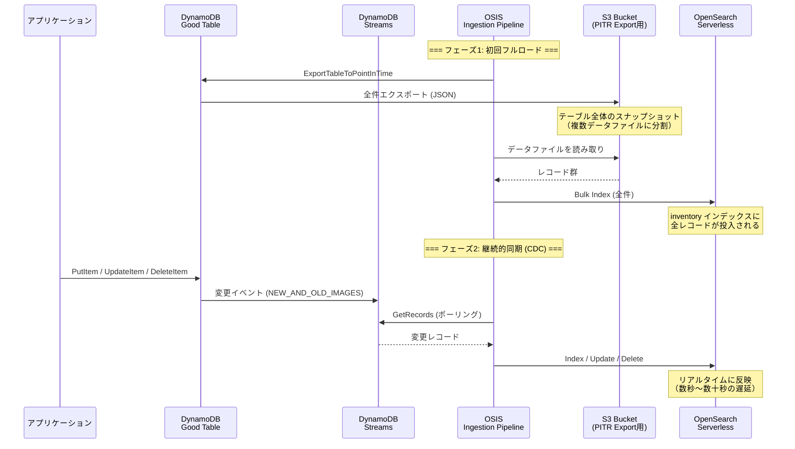

# OpenSearch Serverless NextGen vs DynamoDB GSI — 検索パターン比較検証

## 1. 検証の目的

- DynamoDB の GSI ベース検索と OpenSearch Serverless NextGen の全文検索を同一データ・同一条件で比較
- 業務システムにおける「DynamoDB だけで検索要件を満たせるか？」の実証
- OpenSearch Serverless NextGen（scale-to-zero）のコスト特性と実用性の確認

---

## 2. アーキテクチャ構成

```
DynamoDB Good Table (PK=itemId, SK=warehouseId, GSI×3)
  │
  ├── DynamoDB Streams (CDC)
  │     └── OSIS Ingestion Pipeline → OpenSearch Serverless Collection
  │
  ├── GSI byWarehouse (PK=warehouseId, SK=itemId)
  ├── GSI byLocation (PK=warehouseId, SK=location)
  └── GSI byUnitPrice (PK=warehouseId, SK=unitPrice)
```

- データソース: 5,000 SKU × 3 倉庫 = 15,000 レコード
- 同期方式: DynamoDB Streams + PITR フルエクスポート（初回）
- Collection Group: NextGen（scale-to-zero 対応）

### データ同期フロー

OSIS Ingestion Pipeline は 2 つのフェーズでデータを同期する:



### フェーズの詳細

| フェーズ | トリガー | 経由 | 用途 |
|---------|---------|------|------|
| フルロード | Pipeline 起動時に自動実行 | DDB → PITR Export → **S3** → Pipeline → OpenSearch | 既存データの一括同期 |
| CDC（継続的同期） | DynamoDB への書き込み | DDB → **Streams** → Pipeline → OpenSearch | 差分のリアルタイム同期 |

**S3 の役割**: PITR Export はテーブル全体を JSON 形式で S3 にエクスポートする。Pipeline はこの S3 データファイルを読み取って OpenSearch にバルクインデックスする。CDC 開始後は S3 は使用されない（Streams から直接読み取り）。

**start_position: "LATEST" の意味**: Pipeline は起動時点以降の Streams イベントのみを読む。起動前の既存データはフルロード（PITR Export → S3）で補完する。両方のフェーズが完了して初めて、全データが OpenSearch に揃う。

---

## 3. 検索パターンの対応比較

| 検索パターン | DynamoDB GSI | OpenSearch | 備考 |
|---|---|---|---|
| 倉庫指定（完全一致） | ✅ GSI PK で直接 Query | ✅ term (keyword) | 両方高速 |
| 商品 ID 前方一致 | ✅ GSI SK で begins_with | ✅ prefix (keyword) | |
| ロケーション前方一致 | ✅ GSI SK で begins_with | ✅ prefix (keyword) | |
| 商品名部分一致 | ⚠️ FilterExpression (全件スキャン後フィルタ) | ✅ match (全文検索) | DynamoDB の弱点 |
| 単価範囲 | ✅ GSI SK で BETWEEN | ✅ range | |
| 数量範囲 | ⚠️ FilterExpression | ✅ range | GSI がないため |
| 複合条件 | ⚠️ 1 GSI + FilterExpression | ✅ bool.must で全条件 AND | OpenSearch の強み |
| 総件数取得 | ❌ 不可（全ページング必要） | ✅ total で即時取得 | 大きな違い |
| ページネーション | カーソルベース（nextToken） | offset/size（ページ番号指定可） | |

---

## 4. DynamoDB GSI の制約と設計上のトレードオフ

### GSI 選択ロジック（優先順位）

1. 単価範囲 → byUnitPrice（SK=unitPrice で BETWEEN）
2. ロケーション前方一致 → byLocation（SK=location で begins_with）
3. 商品 ID 前方一致 → byWarehouse（SK=itemId で begins_with）
4. デフォルト → byWarehouse（全件）

### 制約メッセージ

- 倉庫未指定時: 「GSI の PK が warehouseId のため、倉庫指定が必須」
- 商品名部分一致のみ: 「FilterExpression で実行（全件スキャン後フィルタ）」
- 数量範囲: 「FilterExpression で実行（専用 GSI なし）」

### 1 回の Query で使える GSI は 1 つだけ

複合条件（例: 倉庫=東京 AND 単価 1000〜2000 AND ロケーション A-03）の場合:

- GSI byUnitPrice の KeyCondition で倉庫+単価範囲を処理
- ロケーション条件は FilterExpression に回る
- FilterExpression は Query 結果（最大 1MB）に対して適用されるため、大量データでは非効率

> **補足**: GSI のマルチ属性キースキーマ（PK・SK 各最大 4 属性）を使えば、本検証の 3 本の GSI を 1 本に統合し、複数属性を KeyCondition に含めることも可能。ただし SK 属性は定義順に左から指定する制約があるため、「独立した軸を単独で検索したい」本検証の要件では引き続き複数 GSI が必要になる。詳細は [dynamodb-vs-rds-search.md](dynamodb-vs-rds-search.md) の「GSI のマルチ属性キースキーマ」を参照。

---

## 5. OpenSearch Serverless NextGen の特性

### scale-to-zero

- Collection Group の `generation: 'NEXTGEN'` で有効化
- アイドル時は OCU 0 まで縮退 → コスト削減
- 初回リクエスト時にコールドスタート（10〜30 秒）

### 自動マッピング

- 文字列フィールド: `text`（アナライズ済み）+ `keyword`（そのまま）の dual mapping
- 数値フィールド: `long` / `double`
- ⚠️ `term` や `prefix` クエリは `.keyword` サブフィールドを使う必要がある

### Ingestion Pipeline (OSIS)

- DynamoDB Streams から CDC イベントをリアルタイム同期
- PITR Export で初回フルロードをサポート
- `start_position: "LATEST"` — Pipeline 起動後の変更のみキャプチャ

Amazon OpenSearch Service の機能の一つだが、Collection とは**別リソース・別課金枠**である点に注意。

| | Collection（検索側） | Ingestion Pipeline |
|---|---|---|
| リソース型 | `AWS::OpenSearchServerless::Collection` | `AWS::OSIS::Pipeline` |
| OCU の種類 | Search OCU / Indexing OCU | **Ingestion OCU**（別枠） |
| 最小 OCU | 0（NextGen） | 1 |
| CLI 名前空間 | `aws opensearchserverless` | `aws osis` |

同じ OpenSearch Service の請求に載るが、キャパシティモデルが独立しているため、**Collection が 0 OCU に縮退しても Pipeline は 1 OCU で稼働し続ける**。

実体は OSS の **Data Prepper** のマネージド版。パイプライン設定が `version: "2"` + `source` / `sink` の YAML 形式なのはそのためで、CloudWatch Logs にも Data Prepper のクラス名が出力される。

```
org.opensearch.dataprepper.plugins.source.dynamodb.leader.LeaderScheduler
org.opensearch.dataprepper.plugins.source.dynamodb.export.ExportScheduler
```

#### キャパシティ（Ingestion OCU）の挙動

Pipeline は `minUnits`〜`maxUnits` の範囲で自動スケールする。`minUnits` は下限かつ起動時の初期容量。

- **1 Ingestion OCU ≈ 1 MB/秒の書き込み ≈ 約 1,000 WCU 相当**（AWS 公式の目安）
- 本検証の設定は `minUnits: 1` / `maxUnits: 4` なので上限は約 4,000 WCU 相当
- 1 OCU が処理できるシャード数は最大 150

**容量が足りなくなったときの挙動:**

| 段階 | 何が起きるか |
|---|---|
| 1. 負荷増 | `minUnits` → `maxUnits` の範囲で自動スケールアップ |
| 2. `maxUnits` でも不足 | OpenSearch への反映が遅れ始める（`EndtoEndLatency` が上昇） |
| 3. 遅延が 24 時間超 | **DynamoDB Streams の保持期間が 24 時間のため、読む前にレコードが期限切れ → 欠損** |
| 4. 復旧 | 欠損を直すにはフルインデックス再構築が必要 |

容量不足はまず「遅延」として現れ、24 時間を超えた時点で「欠損」に変わる。緩やかに劣化したあとに崖があるため、遅延の監視が重要。

AWS 公式のアラーム推奨にも、`EndtoEndLatency` が高い原因として「OpenSearch クラスターのスケール不足」または「**テーブルの WCU スループットに対して Pipeline の最大 OCU が低すぎること**」が挙げられている。

**監視すべきメトリクス:**

| メトリクス | 意味 |
|---|---|
| `opensearch.EndtoEndLatency.avg` | 同期遅延。上昇は maxUnits 不足 or OpenSearch 側の詰まり |
| `dynamodb.changeEventsProcessed.count` | Streams から取得したイベント数。0 が続くなら停止中 or 権限異常 |
| `BlockingBuffer.bufferUsage.value` | 内部バッファ使用率。飽和は処理が追いついていない兆候 |
| `dynamodb.exportJobFailure.count` | 初回フルロードのエクスポート失敗 |

同じ罠は初回フルロードにもある。大規模テーブルのスナップショット取り込みに 24 時間以上かかると、その間の Streams イベントが期限切れになり初期データが欠ける。テーブルサイズに対して十分な OCU を見積もる必要がある。

---

## 6. デプロイ時の知見・ハマりポイント

### 6.1 Collection Group の Generation 指定

- CDK の `CfnCollectionGroup` に `generation` プロパティが型定義に含まれない場合あり
- `addPropertyOverride('Generation', 'NEXTGEN')` で L1 escape hatch を使用
- `minIndexingCapacityInOcu: 0` は NextGen のみ許可（Classic は最小 1）

### 6.2 OSIS Pipeline のデプロイ

| 問題 | 原因 | 解決策 |
|------|------|--------|
| AccessDenied: BatchGetCollection | Pipeline ロールに `aoss:CreateSecurityPolicy` 等が不足 | 5 つの aoss 権限を全て `Resource: '*'` で付与 |
| AccessDenied（再発） | `CfnPipeline` に `PipelineRoleArn` 未指定 | `addPropertyOverride('PipelineRoleArn', role.roleArn)` で追加 |
| Export status check 失敗 | `dynamodb:DescribeExport` の Resource に `/export/*` が不足 | `${tableArn}/export/*` をリソースに追加 |
| DescribeContinuousBackups 失敗 | 権限未付与 | `dynamodb:DescribeContinuousBackups` を追加 |

### 6.3 Pipeline IAM ロール — 必要な権限一覧（最終版）

```typescript
// DynamoDB
'dynamodb:DescribeTable'
'dynamodb:DescribeContinuousBackups'
'dynamodb:DescribeExport'          // Resource: tableArn + tableArn/export/*
'dynamodb:ExportTableToPointInTime' // Resource: tableArn + tableArn/export/*
'dynamodb:DescribeStream'          // Resource: tableArn/stream/*
'dynamodb:GetShardIterator'        // Resource: tableArn/stream/*
'dynamodb:GetRecords'              // Resource: tableArn/stream/*

// S3
's3:PutObject', 's3:GetObject'    // Resource: bucketArn/*
's3:ListBucket', 's3:GetBucketLocation' // Resource: bucketArn

// OpenSearch Serverless
'aoss:APIAccessAll'               // Resource: '*'
'aoss:BatchGetCollection'          // Resource: '*'
'aoss:CreateSecurityPolicy'        // Resource: '*'
'aoss:GetSecurityPolicy'           // Resource: '*'
'aoss:UpdateSecurityPolicy'        // Resource: '*'
```

### 6.4 Data Access Policy の注意点

- Pipeline ロール AND Lambda ロールの両方を Principal に含める必要がある
- Lambda ロールは OpenSearch Construct より後に作成されるため、`addPropertyOverride` で事後追加
- `aoss:ReadDocument` 権限がないと Lambda から検索できない（security_exception: Bad Authorization）

### 6.5 Pipeline YAML の serverless_options

```yaml
sink:
  - opensearch:
      aws:
        serverless: true
        serverless_options:
          network_policy_name: "collection-name-net"
          collection_name: "collection-name"
```

### 6.6 CloudFormation 依存関係

```
CollectionGroup → Collection → DataAccessPolicy → Pipeline
                → EncryptionPolicy ↗
                → NetworkPolicy ↗
Pipeline ← pipeline.node.addDependency(pipelineRole)  # IAM eventual consistency
```

### 6.7 Seed Lambda の注意

- 環境変数が未設定のテーブルは `undefined` になるため、条件チェックでスキップする
- Pipeline が ACTIVE な状態で seed を実行する（Deployment 完了 = Pipeline ACTIVE）
- DynamoDB の `DescribeTable.ItemCount` は 6 時間ごとの更新で即時反映されない

### 6.8 Query DSL の keyword フィールド

- OpenSearch の Dynamic Mapping で文字列は `text` + `keyword` になる
- `term`（完全一致）や `prefix`（前方一致）は `.keyword` を使う
- `match`（全文検索）は `text` フィールドをそのまま使う

---

## 7. レイテンシ（初期観測）

> ⚠️ 以下は初期テスト結果。正式な負荷テストは別途実施予定。

| 条件 | DynamoDB (ms) | OpenSearch (ms) | 備考 |
|------|---:|---:|------|
| 倉庫指定 + 複合条件 | 23 | 96 | DynamoDB は GSI 直接 Query |
| （追記予定） | | | |

---

## 8. コスト比較（概算）

> 料金は us-west-2 (Oregon) 基準、2024〜2025 年の公開料金に基づく概算。  
> 実際の請求は使用パターンにより変動する。

### 前提条件

- データ量: 15,000 レコード（約 3 MB）
- GSI: 3 本（各 GSI もストレージを消費）
- 使用頻度: 1 日 100 回検索、月間 3,000 回
- PITR: 有効

### 最重要: 常時課金は Ingestion Pipeline だけ

この構成でアイドル時も課金が続くのは **OSIS Ingestion Pipeline だけ**。OpenSearch 本体は NextGen の scale-to-zero で $0 になる。

| リソース | 最小 OCU | アイドル時のコンピュート課金 |
|---|---:|---|
| Collection Group（NextGen） | **0** | $0（10 分アイドルで 0 OCU まで縮退） |
| Ingestion Pipeline（OSIS） | **1** | 課金継続（下限を 0 にできない） |

OSIS の `minUnits` は **最小 1**（0 は指定不可）。「処理していないときは最小 OCU まで縮退する」= 1 OCU で止まるという挙動なので、稼働させている限り課金され続ける。

```
1 OCU × $0.24/OCU-hour × 730h = 約 $175/月
```

検索側が月 $0.01 未満なのに対し Pipeline が約 $175 — **コストのほぼ全部が Pipeline** という構造になる。OpenSearch 本体が scale-to-zero を獲得した一方で、そこへデータを流し込む側は旧来の常時課金モデルのまま残っている、という非対称性がある。

AWS の料金ページも「使わないときは Pipeline を完全に一時停止でき、その間 OCU は課金されない」としており、**$0 にする手段は停止のみ**。

> **注**: 「DynamoDB zero-ETL integration with Amazon OpenSearch Service」も内部実装は同じ OSIS Pipeline なので課金構造は変わらない。名前から受ける印象と異なり、乗り換えてもコストは下がらない。

### シナリオ A: 開発・検証環境（たまに使う）

| 項目 | DynamoDB (オンデマンド) | OpenSearch NextGen |
|------|---:|---:|
| ストレージ | 15 MB × 4（テーブル+GSI3本）= 60 MB → **$0.015/月** | 3 MB → **$0.00007/月** |
| 読み取り | 3,000 回 × $0.25/百万 = **$0.00075/月** | **$0（アイドル→0 OCU）** |
| PITR | 60 MB × $0.20/GB = **$0.012/月** | — |
| Ingestion Pipeline | — | 停止可能 → **$0** |
| **月額合計** | **約 $0.03** | **約 $0.001**（実質無料） |

※ 両方とも Free Tier 内に収まる可能性が高い。NextGen は scale-to-zero で検索しない間はコンピュート $0。

### シナリオ B: 業務利用（日中アクティブ、夜間アイドル）

前提: 1 日 8 時間アクティブ（検索 100 回/時）、データ 100 万レコード（約 200 MB）

| 項目 | DynamoDB (オンデマンド) | OpenSearch NextGen | OpenSearch Classic |
|------|---:|---:|---:|
| ストレージ | 200 MB × 4 = 800 MB → **$0.20/月** | 200 MB → **$0.005/月** | 200 MB → **$0.005/月** |
| 読み取り | 24,000 回/月 × $0.25/百万 = **$0.006/月** | — | — |
| 検索コンピュート | — | 8h × 30日 × 1 OCU × $0.24 = **$57.60/月** | 730h × 2 OCU × $0.24 = **$350.40/月** |
| インデキシング | — | 8h × 30日 × 1 OCU × $0.24 = **$57.60/月** | 730h × 1 OCU × $0.24 = **$175.20/月** |
| Ingestion Pipeline | — | 730h × 1 OCU × $0.24 = **$175.20/月** | 730h × 1 OCU × $0.24 = **$175.20/月** |
| PITR | $0.16/月 | — | — |
| **月額合計** | **約 $0.37** | **約 $290** | **約 $701** |

### シナリオ C: Pipeline 停止運用（データ同期不要な場合）

検証後に Pipeline を停止し、OpenSearch を検索専用にする場合:

| 項目 | OpenSearch NextGen（Pipeline 停止） |
|------|---:|
| ストレージ | **$0.005/月** |
| Pipeline | 停止 → **$0** |
| 検索コンピュート（アイドル時） | scale-to-zero → **$0** |
| 検索コンピュート（使用時） | 使った分だけ × $0.24/OCU-hour |
| **月額合計（ほぼアイドル）** | **$0.005（実質無料）** |

### Pipeline の常時課金を避ける選択肢

| 方式 | 月額目安 | トレードオフ |
|---|---:|---|
| Pipeline 常時稼働 | 約 $175 | 同期遅延は数秒。運用は最も楽 |
| 停止したまま、必要時だけ起動 | ほぼ $0 | 停止中は同期されない。検証用途に最適 |
| EventBridge Scheduler で日次 N 時間だけ起動 | 1 時間/日なら約 $7 | 同期が日次バッチ相当になる |
| DynamoDB Streams → Lambda → OpenSearch | 実質 $0（低更新量なら無料枠内） | 同期コードを自作。バッチング・リトライ・DLQ を自前で実装 |

停止・再開は CLI で実行できる。

```bash
# 停止（OCU 課金が止まる）
aws osis stop-pipeline --pipeline-name kiro-inventory-pipeline --region us-west-2

# 再開（PITR フルエクスポートが再実行され、停止中の差分も追いつく）
aws osis start-pipeline --pipeline-name kiro-inventory-pipeline --region us-west-2
```

停止リクエストから `STOPPED` 到達までは数分かかる。課金が止まるのは `STOPPED` 到達時点。

CloudFormation は Pipeline の稼働/停止状態を管理しないため、`CfnPipeline` の定義が変わらなければ再デプロイしても停止状態は維持される。

### 代替案: DynamoDB Streams → Lambda → OpenSearch

OSIS を使わず、同期処理を Lambda で自作する構成。OSIS 登場前からの定番パターンで、AWS 公式ブログでも紹介されている。**Pipeline の月 $175 をゼロにできる**のが最大の利点。

```
DynamoDB Good Table
  └── DynamoDB Streams
        └── Lambda（Event Source Mapping）
              └── OpenSearch _bulk API（SigV4 署名）
```

Lambda は呼ばれた分だけの課金なので、書き込みがなければ $0。本検証の規模（15,000 レコード、バッチサイズ 100 なら約 150 実行）なら完全に無料枠内に収まる。

#### CDC だけなら実装は素直

継続的同期（CDC）の処理内容は「Streams から受け取った変更イベントを OpenSearch の `_bulk` に投げる」だけなので、コードとしては単純。

- `INSERT` / `MODIFY` → `index` アクション
- `REMOVE` → `delete` アクション
- `StreamViewType: NEW_AND_OLD_IMAGES` を有効にしてあれば新旧両方の値が取れる

ポーリング・バッチング・シャード分散は Event Source Mapping が担当するため、そこは実装しなくてよい。

#### 自作で引き受けることになるもの

| 項目 | OSIS | Lambda 自作 |
|---|---|---|
| 継続同期（CDC） | 組み込み | **素直に実装できる** |
| 初回フルロード | PITR Export → S3 → 一括投入を自動実行 | **自前で用意が必要**（Streams には過去分が流れてこない） |
| スケール | Ingestion OCU を自動増減 | Lambda 同時実行数で吸収。バッチサイズ・並列度は自分でチューニング |
| バックプレッシャー | サービス側で処理 | OpenSearch の bulk 429 を自分でリトライ制御 |
| 部分失敗 | 組み込み | `ReportBatchItemFailures` を実装し、失敗レコードのみ再処理 |
| DLQ | S3 DLQ を設定で有効化 | `onFailure` に SQS/SNS を設定 |
| 変換処理 | Data Prepper のプロセッサ群（grok / date / route 等） | コードで実装 |
| 順序保証 | シャード単位で担保 | シャード単位で担保。`ParallelizationFactor` を上げると崩れる点に注意 |

つまり **月 $175 と引き換えに引き受けるのは主に「初回フルロード」と「エラーハンドリング」**。CDC 部分そのものは Lambda で十分にカバーできる。

#### 24 時間の崖は共通

Streams の保持期間 24 時間は、**消費側が OSIS でも Lambda でも同じ制約**。Lambda が詰まって 24 時間以上遅延すれば同様に欠損する。OSIS 固有の弱点ではないため、自作に切り替えても改善しない。

#### 使い分け

| 状況 | 適した方式 |
|---|---|
| 初回フルロードが必要 / 運用の手間を最小化したい | OSIS Pipeline |
| 継続同期のみで十分 / ランニングコスト最優先 | **Lambda 自作** |
| 同期が日次バッチで足りる | OSIS を EventBridge Scheduler で日次起動 |
| 検証用途でデータが静的 | OSIS を停止したまま（本検証はこれ） |

> **本検証での位置づけ**: 今回は Lambda 同期の実装は行っていない（OSIS を停止して対応）。ランニングコストを恒久的に下げる選択肢として記録しておく。

### コスト上の結論

| ユースケース | 推奨 | 理由 |
|------------|------|------|
| PoC・検証 | NextGen + Pipeline 停止 | $0 に近い |
| 管理画面（低頻度検索） | NextGen | コールドスタート許容、アイドル $0 |
| 継続同期が必要 + コスト最優先 | NextGen + Lambda 自作同期 | Pipeline の $175/月を回避。初回フルロードとエラー処理は自作 |
| リアルタイム検索 | Classic | 常時 OCU 稼働で即応答。最低 $350/月 |
| DynamoDB で十分 | DynamoDB のみ | 単一軸検索 + 網羅性不要なら最安 |

**重要**: DynamoDB は検索回数に関わらず月額 $1 未満（オンデマンド）。OpenSearch は「検索エンジンとしての機能」に対して支払うので、DynamoDB の検索制約を許容できるならコスト面では圧倒的に DynamoDB が有利。OpenSearch は「DynamoDB では不可能な検索要件」がある場合に導入する。

---

## 9. 結論（暫定）

- **GSI だけで対応可能**: 倉庫指定 + 単一軸の範囲検索/前方一致
- **OpenSearch が必要**: 商品名部分一致、複合条件の AND 検索、総件数取得、柔軟なページネーション
- **NextGen の実用性**: コールドスタートを許容できるユースケース（バッチ分析、管理画面）なら有力
- **リアルタイム検索**: コールドスタート不可なら Classic（常時 OCU 稼働）が必要

---

## 10. 実検証結果

> 検証日: 2026-08-08  
> データ: 5,000 SKU × 3 倉庫 = 15,000 レコード（DynamoDB）/ 10,000 レコード（OpenSearch ※同期タイミング差）  
> 環境: Amplify sandbox (us-west-2)、Lambda Node.js 20、DynamoDB オンデマンド、OpenSearch Serverless NextGen

### 10.1 コールドスタート計測

OpenSearch NextGen の scale-to-zero からのウォームアップ:

| 試行 | DynamoDB (ms) | OpenSearch (ms) | 備考 |
|---:|---:|---:|---|
| 1（コールドスタート） | 101 | 13,958 | 約 14 秒。NextGen がゼロ OCU から起動 |
| 2（ウォーム） | 55 | 276 | 急速に改善 |
| 3（ウォーム安定） | 32 | 104 | 安定値に収束 |

**所見**: NextGen のコールドスタートは約 14 秒。ドキュメントの想定（10〜30 秒）の範囲内。2 回目以降は 100ms 前後に収束。

---

### 10.2 検索パターン別レイテンシ

#### DynamoDB が得意（GSI KeyCondition で完結）

| # | 検索条件 | DynamoDB (ms) | OpenSearch (ms) | DDB 件数 | OS 件数 | 使用 GSI |
|---|---------|---:|---:|---:|---:|---|
| 1 | 倉庫: WH-TOKYO | 32〜55 | 104〜276 | 20 | 5,000 | byWarehouse |
| 2 | 倉庫: WH-TOKYO + 商品ID: ITEM#ETH- | 11〜41 | 77〜123 | 20 | 124 | byWarehouse |
| 3 | 倉庫: WH-TOKYO + ロケーション: D- | 61 | 46 | 20 | 626 | byLocation |
| 4 | 倉庫: WH-TOKYO + 単価: 2000〜3000 | 43〜62 | 71〜84 | 20 | 932 | byUnitPrice |

**所見**:
- DynamoDB は GSI KeyCondition 完結時に **10〜60ms** で安定
- OpenSearch はウォーム後 **46〜104ms** が安定値
- 件数が多い条件（#3: 626件）では OpenSearch の方が速いケースもある（DynamoDB 61ms vs OpenSearch 46ms）
- DynamoDB は常に 20 件（1 ページ分）、OpenSearch は total を即時返却

#### DynamoDB が苦手（FilterExpression 依存 = 20件ガチャ）

| # | 検索条件 | DynamoDB (ms) | DDB 件数 | OpenSearch (ms) | OS 件数 | 備考 |
|---|---------|---:|---:|---:|---:|---|
| 5 | 倉庫: WH-TOKYO + 商品名: ベリー シティ | 5〜9 | 3 | 42〜59 | 568 | 20件中3件マッチ |
| 6 | 倉庫: WH-TOKYO + 商品名: ブラジル + 単価: 1000〜2500 | 8〜36 | 0〜1 | 39〜56 | 78 | ページ送りしても0〜1件 |
| 7 | 倉庫: WH-OSAKA + ロケーション: B- + 数量: 100〜500 | 10〜45 | 6 | 42〜68 | 259 | ヒット率30%で安定 |
| 8 | 全条件（商品ID: ITEM#BRA- + ロケ: E- + 商品名: ブラジル + 単価: 1500〜3000 + 数量: 50〜300） | 8〜20 | 0 | 45〜60 | 7 | DynamoDB は常に0件 |

**所見**:
- FilterExpression は Limit 20 件の中からフィルタするため、マッチ率が低いと 0 件が頻発
- #6 は 78 件存在するのに DynamoDB ではページ送りを繰り返しても 0〜1 件しか見つからない
- #8 は 7 件確実に存在するが DynamoDB では 1 件もたどり着けない（全ページで 0 件）
- レイテンシは DynamoDB の方が速いが、**結果の網羅性が根本的に欠如**

#### DynamoDB が構造的に不可能（倉庫横断）

| # | 検索条件 | DynamoDB (ms) | DDB 件数 | OpenSearch (ms) | OS 件数 | 備考 |
|---|---------|---:|---:|---:|---:|---|
| 9 | 全倉庫 + 商品名: ブラジル | 0 | 0 | 34〜44 | 531 | DynamoDB: 制約メッセージ即時返却 |

**所見**:
- DynamoDB は全 GSI の PK が warehouseId のため、倉庫横断検索は Query API で構造的に不可能
- OpenSearch は 34〜44ms で 531 件を全倉庫横断（WH-TOKYO/WH-OSAKA/WH-FUKUOKA 混在）で返却

---

### 10.3 総合まとめ

| 観点 | DynamoDB GSI | OpenSearch NextGen |
|------|-------------|-------------------|
| 単純条件のレイテンシ | ◎ 10〜60ms | ○ 46〜104ms |
| 複合条件のレイテンシ | ◎ 8〜20ms（ただし結果不完全） | ○ 39〜60ms（全件正確） |
| 結果の網羅性 | △〜✗ Filter 依存で不完全 | ◎ 全件返却 + total |
| 倉庫横断検索 | ✗ 構造的に不可能 | ◎ 即時対応 |
| ページネーション | ○ KeyCondition のみなら正確 | ◎ offset/size で自由 |
| 総件数取得 | ✗ 不可（全ページ走査が必要） | ◎ total で即時 |
| コールドスタート | なし | △ 約 14 秒（scale-to-zero 後） |
| コスト（アイドル時） | ストレージのみ | ストレージのみ（NextGen） |

### 10.4 結論

1. **DynamoDB GSI だけで十分なケース**: 単一軸の検索（倉庫+商品ID、倉庫+ロケーション、倉庫+単価範囲）で、結果の網羅性を求めない場合
2. **OpenSearch が必要なケース**: 部分一致検索、複合条件 AND、件数取得、倉庫横断、結果の完全性が必要な場合
3. **NextGen の適用判断**: コールドスタート 14 秒を許容できる管理画面・分析用途なら NextGen（$0 アイドル）。リアルタイム検索が必要なら Classic（常時 OCU 稼働）
4. **DynamoDB の FilterExpression は「検索」ではない**: 読み取った N 件に対する後付けフィルタであり、条件に一致する全件を返す保証がない。業務システムの検索要件には根本的に不適合
5. **GSI 設計の前提が変わった点に注意**: DynamoDB の GSI はマルチ属性キースキーマ（PK・SK 各最大 4 属性）に対応済み。本検証の「GSI 1 本で 1 軸」という制約の一部は緩和できる。ただし部分一致検索・倉庫横断・総件数取得といった本質的な制約は解消されないため、上記の結論は変わらない。
6. **コストのほぼ全部が Ingestion Pipeline**: OpenSearch NextGen は scale-to-zero でアイドル時 $0 になるが、OSIS Pipeline は最小 1 OCU が下限で、停止しない限り約 $175/月かかる。検索側の実測コスト（月 $0.01 未満）と 4 桁違う。PoC・検証用途では「データ投入後に Pipeline を停止する」運用が前提になる
